<div align="center">


**Intelligent warehouse management with demand forecasting, storage optimization, route handling and anomaly detection**

Java 21 · Spring Boot 3.3 · Next.js 14 · PostgreSQL 16 · Python 3.12 · OR-Tools · Docker

</div>

---

OptiWMS is an integrated warehouse management and planning system that connects
inbound, inventory and outbound execution with leakage-safe demand forecasting,
stochastic inventory policy, ABC/FMS classification, physical multi-bin
slotting and conflict-aware worker routing.

The current project-operational source of truth is
`PROJECT_OPERATIONAL_SIMULATION_V8`. It is a deterministic, explicitly labelled
synthetic population used as normal project data because representative
external customer history is unavailable. The project does not claim that
synthetic forecast performance, generated coordinates or modeled forklift
routes prove external production validity.

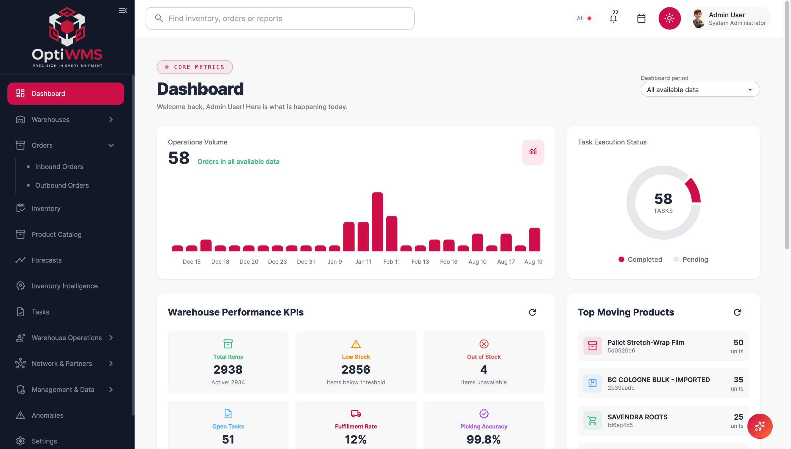

## Project Deliverables

| Document | Description |
| --- | --- |
| [Final report](docs/deliverables/OptiWMS-Final-Report.pdf) | Submitted project report |
| [User manual](docs/deliverables/OptiWMS-User-Manual.pdf) | Operator and administrator guide for the running system |
| [Presentation](docs/deliverables/OptiWMS-Presentation.pdf) | Project defence slide deck |
| [Report in Markdown](report.md) | Same report as the PDF, browsable on GitHub with live links into the evidence |

## Start Here

- [Clone to running in one pass](SETUP.md)
- [Complete final project report](report.md)
- [Current implementation and runtime status](Ai%20miroservices/modeling/CURRENT_STATUS.md)
- [Worker-routing implementation log](docs/WORKER_ROUTING_IMPLEMENTATION_LOG.md)
- [v8 modeling and physical-population guide](Ai%20miroservices/modeling/v8_controlled_synthetic_validation/README.md)
- [Complete notebook and test index](report.md#appendix-a--test-catalogue-and-execution)
- [Full interface gallery](docs/screenshots/) — every admin and worker screen

## Six Core Solution Pillars

| Pillar | What OptiWMS provides |
| --- | --- |
| WMS execution | Master data, inbound, quality/quarantine, putaway, location/LPN inventory, cycle count, transfers, outbound, returns, tasks, notifications, analytics and reports |
| Forecasting | Leakage-safe RM/PM H1-H12 forecasts, uncertainty, statistical tests and model governance |
| Inventory min/max | Reorder point, safety stock, proposed minimum/maximum, order quantity, service/cost simulation and approval |
| MILP slotting | Physical-capacity and compatibility-constrained pick-face/reserve allocation using OR-Tools MILP and min-cost flow |
| Worker routing | PWA guidance, rack-safe paths, multi-worker time reservations and admin live monitoring |
| Warehouse assistant | SOP retrieval plus authenticated, warehouse-scoped forecast and inventory business tools |

## Current Verified Scope

### Operational WMS

- material, supplier, customer, warehouse, rack, bin and handling-unit masters;
- versioned FG BOMs with raw and packaging components;
- inbound order, receiving, quality check and putaway;
- location-level inventory, replenishment, cycle count and stock transfer;
- outbound order, picking, packing, shipping and returns;
- JWT authentication and role/warehouse-scoped authorization;
- manager-controlled recommendation and transfer approval.

### Forecasting

- direct monthly RM/PM demand forecasts for H1-H12;
- lags, rolling statistics, trends and seasonal/cyclic features;
- trailing periodogram/Fourier power and spectral entropy evidence;
- classical, statistical, tree, LightGBM and Conv1D-attention candidates;
- rolling-origin selection, untouched test and dependence-aware comparisons;
- residual, calibration, assumption and claim-evidence registries.

### Mandatory synthetic-data quality and statistical evidence

Forecasting, inventory-policy and MILP results are not accepted merely because
a notebook runs. Two deterministic evidence populations are retained:

- the v8 controlled benchmark has 120 RM/PM demand series, 24 related FG
  series, 72 monthly periods and a 144-material physical population;
- the shared operational-baseline evaluator has 80 primary RM/PM series and
  16 separately reported FG series, using 24-month input windows, H1-H12
  direct outputs, seven pre-test origins and an untouched January–December
  2025 test.

Mandatory checks and their persisted evidence are:

| Evidence gate | What is tested | Authoritative evidence |
| --- | --- | --- |
| Generation and lineage | Fixed seed, equations/distributions, BOM closure, causal production-to-material demand, dataset hash and synthetic label | [Generation proof notebook](Ai%20miroservices/modeling/v8_controlled_synthetic_validation/07_Synthetic_Data_Generation_Methods_And_Proof.ipynb), [baseline manifest](Ai%20miroservices/modeling/project_operational_baseline/outputs/manifest.json) |
| Data quality | Row/schema contracts, missingness, duplicates, non-negative demand, complete panels, physical dimensions, connected layout and capacity | [v8 quality report](Ai%20miroservices/modeling/v8_controlled_synthetic_validation/outputs/data_quality_report.csv), [baseline validations](Ai%20miroservices/modeling/project_operational_baseline/outputs/manifest.json) |
| Leakage guardrails | Future-actual mutation invariance, train-only normalization, causal rolling/spectral features, known-future timestamp rules and no random K-fold | [Evaluator tests](Ai%20miroservices/modeling/project_operational_baseline/tests), [normalization artifacts](Ai%20miroservices/modeling/project_operational_baseline/outputs/evaluator/normalization) |
| Time/frequency evidence | Lags, rolling/trend, month sin/cos, ACF/PACF, STL, detrended periodograms, Fourier power ratios and spectral entropy | [Time-series notebook](Ai%20miroservices/modeling/project_operational_baseline/02_RM_PM_EDA_And_Time_Series_Evidence.ipynb), [spectral evidence](Ai%20miroservices/modeling/project_operational_baseline/outputs/evaluator/spectral_evidence.csv) |
| Model hypothesis tests | Same origins/horizons, effect sizes, HAC/DM comparisons, paired block-bootstrap CIs and Holm correction | [Hypothesis tests](Ai%20miroservices/modeling/project_operational_baseline/outputs/evaluator/model_hypothesis_tests.csv), [untouched-test notebook](Ai%20miroservices/modeling/v8_controlled_synthetic_validation/03_Untouched_Test_And_Hypothesis_Tests.ipynb) |
| Residual assumptions | HAC mean/bias, Jarque–Bera, Ljung–Box, Breusch–Pagan and absolute-error/scale association; rejected assumptions change inference | [Residual diagnostics](Ai%20miroservices/modeling/project_operational_baseline/outputs/evaluator/residual_diagnostics.csv), [assumption registry](Ai%20miroservices/modeling/project_operational_baseline/outputs/evaluator/assumption_registry.csv) |
| Calibration and decisions | Empirical interval coverage with block CI, shortage, holding, safety stock, fill-rate and cost-ratio sensitivity | [Calibration](Ai%20miroservices/modeling/project_operational_baseline/outputs/evaluator/interval_calibration.csv), [decision-cost sensitivity](Ai%20miroservices/modeling/project_operational_baseline/outputs/evaluator/decision_cost_sensitivity.csv) |
| MILP/physical guards | Full allocation, one pick face, unique locations, weight/volume/class compatibility, capacity and independently validated solver status | [Physical validation](Ai%20miroservices/modeling/v8_controlled_synthetic_validation/outputs/storage_slotting_validation.csv), [slotting summary](Ai%20miroservices/modeling/v8_controlled_synthetic_validation/outputs/storage_slotting_summary.json) |

The assumption registry explicitly records `SUPPORTED`, `REJECTED`,
`NOT_REQUIRED` and `UNVERIFIED`. Non-Gaussian or heteroscedastic residuals are
not hidden; empirical intervals, HAC inference, block resampling and slice
metrics are used instead. Synthetic evidence validates the implementation and
controlled population only; external population validity remains
`UNVERIFIED`.

### Inventory min/max and replenishment policy

- forecast P10/P50/P90, lead-time demand and calibrated uncertainty;
- reorder point, safety stock and proposed min/max stock;
- MOQ, order multiple, handling-unit, cost, expiry and capacity constraints;
- 1,000-trial policy simulation with fill-rate and expected-cost evidence;
- manager override reasons, approval snapshots and rollback;
- approved eligible lines update policy fields and create draft—not released—
  purchase suggestions.

### Physical storage and MILP slotting

- dimensions, weight, volume, pallet and compatibility attributes for all 144
  materials;
- policy-derived pallet-position requirements;
- OR-Tools MILP for complete constrained target-state allocation;
- integer min-cost flow for reserve positions across multiple bins;
- relocation cap, accessibility, travel, carrying-space and stockout-risk
  objective terms;
- manager approval creates stock-transfer jobs; inventory moves only after
  confirmed execution.

### Worker routing

- installable worker PWA for putaway and picking;
- rack-safe WEST/EAST access faces and orthogonal aisle arrows;
- server-authoritative multi-stop A*;
- canonical edge/node time reservations for concurrent workers;
- leases, heartbeats, idempotent events and stale-route rejection;
- scan-triggered release and replanning;
- authenticated admin fleet view through SSE and recovery polling.

### Warehouse assistant for workers and administrators

- worker mobile overlay for SOP, task and SKU-location questions;
- manager drawer and full-screen assistant;
- retrieval-augmented answers grounded in the included warehouse SOP files;
- source labels returned with SOP answers;
- 10 reviewed parameterised queries the model selects between but never writes;
- typed, authenticated Spring tools for SKU outlooks, inventory risks,
  recommendation explanations and planning-cycle status;
- page-aware follow-ups, so "why is this one low?" resolves without a material
  code being typed;
- model-generated SQL only as a last-resort fallback, restricted to SELECT,
  row-capped, allowlist-checked and limited to ADMIN/MANAGER callers;
- guided UI tours driven from a fixed catalogue rather than generated steps.

The assistant is an advisory presentation layer, not the forecast, min/max,
MILP or routing decision engine. See [Agentic
Architecture](#agentic-architecture) for how a question is routed and what each
guard rail is there to prevent.

## The System in Use

Every screenshot below is the running system against the
`PROJECT_OPERATIONAL_SIMULATION_V8` population. The complete gallery — 50 admin
screens and 13 worker PWA screens — is in [`docs/screenshots/`](docs/screenshots/).

### Forecasting and demand planning

Direct H1–H12 RM/PM forecasts with held-out backtest, calibrated 90% intervals
and per-horizon error, all served from the promoted model bundle.

| Historical demand against the published forecast | Error by horizon and the 12-month detail table |
| --- | --- |
| 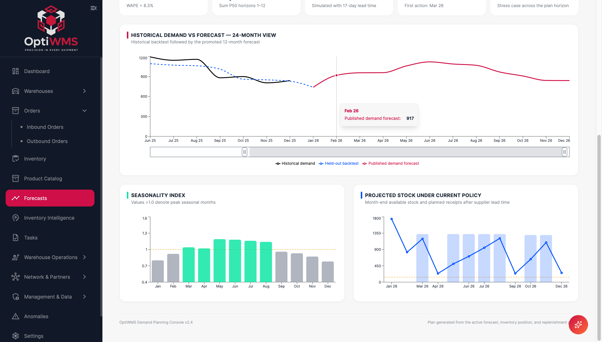 | 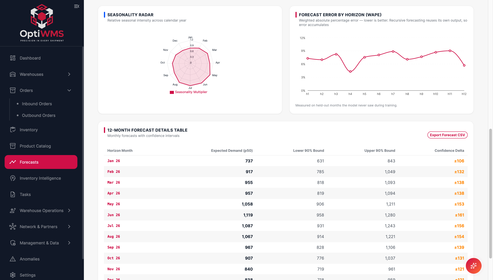 |

| Model performance against operational thresholds | Projected stock under the current policy |
| --- | --- |
| 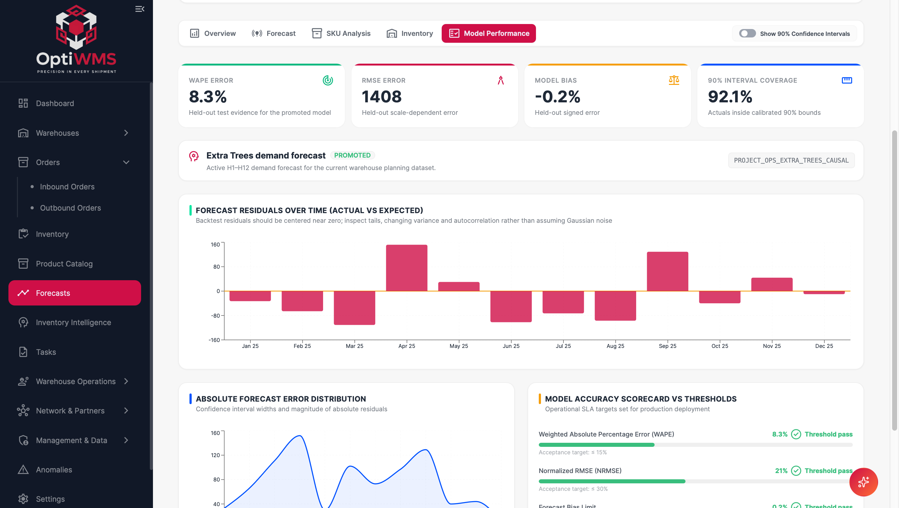 | 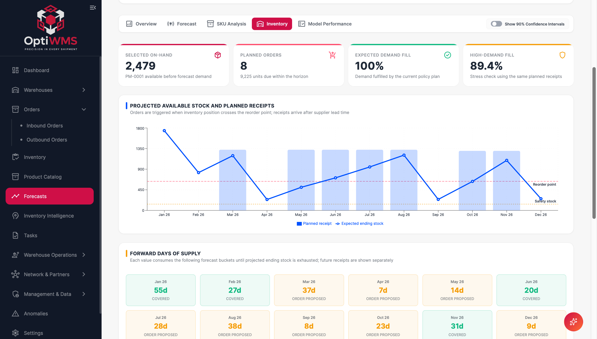 |

### Inventory min/max and replenishment policy

Reorder point, safety stock and proposed min/max derived from forecast
uncertainty, with the storage consequence of every change shown before approval.

| Policy changes awaiting review | Order constraints and storage impact |
| --- | --- |
| 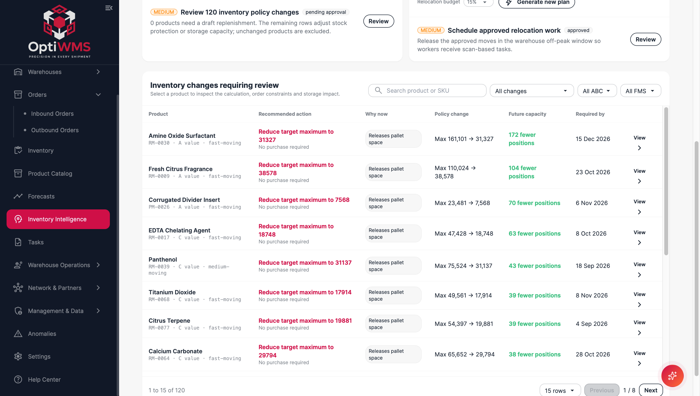 | 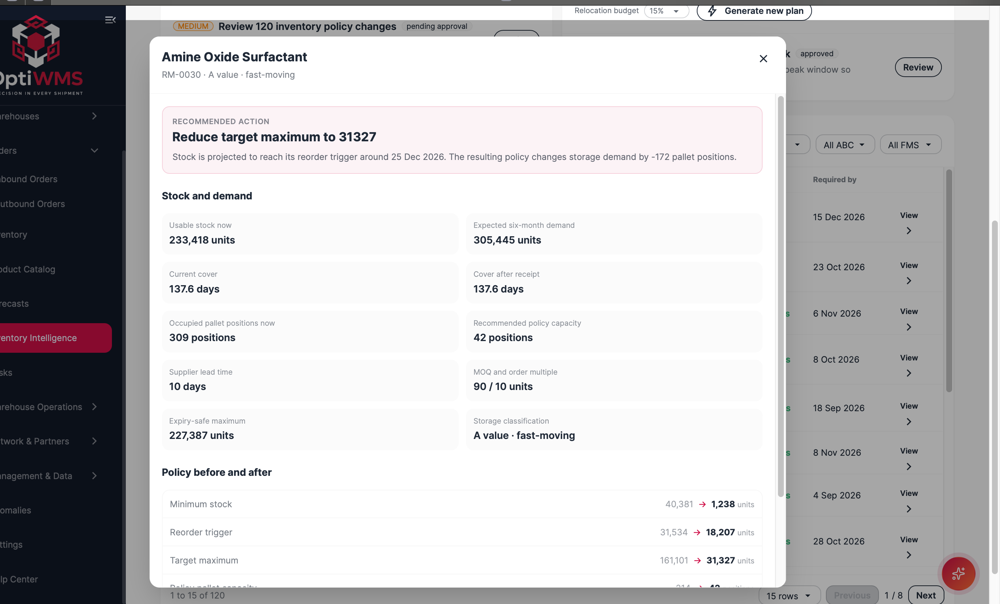 |

### Physical slotting and warehouse layout

OR-Tools MILP allocates pick faces and min-cost flow places reserve stock across
bins. Approving a plan creates stock-transfer jobs; inventory moves only after a
worker confirms execution.

| MILP location plan and proposed transfers | Operational rack plan with L1–L5 occupancy |
| --- | --- |
| 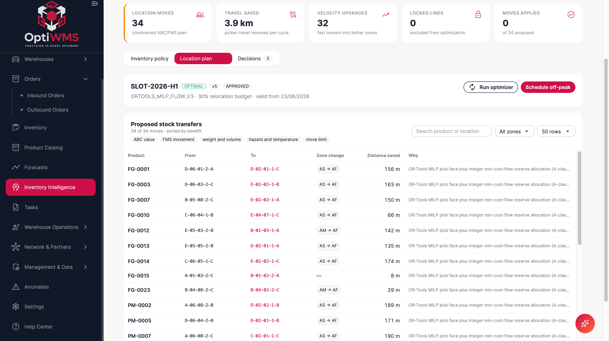 | 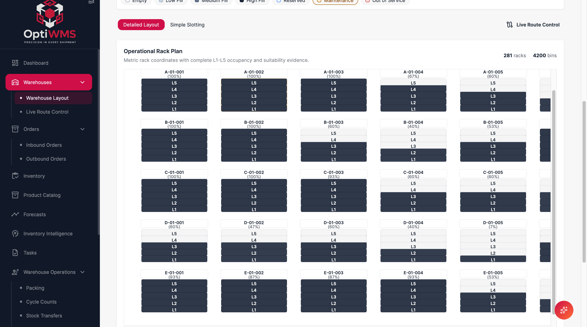 |

### Conflict-aware worker routing

Server-authoritative multi-stop A\* over the versioned aisle graph, with
edge-time reservations shared between concurrent workers and a live admin view.

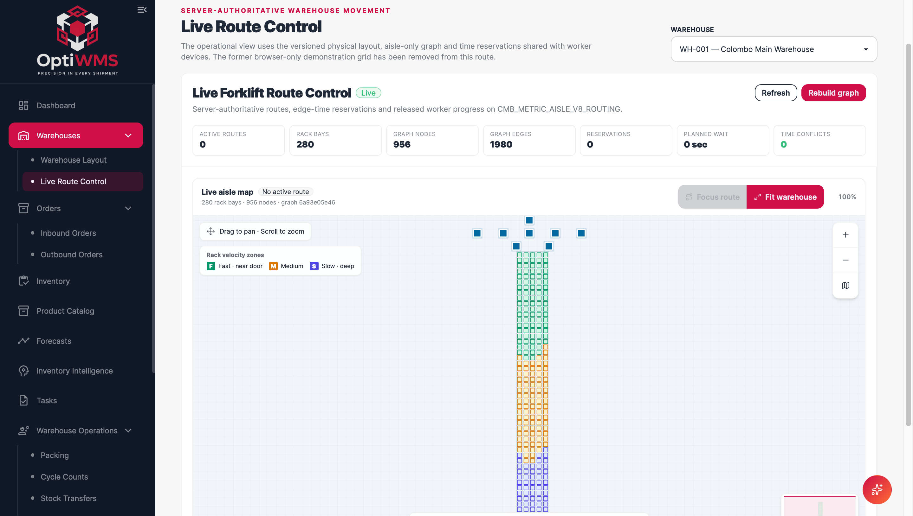

### Worker PWA

Installable, offline-capable, scan-driven. Receiving, putaway and stock transfer
queue locally and replay on reconnect.

| Login | Task home | Route guidance | Productivity |
| --- | --- | --- | --- |
| 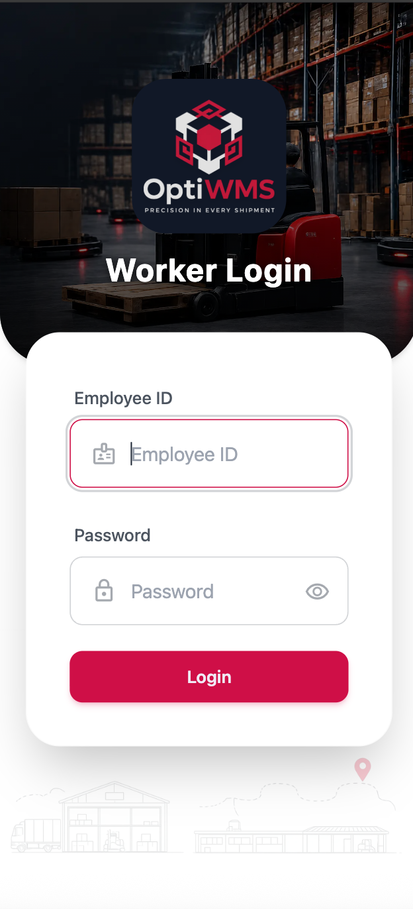 | 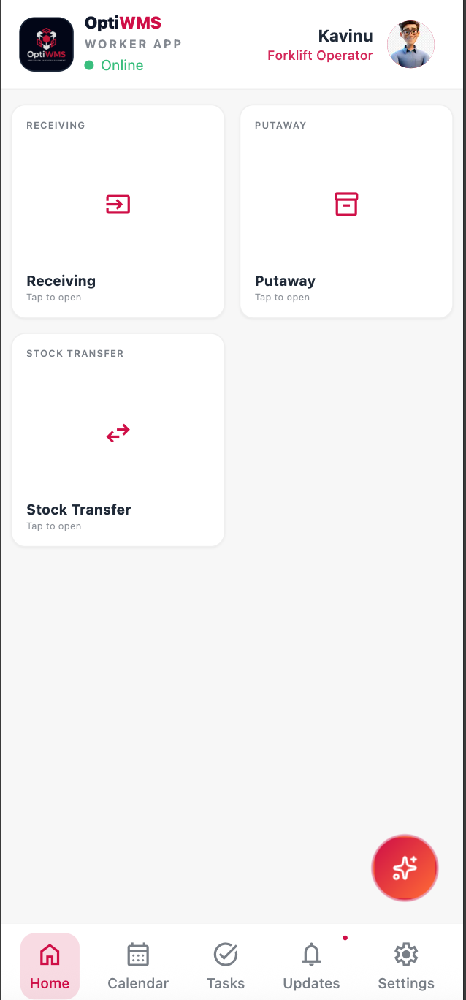 | 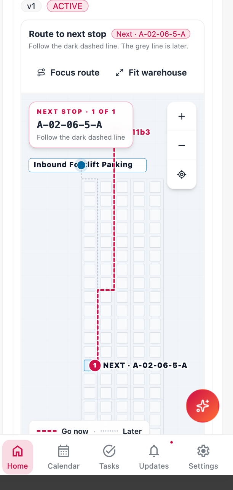 | 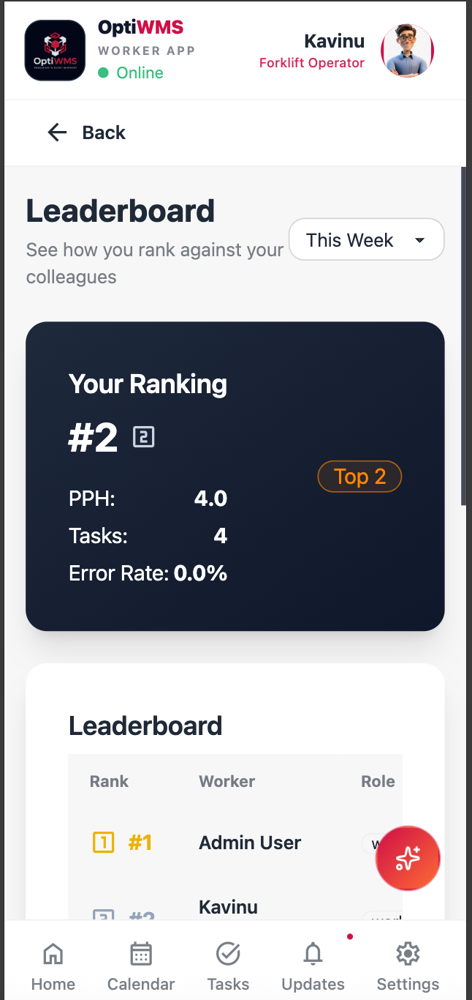 |

### Administration

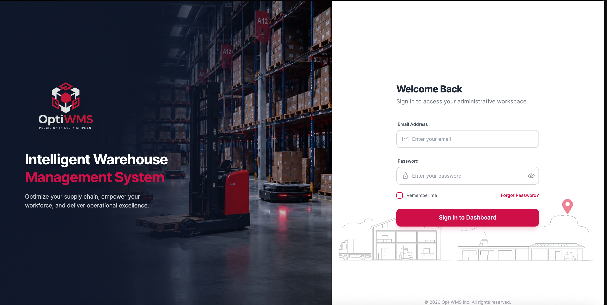

## Complete WMS Feature and Maturity Map

This table is the repository-level scope statement. “Implemented” means source,
API and UI/database support exist. It does not mean that the feature has the
same scale, configuration depth, certification or automated test coverage as a
commercial enterprise WMS.

| Functional area | Implemented project capability | Primary interface | Verification status |
| --- | --- | --- | --- |
| Identity and access | JWT login/refresh, BCrypt passwords, admin/manager/worker roles, assigned warehouse and rate/security filters | Admin and worker login | Backend builds/tests; endpoint rules require a broader authorization test matrix |
| Master data | Warehouses, locations/racks/levels, materials, suppliers and constraints, customers, delivery partners, users and default locations | Admin screens and Spring APIs | Implemented; selected service tests |
| BOM and supply planning | Effective FG BOM headers/components, audit log, forecast-SKU mapping and supply plans | Admin BOM/supply-plan screens | Implemented; v8 BOM closure is contract-tested |
| Inbound orders | Supplier order header/lines, canonical numbers, receiving-task creation and order lookup | Admin order screens; worker receiving | Implemented; manual E2E script, no dedicated automated inbound journey |
| Receiving and GRN | PO/ASN scan, partial receipt, blind-receive option, batch/expiry capture, pallet-weight check, GRN and operation event | Worker PWA | Implemented; offline queue for loaded/entered work; automated journey gap |
| Quality and quarantine | Pending receipt checks, inspection/approval, quarantine inventory and controlled release | Admin quality/inventory screens | Implemented; automated journey gap |
| Putaway | Task creation, capacity-aware location suggestion, split/batch plan, location scan, partial completion and skip reason | Worker PWA and admin | Implemented; routing has automated/live tests, putaway transaction journey is manual |
| Inventory | Material/warehouse/location balances, batch/expiry, reserved/available quantity, LPN records, integrity summaries and quarantine | Admin inventory; worker lookups | Implemented; repository/service validation is partial |
| Cycle count | Schedules, assigned work, mobile location/SKU count, recount, review, approve/reject adjustment and audit | Worker PWA and admin | Implemented with offline count queue; automated journey gap |
| Replenishment/min-max | P10/P50/P90-driven ROP, safety stock, min/max, MOQ/order multiples, simulation, approval and rollback | Admin replenishment | Implemented; modeling/service evidence exists |
| Slotting | ABC/FMS evidence, readiness, MILP/flow allocation, override, approval and transfer-work generation | Admin slotting/replenishment | Implemented; solver and population are contract-tested |
| Stock transfer | Multi-line transfer, release, assignment, worker execution/skip, dispatch, receive, cancellation and event history | Worker PWA and admin | Implemented with offline execution queue; automated journey gap |
| Outbound allocation | Outbound orders, FEFO/FIFO location allocation, inventory reservation and picking-task creation | Admin orders; worker picking | Implemented; manual E2E script, no dedicated automated outbound journey |
| Picking | Order scan, task claim/start, bin verification, completion, issue/skip handling and live route guidance | Worker PWA | Implemented; route logic is tested, complete picking transaction journey remains manual |
| Packing | Picked-order verification, package recommendation/selection, dimensions, weight, labels and task completion | Worker PWA and admin | Implemented; limited offline behavior and no automated journey |
| Shipping | Shipment creation/update, carrier/tracking details, status and delivery confirmation | Worker PWA and admin | Implemented; creating a new shipment is online-only |
| Returns | Outbound return intake, reason/product capture, inspection, approval/rejection, assignment and status history | Worker PWA and admin | Implemented; worker intake is online-only and automated journey is absent |
| Work management | Task create/list/claim/assign/status/error, worker availability, achievements, leaderboard and productivity | Worker PWA and admin | Implemented; not a full engineered-labor-standard system |
| SOPs and assistant | SOP CRUD, eight indexed documents, source-grounded chat and read-only analytics | Worker overlay; admin assistant | Controlled-demo implementation; production auth/scoping/tests incomplete |
| Analytics and reports | Dashboard KPIs, inventory/order charts, worker productivity, location velocity, scheduled/custom reports and CSV export | Admin dashboard/reports | Implemented; selected report service tests |
| Notifications/anomalies | Targeted notifications, read state, data/operation anomaly screens and action center | Admin/worker UI | Implemented; no complete alert-delivery acceptance suite |

### Worker PWA operations

The installable PWA is not only a routing screen. It has role-filtered access
to eight operational work areas:

| PWA operation | Worker action | Offline behavior |
| --- | --- | --- |
| Receiving | Scan/enter PO or ASN, load lines, record quantity/batch/expiry and confirm normal or blind receipt | Previously loaded data can be used; receipt is queued for synchronization |
| Putaway | Select inbound work, receive suggested/split placement, scan bin, record partial/full placement or skip with reason | Completion/skip can be queued; a new conflict-safe route requires the server |
| Picking | Select/scan outbound order, verify source bin, confirm pick or raise an issue, follow route | Pick/issue can be queued; authoritative replanning requires connectivity |
| Cycle count | Select assigned count, scan location/SKU, record quantity | Known SKU/count work can be queued; unknown SKU lookup requires connectivity |
| Stock transfer | Select assigned transfer line, scan source/destination and execute or block | Execution/skip can be queued |
| Packing | Verify picked order, choose packaging, capture dimensions/weight and complete | Only already loaded orders have limited offline support |
| Shipments | Load ready-to-ship work, capture carrier/tracking and confirm shipment | Existing updates can be queued; new shipment creation is online-only |
| Returns | Receive an outbound return and send it to quality review | Online-only in the current implementation |

The PWA registers [`sw.js`](frontend/public/sw.js), uses
[`manifest.json`](frontend/public/manifest.json), stores tasks, paths, scans,
operation logs and synchronization work in
[`indexeddb.ts`](frontend/lib/indexeddb.ts), and replays supported mutations
through [`sync.ts`](frontend/lib/sync.ts). Offline mode never gives the device
authority to invent a route reservation or bypass a server validation.

## Current Project Population

| Entity/evidence | v8 scale |
| --- | ---: |
| Finished goods | 24 |
| Raw materials | 90 |
| Packaging materials | 30 |
| Total active materials | 144 |
| Effective BOM headers | 24 |
| BOM component rows | 211 |
| Monthly FG/RM/PM demand rows | 10,368 |
| Forward RM/PM H1-H12 rows | 1,440 |
| RM/PM inventory-policy rows | 120 |
| Storage positions | 4,200 |
| Operational stations | 6 |
| Physical assignments | 3,257 |
| Occupied location-inventory rows | 2,921 |
| Route rack-bay obstacles | 280 |
| Route graph nodes | 956 |
| Directed route edges | 1,980 |
| Included warehouse SOP documents | 8 |

The active dataset hash is
`4c0e2e4f4166249456061fbf94facf41eaa36ccb6b2352f06954839e11d32619`.
The generation seed is `20260711`.

## Current Model Decision

The operational forecast identifiers are:

```text
dataset: PROJECT_OPS_RM_PM
model:   PROJECT_OPS_EXTRA_TREES_CAUSAL
```

| Locked recursive test measure | Result |
| --- | ---: |
| Extra Trees WAPE | 8.7452% |
| MAE | 772.95 |
| RMSE | 1,559.64 |
| Bias | -0.4877% |
| Under-forecast rate | 47.71% |
| Seasonal-naive baseline WAPE | 13.6170% |
| Relative WAPE reduction vs seasonal naive | 35.78% |
| Conv1D-attention WAPE | 9.8996% |
| Relative Extra Trees advantage | 11.66% |
| HAC/Holm p-value | 0.0197 |

The seasonal-naive baseline is recovered from two independent retained
artifacts — [`model_leaderboard.csv`](Ai%20miroservices/modeling/v8_controlled_synthetic_validation/outputs/model_leaderboard.csv)
and [`evaluator_run_summary.json`](Ai%20miroservices/modeling/v8_controlled_synthetic_validation/outputs/evaluator/evaluator_run_summary.json)
— which agree to all reported digits at WAPE `0.13617019`.

On the untouched test split the causal random forest reached 8.2380% against
Extra Trees at 8.3357% in direct mode. The champion was **not** changed, because
Extra Trees won the selection split (8.1100% against 8.1926%) and that decision
was locked before the untouched test was opened. The paired comparison on the
test split is not significant (mean absolute-error difference +8.64 units,
paired *t* p = 0.395), so the ordering lies within noise.

The neural model remains a challenger. It was not promoted because the locked
Extra Trees model was statistically and operationally better under the common
recursive protocol. Full results and limitations are in
[Chapter 7 of the report](report.md#chapter-7--evaluation).

## Inventory Min/Max Decision

The project creates one policy row for each of the 120 forecasted RM/PM
materials. Each row records:

```text
P50/P90 demand
lead-time demand
reorder point
safety stock
proposed minimum stock
MOQ/order-multiple rounded order quantity
proposed maximum stock
service level and policy lineage
```

Spring adds operational readiness, current-versus-proposed simulation,
fill-rate/cost/capacity gates, approval, override evidence and rollback.
Recommendations that are infeasible, data-insufficient or fail simulation are
not silently applied.

Evidence:

- [Inventory-policy simulation CSV](Ai%20miroservices/modeling/v8_controlled_synthetic_validation/outputs/inventory_policy_simulation.csv)
- [Inventory policy and slotting notebook](Ai%20miroservices/modeling/project_operational_baseline/06_Inventory_Policy_And_Slotting_Readiness.ipynb)
- [Spring policy service](backend/core-app/src/main/java/com/optiwms/coreapp/forecastspace/InventoryPolicyRecommendationService.java)

## MILP and Physical Slotting Decision

The current solver contract is `ORTOOLS_MILP_FLOW_V3`. It solves the full
target-state allocation rather than displaying a nearest-empty-bin
recommendation.

| MILP/physical result | Value |
| --- | ---: |
| Materials allocated | 144 |
| Required unique pallet positions | 3,257 |
| Available storage positions | 4,200 |
| Unused storage positions | 943 |
| Independent validation gates | 14/14 passed |
| Solver result | `OPTIMAL` |
| Stage-1 pick-face objective | 129,847.4251 |
| Objective range over 3 repeated solves | 0.0 (bit-identical) |

> **Objective value corrected.** Earlier revisions of this file, `report.md` and
> `CURRENT_STATUS.md` quoted `109,468.4609` for the verified objective. That
> figure came from an older `ORTOOLS_MILP_FLOW_V3` run and was recorded only in
> hand-maintained markdown — it exists in no machine-written artifact, and the
> current code does not reproduce it. The value above is the stage-1 pick-face
> objective produced by the present code path on the v8 population and is
> written to
> [`outputs/solver_evidence/milp_determinism.json`](Ai%20miroservices/modeling/v8_controlled_synthetic_validation/outputs/solver_evidence/milp_determinism.json).
> It excludes the stage-2 reserve minimum-cost-flow cost.

Constraints include complete allocation, unique bins, weight, volume,
temperature, hazard, fragility, stackability, ABC/FMS compatibility, current
incumbents and relocation budget. Infeasible/unavailable/fallback solutions
cannot be approved as optimal plans.

### Why the MILP holds planning authority and the GA does not

The repository contains two optimisers. They are **not** interchangeable and no
head-to-head benchmark between them exists or should be quoted:

| | Production MILP | Advisory GA |
| --- | --- | --- |
| Entry point | `plan_optimizer.py` | `app/api/main.py`, `run_ga` |
| Scope | all 144 materials solved simultaneously | one parcel at a time |
| Decision space | the 4,200 real v8 storage positions | abstract 4x20x10x5x2 = 8,000-bin grid in `config.py` |
| Objective | travel + access + vertical + relocation cost | hard/soft constraint penalty score |
| Repeatability | **deterministic** — 3/3 identical assignment sets, objective range 0.0 | **stochastic** — 0 of 20 materials placed identically across 5 seeds (mean 2.7 distinct bins each) |

The two do not share a location namespace: `ga_components.decode()` emits
`A-01-01-L1-A` (alphabetic level, two bins) while the v8 layout uses
`A-01-01-2-B` (numeric level, three bins). Zero of the 4,206 v8 location codes
match the GA pattern. Comparing them would require inventing a mapping layer,
and the result would measure that mapping rather than the system.

Reproduce with:

```bash
cd "Ai miroservices/modeling/v8_controlled_synthetic_validation"
python solver_determinism_evidence.py     # requires ortools and deap
```

Outputs land in `outputs/solver_evidence/`:
`milp_determinism.json`, `ga_stochasticity.csv`, `solver_behaviour.png`.

Evidence:

- [Physical slotting summary](Ai%20miroservices/modeling/v8_controlled_synthetic_validation/outputs/storage_slotting_summary.json)
- [Physical validation matrix](Ai%20miroservices/modeling/v8_controlled_synthetic_validation/outputs/storage_slotting_validation.csv)
- [OR-Tools plan optimizer](ai_services/slotting-service/app/services/plan_optimizer.py)
- [Slotting integration tests](ai_services/slotting-service/tests)

## Warehouse Assistant

The assistant answers four kinds of question, and decides which kind it is
before touching any data source. The routing, guard rails and extension rules
are described in [Agentic Architecture](#agentic-architecture); this section
covers what the four sources are.

| Mode | Source | Answers |
| --- | --- | --- |
| `SOP` | Local Chroma vector store, MiniLM embeddings, answered only from retrieved SOP context | Physical warehouse procedure — forklifts, safety, damaged goods, cycle counts |
| `DATA` | One of 10 reviewed parameterised queries in `TOOL_REGISTRY`, run read-only against PostgreSQL, plus the forecast service for SHAP attributions | Stock, orders, analytics, forecasts, and "why is this material's forecast/policy/slotting like this" |
| `TOUR` | `TOUR_CATALOG` in `agent.py`, paired with `frontend/lib/tours/tourConfig.ts` | Where a feature is on screen and how to use it |
| `CHAT` | No source; handled on keywords without a model call | Greetings and small talk |

There are two distinct read-only tool surfaces, and they are not the same thing:

- the **agent's own 10 tools** run fixed, hand-written SQL from the Python
  service. The model picks which tool runs and what parameters it passes; it
  never sees the schema and never writes the SQL;
- **Spring's typed assistant tools** (`/api/v1/assistant/tools`, published as
  [OpenAPI](docs/openapi/optiwms-assistant-tools.yaml)) back the Inventory
  Intelligence panel in the UI. They are audited, rate-limited and warehouse-
  scoped from the caller's JWT assignments.

Both surfaces are read-only. No mutating action exists in either contract, so
the assistant can explain a forecast, policy or slotting plan but cannot
approve one.

Worker access is integrated in the mobile layout; managers can use the top-bar
drawer or `/admin/assistant`. The agent validates every bearer token against
Spring before answering, so an unauthenticated caller reaches no data at all.
The standalone FastAPI service requires a Google Gemini API key (with an
optional Groq fallback key) and is not part of the core Docker Compose
acceptance path.

## Architecture

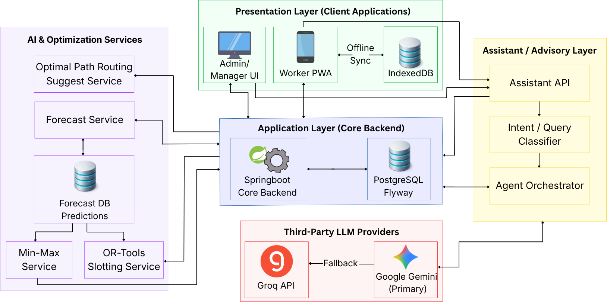

Five layers, with one rule that decides where anything new belongs: the layer
that owns a fact is the layer that writes it. Clients render, Spring decides,
PostgreSQL remembers, Python computes, and the assistant only ever reads.

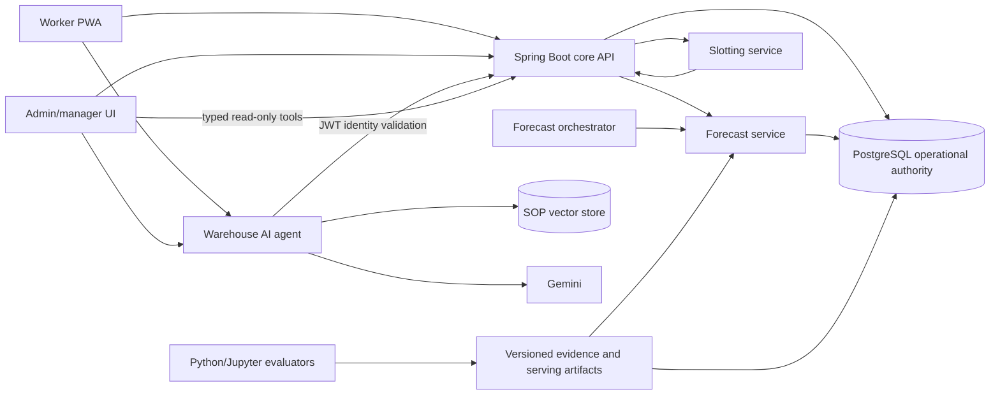
```mermaid
flowchart LR
    WPWA["Worker PWA"] --> API["Spring Boot core API"]
    ADMIN["Admin/manager UI"] --> API
    API --> PG[("PostgreSQL operational authority")]
    API --> F["Forecast service"]
    API --> S["Slotting service"]
    O["Forecast orchestrator"] --> F
    WPWA --> AG["Warehouse AI agent"]
    ADMIN --> AG
    AG --> V[("SOP vector store")]
    AG --> L["Gemini"]
    AG -->|"JWT identity validation"| API
    ADMIN -->|"typed read-only tools"| API
    F --> PG
    S --> API
    E["Python/Jupyter evaluators"] --> A["Versioned evidence and serving artifacts"]
    A --> F
    A --> PG
```

### Ownership rules

- **PostgreSQL owns business truth.** Materials, BOMs, demand, forecasts,
  inventory, locations, plans, route reservations, approvals and execution
  evidence are persisted there.
- **Spring owns operational rules.** It validates permissions and state,
  controls transactions, applies approval gates and exposes the canonical API.
- **Python owns specialist computation.** It trains/evaluates forecasts and
  solves slotting, but it does not own competing WMS state.
- **The browser does not own route decisions.** Worker/admin maps render the
  graph and reservations returned by Spring.
- **The chatbot is advisory.** It explains SOPs and summarizes read-only data;
  it does not approve forecasts, policies, slotting plans or route reservations.
- **Recommendations are not execution.** Forecast, policy and slotting output
  remains governed until approved work is performed.

## Agentic Architecture

The warehouse assistant is a **routed, tool-calling agent**, not a text-to-SQL
box. Every question takes one of four paths, and the path is chosen before any
database or model is touched.

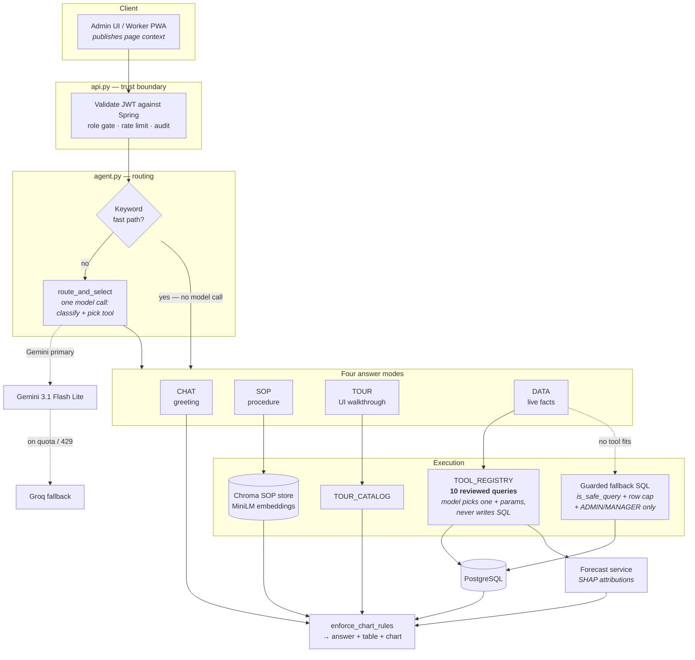
```mermaid
flowchart TB
    subgraph client["Client"]
        UI["Admin UI / Worker PWA<br/><i>publishes page context</i>"]
    end

    subgraph gate["api.py — trust boundary"]
        AUTH["Validate JWT against Spring<br/>role gate · rate limit · audit"]
    end

    subgraph router["agent.py — routing"]
        KW{"Keyword<br/>fast path?"}
        LLM["route_and_select<br/><i>one model call:<br/>classify + pick tool</i>"]
    end

    subgraph modes["Four answer modes"]
        CHAT["CHAT<br/>greeting"]
        SOP["SOP<br/>procedure"]
        TOUR["TOUR<br/>UI walkthrough"]
        DATA["DATA<br/>live facts"]
    end

    subgraph exec["Execution"]
        REG["TOOL_REGISTRY<br/><b>10 reviewed queries</b><br/><i>model picks one + params,<br/>never writes SQL</i>"]
        FALL["Guarded fallback SQL<br/><i>is_safe_query + row cap<br/>+ ADMIN/MANAGER only</i>"]
        VEC[("Chroma SOP store<br/>MiniLM embeddings")]
        CAT["TOUR_CATALOG"]
    end

    PG[("PostgreSQL")]
    FC["Forecast service<br/><i>SHAP attributions</i>"]
    OUT["enforce_chart_rules<br/>→ answer + table + chart"]

    UI --> AUTH --> KW
    KW -->|"yes — no model call"| modes
    KW -->|no| LLM --> modes

    CHAT --> OUT
    SOP --> VEC --> OUT
    TOUR --> CAT --> OUT
    DATA --> REG
    DATA -.->|"no tool fits"| FALL
    REG --> PG
    FALL --> PG
    REG --> FC
    PG --> OUT
    FC --> OUT

    LLM -.->|"Gemini primary"| G["Gemini 3.1 Flash Lite"]
    G -.->|"on quota / 429"| GR["Groq fallback"]
```

### Why it is built this way

| Decision | Reason |
| --- | --- |
| **Route and select in one model call** | Classifying and tool-picking were two sequential calls over the same context, ~4.4 s combined. Merged, they answer in ~1.2 s, and nothing is wasted when the class turns out to be CHAT, SOP or TOUR. |
| **Keyword fast path first** | Greetings and explicit tour phrases are decided with no model call at all. Before it existed, "hi" had only SOP/DATA/TOUR to choose from and launched a dashboard tour. |
| **10 reviewed queries, not generated SQL** | The model chooses *which* pre-written query runs and with what parameters. It never sees the schema. Free-form SQL exists only as a last-resort fallback behind `is_safe_query()`, a row cap, and an ADMIN/MANAGER role gate. |
| **Spring owns identity** | The agent validates every bearer token against the core API and derives warehouse scope from the caller's assignments. The Python service cannot widen what a user may see. |
| **Page context is advisory** | Each message carries the current route, selected entity and filters, so "why is this one low?" resolves without typing a material code. It can supply a subject; it can never widen authorization, and anything named explicitly wins. |
| **Charts are corrected, not just labelled** | `enforce_chart_rules()` bins a pie of a continuous variable into a histogram, turns a >6-slice or ranking pie into a bar, and converts a line over unordered categories to a bar — transforming the data, not renaming the spec. |
| **Two providers** | Gemini is primary; a quota or rate-limit error falls back to Groq rather than surfacing "AI quota exceeded" to a warehouse operator mid-shift. |

The assistant is **advisory by construction**: no mutating action exists in the
tool contract, so it can explain a forecast, a policy or a slotting plan, but it
cannot approve one.

### Extending the agent

Adding a data capability means **adding a tool** to `TOOL_REGISTRY` with a clear
description — the router picks tools by description alone. Widening the SQL
fallback instead would move the system from "the model picks a reviewed query"
to "the model writes queries", which is a different security posture. See
[AGENTS.md](AGENTS.md) for the full contributor guide.

| Assistant in the popup | Explaining what drives a forecast |
| --- | --- |
| 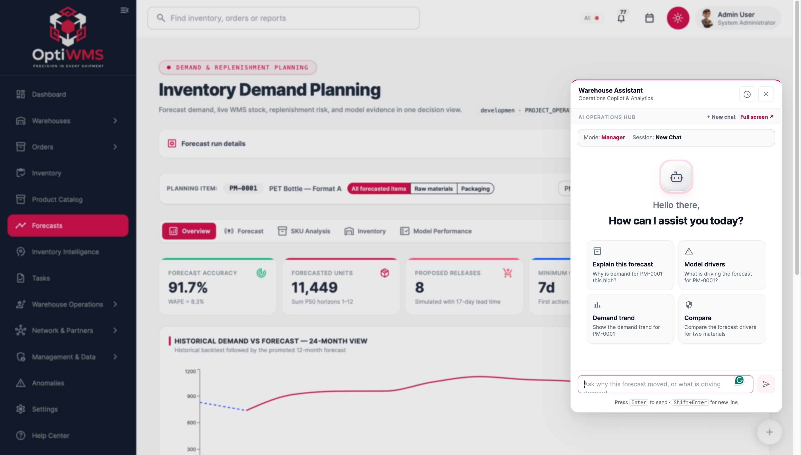 | 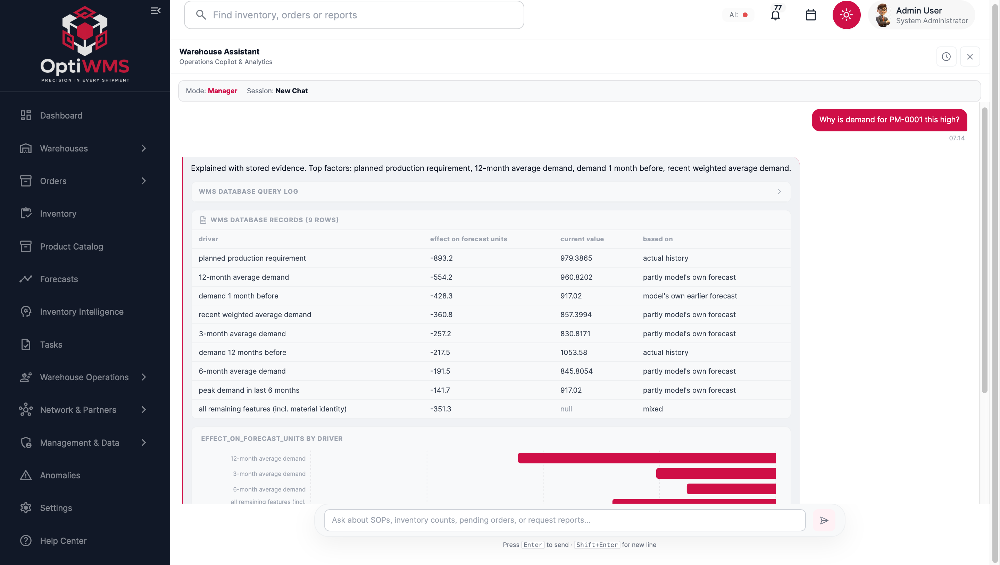 |

## Technology

| Layer | Main technologies |
| --- | --- |
| Frontend | Next.js 14.2.5, React 18.3, TypeScript 5.5, Tailwind, DaisyUI |
| Worker PWA | Web App Manifest, Service Worker, IndexedDB, QR scanning and background replay on reconnect |
| Core API | Java 21, Spring Boot 3.3, Spring Security/JWT, Gradle |
| Live routing UI | Spring Server-Sent Events, recovery polling and database-backed route versions/reservations |
| Persistence | PostgreSQL 16, Flyway 10.21 |
| Forecast runtime | Python 3.12, FastAPI, pandas, scikit-learn, LightGBM |
| Neural evaluator | Python 3.12, Keras 3.15, TensorFlow 2.20 |
| Statistical evaluation | NumPy, SciPy, statsmodels |
| Optimization | OR-Tools 9.10+ MILP and integer min-cost flow |
| Warehouse assistant | FastAPI, LangChain, Chroma, MiniLM embeddings, Gemini |
| Verification | JUnit/Mockito, pytest, TypeScript build, shell acceptance scripts and executed Jupyter notebooks |
| Runtime | Docker Compose |

## Repository Layout

```text
OptiWMS/
|-- backend/
|   |-- core-domain/          Domain entities and contracts
|   |-- core-app/             Application/business services
|   |-- core-api/             HTTP API, security and routing control
|   |-- infra/                Persistence and Flyway migrations
|   `-- integration/          Integration support
|-- frontend/                 Next.js admin and worker PWA
|-- ai_services/
|   |-- forecast-service/     Forecast serving and governance
|   |-- orchestrator-service/ Forecast run orchestration
|   |-- slotting-service/     OR-Tools physical slotting
|   `-- ai-agent/             SOP RAG only; live facts use Spring typed tools
|-- Ai miroservices/modeling/
|   |-- v8_controlled_synthetic_validation/  Current project evidence
|   |-- project_operational_baseline/        Shared V3 evaluator baseline
|   |-- evaluator_forecasting/               Time-series/neural contracts
|   `-- warehouse_routing_evaluation/        Routing benchmark/notebook
|-- infra/                    Core Docker Compose definitions
|-- scripts/                  Load, build and acceptance scripts
|-- docs/
|   |-- deliverables/         Final report, user manual and presentation (PDF)
|   |-- screenshots/          README figures and the full interface gallery
|   |-- ai/                   Forecast runbooks, gates and experiment records
|   `-- openapi/              Published API contracts
|-- Help/                     Class, schema and operational reference documents
|-- AGENTS.md                 Contributor guide for the agentic assistant
|-- SETUP.md                  Clone-to-running instructions
`-- report.md                 Final evaluator-oriented project report
```

The v1–v7 modeling directories are retained research history. They are not the
current runtime source of truth.

## Prerequisites

- Docker Desktop with Compose v2;
- Java 21;
- Node.js 20 recommended;
- repository Python environment at `.venv`;
- clean Python 3.12 evaluator environment at `.venv-evaluator`;
- `jq` and PostgreSQL `psql` for the live routing acceptance script.

Commands below assume the repository root:

```bash
cd /Users/k.e.oshada/Documents/OptiWMS
```

## Build and Run

### Fast local development (Docker database only)

For day-to-day UI and Spring work, keep only PostgreSQL in Docker and run the
application processes locally. This avoids rebuilding containers after every
source change:

```bash
docker compose -f infra/docker-compose.db.yml up -d db

cd backend
./gradlew :core-api:bootRun

# In a second terminal
cd frontend
npm run dev
```

The local Spring profile connects to `localhost:5434`; Next.js connects to the
local Spring API using `frontend/.env.local`. Use the complete bootstrap below
for clean clones, dataset refreshes, CI acceptance, or deployment packaging.

### First-time complete project sequence

For a clean developer clone, copy and review the AI environment and run the
supported one-command bootstrap:

```bash
cp ai_services/.env.example ai_services/.env
./scripts/dev-bootstrap.sh
```

If ordinary development processes already use ports 8080 or 3000, use for
example `BACKEND_HOST_PORT=18080 FRONTEND_HOST_PORT=13000
./scripts/dev-bootstrap.sh`.

It starts PostgreSQL/Spring, waits for Flyway, runs the idempotent forecast
bootstrap, verifies exactly 144 project materials and 1,440 canonical H1-H12
rows, checks the promoted model/checksum, starts forecast/orchestrator/slotting,
removes stale `.next` output and builds the frontend. It refuses to replace a
populated unmarked database. `--refresh-project-data` is only for a disposable
development database.

After bootstrap, Spring creates review-only forecast/policy evidence daily at
02:15 Asia/Colombo and a low-disruption slotting draft on the first day of each
month. These jobs never approve purchasing or physical moves. Override the
`intelligence.policy.cron` / `intelligence.slotting.cron` properties, or set
`intelligence.scheduling.enabled=false`, when another production scheduler owns
the cadence.

The following is the supported order for a clean evaluator workstation. AI
services and the assistant are started after the transactional WMS so that
their health checks and data contracts have an operational source.

```text
Docker Desktop
  -> PostgreSQL + Spring/Flyway
  -> v8 project population
  -> Next.js admin/worker application
  -> forecast/orchestrator/slotting services
  -> optional warehouse assistant
  -> health, test and browser checks
```

Do not run the v8 loader against a database that contains irreplaceable
operational data without first reviewing its transaction and replacement
scope. The supplied population is project/evaluator data.

### 1. Build and start PostgreSQL/Spring

```bash
./scripts/build_backend_runtime.sh
```

This builds the Spring boot JAR with the host Gradle cache, packages it with
`backend/Dockerfile.runtime`, runs Flyway and preserves the PostgreSQL volume.

### 2. Load or refresh the v8 project population

Run this only for a new database or after v8 artifacts change:

```bash
./.venv/bin/python scripts/load_project_operational_simulation.py
```

The loader publishes the material/BOM/demand/forecast/physical inventory/
location/slotting population transactionally and validates post-load counts.

### 3. Build the frontend standalone output

```bash
cd frontend
npm install
npm run build
cd ..
```

Package and start the verified standalone server:

```bash
docker compose \
  -f infra/docker-compose.yml \
  -f infra/docker-compose.runtime.yml \
  build frontend

docker compose \
  -f infra/docker-compose.yml \
  -f infra/docker-compose.runtime.yml \
  up -d --force-recreate frontend
```

If host port `3000` is already in use, select another host port without
changing the container:

```bash
FRONTEND_HOST_PORT=3001 docker compose \
  -f infra/docker-compose.yml \
  -f infra/docker-compose.runtime.yml \
  up -d --force-recreate frontend
```

For local frontend development:

```bash
cd frontend
npm run dev
```

### 4. Start AI services

```bash
test -f ai_services/.env || cp ai_services/.env.example ai_services/.env
cd ai_services
docker compose -f docker-compose.ai.yml up -d --build \
  forecast-service orchestrator-service slotting-service
cd ..
```

Review secrets, database URLs and service tokens before any non-development
deployment.

### 5. Start the warehouse assistant

Create the agent environment file and supply a valid `GOOGLE_API_KEY`:

```bash
test -f ai_services/ai-agent/.env || \
  cp ai_services/ai-agent/.env.example ai_services/ai-agent/.env

cd ai_services/ai-agent
../../.venv/bin/pip install -r requirements.txt
../../.venv/bin/python -m uvicorn api:app \
  --host 0.0.0.0 --port 8000
```

The checked-in vector store is built from the SOP documents under
`ai_services/ai-agent/docs`. To rebuild it after changing SOPs:

```bash
cd ai_services/ai-agent
../../.venv/bin/python ingest.py
```

### 6. Verify the running project

```bash
curl -fsS http://localhost:8080/actuator/health
curl -fsS http://localhost:8091/health
curl -fsS http://localhost:8092/health
curl -fsS http://localhost:8093/health
curl -fsS http://localhost:8000/health   # only when the assistant is running

docker compose \
  -f infra/docker-compose.yml \
  -f infra/docker-compose.runtime.yml ps
```

Then open `http://localhost:3000/admin/login` and
`http://localhost:3000/worker/login`. Confirm the selected warehouse is
`WH-001`, the route graph reports 956 nodes/1,980 directed edges, and the
forecast UI identifies `PROJECT_OPS_EXTRA_TREES_CAUSAL`. Replace `3000` with
the configured `FRONTEND_HOST_PORT` when an alternate host port is used.

### Day-to-day restart

When images, the database volume and v8 population already exist:

```bash
docker compose \
  -f infra/docker-compose.yml \
  -f infra/docker-compose.runtime.yml up -d db backend frontend

cd ai_services
docker compose -f docker-compose.ai.yml up -d \
  forecast-service orchestrator-service slotting-service
```

The standalone assistant must be restarted separately with the command in
Step 5.

### Shared team environment

`infra/deploy` contains the HTTPS team deployment template. After DNS points
to the VM and the versioned GHCR images exist, copy `.env.example`, supply its
values from the VM's secret manager, and provision the canonical dataset once:

```bash
cp infra/deploy/.env.example infra/deploy/.env
docker compose --env-file infra/deploy/.env \
  -f infra/deploy/docker-compose.team.yml --profile provision \
  run --rm forecast-bootstrap
docker compose --env-file infra/deploy/.env \
  -f infra/deploy/docker-compose.team.yml up -d
```

The proxy provides HTTPS plus team-level access control. Application users
still authenticate with Spring JWTs; create a warehouse-assigned read-only
account for chatbot development rather than sharing database credentials.
Operational tools remain available under `/api/v1/assistant/tools`, and the
SOP assistant is proxied at `/agent/ask`.

## Service URLs

| Service | URL |
| --- | --- |
| Frontend | `http://localhost:${FRONTEND_HOST_PORT:-3000}` |
| Admin live route control | `http://localhost:${FRONTEND_HOST_PORT:-3000}/admin/pathfinding` |
| Worker PWA | `http://localhost:${FRONTEND_HOST_PORT:-3000}/worker` |
| Spring API | `http://localhost:8080` |
| Spring health | `http://localhost:8080/actuator/health` |
| Forecast service/OpenAPI | `http://localhost:8091`, `/docs` |
| Orchestrator/OpenAPI | `http://localhost:8092`, `/docs` |
| Slotting service/OpenAPI | `http://localhost:8093`, `/docs` |
| Warehouse assistant/OpenAPI | `http://localhost:8000`, `/docs` |
| PostgreSQL | `localhost:5434` |
| pgAdmin, when started | `http://localhost:5050` |

## Test and Verification

Python services must be tested from their own directories. Do not combine
forecast-service and slotting-service in one pytest process because both use a
top-level package named `app`.

| Test layer | Command | Latest result |
| --- | --- | --- |
| Spring backend | `cd backend && ./gradlew test --no-daemon` | Full suite succeeds |
| Forecast service | `cd ai_services/forecast-service && ../../.venv/bin/python -m pytest tests -q` | 13 passed |
| Slotting service | `cd ai_services/slotting-service && ../../.venv/bin/python -m pytest tests -q` | 6 passed |
| v8 contracts | `cd "Ai miroservices/modeling/v8_controlled_synthetic_validation" && ../../../.venv/bin/python -m pytest tests -q` | 4 passed |
| V3 baseline/notebooks | See [Appendix A.6](report.md#a6-v3-baseline-and-notebook-contract) | 14 passed, 156 subtests |
| Time-series evaluator | See [Appendix A.7](report.md#a7-shared-time-seriesneural-evaluator-tests) | 8 passed |
| Routing evaluator | See [Appendix A.8](report.md#a8-routing-evaluator-tests) | 5 passed |
| Frontend | `cd frontend && npx tsc --noEmit && npm run build` | Passed |
| Live routing | `./scripts/test_worker_routing_runtime.sh` | Passed |
| Solver behaviour | `cd "Ai miroservices/modeling/v8_controlled_synthetic_validation" && python solver_determinism_evidence.py` | MILP 3/3 identical; GA 0/20 identical across 5 seeds |
| Warehouse assistant | Spring contract, warehouse-scope and rate-limit tests; Python syntax/API contract check | Typed tools and removed SQL paths verified |

The complete test-case-by-file catalogue, integration behavior and commands are
in [Appendix A of the final report](report.md#appendix-a--test-catalogue-and-execution).

The old `scripts/smoke_test.sh` checks legacy v1/MLflow artifacts and is not part
of the v8 acceptance path. The inbound/outbound smoke script mutates the
development database and must be supplied explicit test entity IDs.

## Authoritative Notebooks

### v8 forecasting, statistics and end-to-end decision

1. [Controlled data generation](Ai%20miroservices/modeling/v8_controlled_synthetic_validation/00_Controlled_Data_Generation.ipynb)
2. [Demand EDA](Ai%20miroservices/modeling/v8_controlled_synthetic_validation/01_Controlled_Demand_EDA.ipynb)
3. [Features, models and tuning](Ai%20miroservices/modeling/v8_controlled_synthetic_validation/02_Features_Models_And_Tuning.ipynb)
4. [Conv1D-attention challenger](Ai%20miroservices/modeling/v8_controlled_synthetic_validation/02A_Conv1D_Attention_Challenger.ipynb)
5. [Untouched test and hypothesis tests](Ai%20miroservices/modeling/v8_controlled_synthetic_validation/03_Untouched_Test_And_Hypothesis_Tests.ipynb)
6. [Residuals, intervals and policy](Ai%20miroservices/modeling/v8_controlled_synthetic_validation/04_Residuals_Intervals_And_Policy.ipynb)
7. [Statistical conclusion](Ai%20miroservices/modeling/v8_controlled_synthetic_validation/05_Statistical_Conclusion.ipynb)
8. [Final enterprise model decision and E2E](Ai%20miroservices/modeling/v8_controlled_synthetic_validation/06_Final_Enterprise_Model_Decision_And_E2E.ipynb)
9. [Synthetic generation methods and proof](Ai%20miroservices/modeling/v8_controlled_synthetic_validation/07_Synthetic_Data_Generation_Methods_And_Proof.ipynb)

### Shared operational-baseline evaluator

1. [Data contract and lineage](Ai%20miroservices/modeling/project_operational_baseline/00_Data_Contract_And_Lineage.ipynb)
2. [Generation methods and causal proof](Ai%20miroservices/modeling/project_operational_baseline/01_Generation_Methods_And_Causal_Proof.ipynb)
3. [RM/PM EDA and time-series evidence](Ai%20miroservices/modeling/project_operational_baseline/02_RM_PM_EDA_And_Time_Series_Evidence.ipynb)
4. [ABC/FMS and layout evidence](Ai%20miroservices/modeling/project_operational_baseline/03_ABC_FMS_And_Layout_Evidence.ipynb)
5. [Conv1D-attention challenger](Ai%20miroservices/modeling/project_operational_baseline/04A_Conv1D_Attention_Challenger.ipynb)
6. [Model selection and untouched test](Ai%20miroservices/modeling/project_operational_baseline/04_Model_Selection_And_Untouched_Test.ipynb)
7. [Residuals, intervals and risk](Ai%20miroservices/modeling/project_operational_baseline/05_Residuals_Intervals_And_Risk.ipynb)
8. [Inventory policy and slotting readiness](Ai%20miroservices/modeling/project_operational_baseline/06_Inventory_Policy_And_Slotting_Readiness.ipynb)
9. [Executive end-to-end evidence](Ai%20miroservices/modeling/project_operational_baseline/07_Executive_End_To_End_Evidence.ipynb)

### Routing

- [Warehouse routing algorithm evaluation](Ai%20miroservices/modeling/warehouse_routing_evaluation/01_Warehouse_Routing_Algorithm_Evaluation.ipynb)

The shared operational-baseline evaluator notebooks and every CSV/JSON evidence
link are indexed in [Appendix B](report.md#appendix-b--evidence-and-file-index).
All code cells in the indexed current notebooks have non-null execution counts;
setup/import cells may correctly produce no visible output.

## Key Operational APIs

### Core WMS

- `/api/auth`
- `/api/master/warehouses`, `/api/master/locations`,
  `/api/master/materials`, `/api/master/suppliers` and
  `/api/master/customers`
- `/api/orders` and `/api/orders/{orderId}/items`
- `/api/operations/receiving`, `/api/operations/putaway` and
  `/api/quality-checks`
- `/api/inventory` and `/api/inventory/calculate`
- `/api/operations/cycle-counts` and
  `/api/operations/cycle-count-schedules`
- `/api/operations/stock-transfers`
- `/api/operations/picking`, `/api/packing` and `/api/shipments`
- `/api/returns`, `/api/tasks`, `/api/notifications`, `/api/analytics`,
  `/api/reports` and `/api/sops`

### Forecasting and planning

- `GET /api/ai/forecasts`
- `GET /api/ai/forecast-history`
- `GET /api/ai/forecast-backtests`
- `GET /api/ai/forecast-interval-calibration`
- `GET /api/ai/forecast-dashboard-summary`
- `POST /api/ai/jobs/forecast-run`
- `/api/v1/forecast-space/policy-runs`
- `/api/v1/slotting/plans`
- `/api/planning/bom`

### Worker routing

- `GET /api/routing/graph`
- `POST /api/routing/graph/rebuild`
- `POST /api/routing/sessions`
- `GET /api/routing/sessions/{id}`
- `POST /api/routing/sessions/{id}/progress`
- `POST /api/routing/sessions/{id}/cancel`
- `GET /api/routing/fleet`
- `GET /api/routing/stats`
- `GET /api/routing/events`

### Warehouse assistant

- `GET http://localhost:8000/health`
- `POST http://localhost:8000/ask`
- `GET /api/v1/assistant/tools/sku-outlook`
- `GET /api/v1/assistant/tools/inventory-risks`
- `GET /api/v1/assistant/tools/recommendations/{id}/explanation`
- `GET /api/v1/assistant/tools/planning-cycles/{id}`

All Spring tool endpoints and the SOP `/ask` endpoint require a user JWT. The
SOP service validates that identity against Spring and returns the common
`answer`, `citations`, `facts`, `warnings`, `toolCalls`, `correlationId`
contract. See
[`docs/openapi/optiwms-assistant-tools.yaml`](docs/openapi/optiwms-assistant-tools.yaml)
for teammate integration examples. The removed `/ask-data` and `/query-sql`
routes are not part of the supported architecture.

See [the route setup document](frontend/PATHFINDING_SETUP.md) for the full
worker/admin lifecycle and security boundary.

## Verification Coverage by Feature

The test totals must not be interpreted as uniform coverage. This traceability
summary shows what is and is not currently proven:

| Capability group | Automated evidence | Manual/live evidence | Remaining gap |
| --- | --- | --- | --- |
| Forecasting/time-series | Service, leakage, deterministic seed, normalization, spectral and notebook contracts | UI/model-identity inspection | Representative external history |
| Inventory min/max | Baseline policy/capacity contracts and Spring supporting-service tests | Notebook evidence and UI review | Dedicated policy approval/rollback integration test |
| Physical MILP slotting | OR-Tools unit/integration and full-population feasibility tests | Admin plan review | Execution-at-scale and real-site validation |
| Routing | Algorithm, rack geometry, concurrency and live database acceptance | Authenticated worker/admin map check | Long-duration fairness, RTLS and safety certification |
| Core WMS masters | Selected warehouse/location/capacity services | Admin CRUD inspection | Full controller authorization and CRUD integration matrix |
| Inbound/quality/putaway | No dedicated automated end-to-end suite | Mutating inbound-to-outbound smoke workflow and PWA inspection | Repeatable seeded integration and browser tests |
| Inventory/cycle count/transfer | Supporting repository/contract checks only | PWA/admin inspection | Transaction, concurrency and offline-replay integration tests |
| Outbound/picking/packing/shipping | Routing tests cover movement only | Mutating smoke workflow and PWA inspection | Allocation-to-delivery automated journey |
| Returns | None dedicated | UI/API inspection | Lifecycle and exception integration tests |
| PWA/offline sync | TypeScript and production build | Browser/offline inspection | Playwright service-worker, retry and conflict tests |
| Warehouse assistant | Spring contract, scope and rate-limit tests; TypeScript/build and source guard review | Authenticated typed-tool and SOP inspection | Broader prompt-injection and retrieval-quality evaluation |
| Reports/analytics | Report service JUnit tests | Dashboard/report inspection | Scheduled-run and export integration coverage |

The report’s [Appendix A](report.md#appendix-a--test-catalogue-and-execution)
contains commands, test files, case descriptions and proposed missing
acceptance cases for both AI and non-AI functions.

## Enterprise WMS Position

OptiWMS is a research-grade integrated project, not a claim of commercial
feature parity with SAP EWM, Oracle WMS Cloud, Manhattan Active WM, Blue Yonder
WMS or Microsoft Dynamics 365 Warehouse Management. Its distinguishing project
contribution is transparent forecast/statistical evidence connected to
min/max, physical MILP slotting and conflict-aware worker routes. Commercial
enterprise suites remain ahead in high availability, SSO/MFA, multi-company
configuration, wave/value-added processes, engineered labor,
transport execution, MHE/robotics integration,
localization and vendor
support. The researched feature comparison and source links are in
[Chapter 2 of the report](report.md#23-enterprise-wms-benchmark).

## Development Credentials

The development seed creates:

```text
username: admin
email:    admin@optiwms.com
password: admin123
```

These and the Compose fallback secrets are development-only. Replace the JWT,
database, service and pgAdmin secrets outside local development.

## Governance and Limitations

- Never label the current dataset as externally observed customer history.
- Never rename one model as another in the UI or report.
- Never calculate residual evidence from forward-only forecast rows.
- Never approve an infeasible/fallback slotting plan as optimal.
- Never mutate inventory only because a recommendation was generated.
- Never treat route reservations as a certified collision-avoidance system.
- Never allow the assistant to approve or execute forecast, min/max, MILP or
  routing decisions.
- Do not expose the assistant data endpoints outside the controlled environment
  until JWT, role/warehouse scoping, SQL parsing and audit/rate limits are
  enforced.
- Preserve dataset/model/run versions, evaluation origins, approvals and
  execution evidence.

External deployment still requires representative real issue history, a
physical warehouse survey, measured vehicle/load envelopes, RTLS validation,
shadow-mode testing, manager approval and site safety certification. Next.js
14.2.5 also requires a security-upgrade regression cycle.

## Further Documentation

**Deliverables**

- [Final report (PDF)](docs/deliverables/OptiWMS-Final-Report.pdf) · [User manual (PDF)](docs/deliverables/OptiWMS-User-Manual.pdf) · [Presentation (PDF)](docs/deliverables/OptiWMS-Presentation.pdf)
- [Final project report in Markdown](report.md)

**Running and building**

- [Clone to running](SETUP.md)
- [Deploying on AWS](docs/DEPLOYMENT.md)
- [Database seed and restore](scripts/README_SEED.md)
- [AI services overview](ai_services/README.md)

**Current status and design**

- [Current implementation status](Ai%20miroservices/modeling/CURRENT_STATUS.md)
- [Agentic assistant contributor guide](AGENTS.md)
- [Worker-routing workflow log](docs/WORKER_ROUTING_IMPLEMENTATION_LOG.md)
- [v8 modeling and physical population](Ai%20miroservices/modeling/v8_controlled_synthetic_validation/README.md)
- [Shared operational-baseline evaluator](Ai%20miroservices/modeling/project_operational_baseline/README.md)

**Reference**

- [Database schema](database_schema.md) · [Schema relations](Help/DATABASE_SCHEMA_RELATION_REPORT.md)
- [Backend class documentation](Help/BACKEND_CLASS_DOCUMENTATION.md)
- [Forecast documentation index](docs/ai/README.md)
- [Model release and rollback runbook](docs/ai/MODEL_RELEASE_AND_ROLLBACK_RUNBOOK.md)
- [Forecast go-live punch list](docs/ai/FORECAST_GO_LIVE_PUNCHLIST.md)
- [Interface gallery](docs/screenshots/)

## License

No open-source license is included. Treat the repository as private project
material unless the owner supplies explicit terms.
