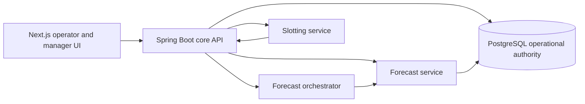

# OptiWMS

OptiWMS is a warehouse management and planning system for a single operational
warehouse. It combines normal WMS execution with demand forecasting, stochastic
inventory policy, ABC/FMS classification, and constrained multi-location
slotting.

The current project is built around one deterministic generated operational
baseline because external customer data is not available. Generated records are
used as normal operational data inside the application. Their seed, version,
hash, assumptions, and quality evidence remain available to administrators and
evaluators. The project does **not** claim that generated-data performance proves
accuracy on an external warehouse.

## Current Scope

OptiWMS currently covers:

- product, raw-material, and packaging-material masters;
- suppliers, customers, warehouses, zones, racks, bins, and handling units;
- versioned finished-good BOMs with raw and packaging components;
- inbound orders, receiving, quality checks, putaway, and inventory placement;
- replenishment, cycle counts, adjustments, and approved stock transfers;
- outbound orders, picking, packing, shipping, returns, and demand feedback;
- 12-month FG/RM/PM demand forecasts with backtest and interval evidence;
- simulation-gated stochastic `(s,S)` inventory policy proposals;
- ABC/FMS classification and forecast-aware multi-bin slotting;
- manager review and approval boundaries for planning decisions.

The chatbot and experimental services are outside the core acceptance path. The
core system must remain usable without them.

## Architecture



### Ownership boundaries

- **PostgreSQL is the business authority.** Materials, inventory, operations,
  forecasts, backtests, policies, classifications, slotting plans, approvals,
  and execution evidence are persisted there.
- **Spring owns operational rules.** It validates requests, applies approval
  rules, persists business state, creates jobs/tasks, and exposes the canonical
  UI APIs.
- **Python owns specialized computation.** It generates evidence, trains and
  serves forecasting artifacts, and solves slotting problems. It does not own a
  competing operational truth.
- **Forecast-service SQLite is service-local state/cache only.** The dashboard,
  inventory policy, and slotting workflows read canonical PostgreSQL-backed
  Spring endpoints.
- **AI output is advisory until approved.** Forecast releases, inventory policy
  proposals, purchase suggestions, and slotting plans retain draft/review/
  approval state.

## Technology

| Layer | Main technologies |
| --- | --- |
| Frontend | Next.js 14, React 18, TypeScript, Tailwind CSS, DaisyUI, React Query, Recharts |
| Core API | Java 21, Spring Boot 3.3, Gradle, Spring Security/JWT, Flyway |
| Database | PostgreSQL 16 |
| AI services | Python 3.11, FastAPI, scikit-learn, OR-Tools |
| Runtime | Docker Compose, Docker Desktop for local development |

## Operational Baseline

`PROJECT_OPERATIONAL_BASELINE_V3` is the reproducible dataset used by the
application. The canonical checkpoint contains:

| Entity | Canonical scale |
| --- | ---: |
| Finished goods | 16 |
| Raw materials | 48 |
| Packaging materials | 32 |
| Total SKUs | 96 |
| Rack structures | 40 |
| Storage positions | 600 |
| Operational stations | 6 |
| Versioned FG BOMs | 16 |
| BOM component lines | 250 |
| Monthly planning history | 72 months |
| Orders | 5,000 |
| Order lines | 15,000 |
| Movements/tasks/events | 30,000 each |

The generator models dimensions, weight, volume, handling-unit multiples, MOQ,
lead time, supplier reliability, shelf life, compatibility, seasonality, trends,
promotions, disruptions, production variance, returns, and correlated demand
shocks. Hidden generator variables are excluded from model features to reduce
target leakage.

The fixed seed is `20260715`. The current dataset hash and exact row counts are
recorded in
[`CURRENT_STATUS.md`](Ai%20miroservices/modeling/CURRENT_STATUS.md) and in the
generated manifest. Generator design and execution are documented in
[`project_operational_baseline/README.md`](Ai%20miroservices/modeling/project_operational_baseline/README.md).

## Planning Intelligence

### Demand forecasting

The active generated-baseline champion is the **responsive Extra Trees configuration** selected through
expanding-window evaluation and an untouched final 12-month test period. It is
not presented as LightGBM. Current checkpoint evidence is:

| Metric | Untouched-test result |
| --- | ---: |
| WAPE | 12.76% |
| MAE | 128.81 |
| RMSE | 488.24 |
| Bias | -1.74% |
| Under-forecast rate | 48.44% |
| P10-P90 empirical coverage | 89.15% |
| Critical-class WAPE | 11.39% |
| Seasonal-naive WAPE | 17.43% |

Forecast publication contains H1-H12 rows for every FG, RM, and PM SKU. The UI
uses separate sources for separate claims:

- actual-demand history for historical and seasonality views;
- rolling backtests for error, residual, and calibration views;
- forward forecast rows for future demand;
- policy simulation output for projected stock and days-of-cover views.

Panels are hidden when their required evidence is unavailable. Forward forecasts
must not be reused as fake residuals or historical actuals.

### ABC/FMS classification

ABC is calculated separately for RM and PM subtypes from annual issued base-unit
volume, excluding returns:

- `A`: cumulative first 80% of annual usage;
- `B`: cumulative 80-95%;
- `C`: remaining usage.

FMS uses annual issue-event frequency within each subtype. Persisted natural-break
thresholds are used where the group supports them; small groups fall back to
terciles, and zero-issue items are non-moving. `AF`, `AM`, and `BF` are treated as
critical classes for accessibility and service decisions.

### Inventory policy

Inventory planning uses a stochastic `(s,S)` policy, not a static saw-tooth
display formula. Proposals use forecast demand, empirical lead-time demand,
calibrated residual uncertainty, MOQ, order multiples, handling units, shelf
life, holding cost, shortage cost, expiry risk, and storage capacity.

Every proposal is compared with the current policy through discrete-event
simulation. A proposal is eligible for approval only when it meets its configured
service target, reduces expected total cost, and introduces no capacity
violation. Approval creates draft purchase suggestions; it does not silently
create purchase orders.

### Slotting and space optimization

The active solver contract is `ORTOOLS_MILP_FLOW_V3`:

1. MILP selects constrained pick-face and relocation decisions.
2. Integer min-cost flow allocates complete reserve demand across multiple bins,
   levels, and racks.

This subsumes the relevant knapsack capacity problem; OptiWMS does not advertise
a separate fake knapsack model. The objective combines travel/accessibility,
relocation cost, overflow, carrying-space cost, and forecast-weighted stockout
risk. Constraints include pallet count, weight, volume, handling-unit multiples,
temperature, hazardous/fragile compatibility, stackability, current occupancy,
and relocation budget.

A feasible plan can allocate one SKU to one or many locations. Manager approval
creates stock-transfer jobs and tasks. Inventory moves only when transfer work is
executed and confirmed.

## Core Workflow

```text
forecast and classification
  -> inventory-policy simulation
  -> manager approval
  -> draft purchase suggestion
  -> inbound receipt and quality check
  -> putaway to approved locations
  -> storage, replenishment, cycle counts, and transfers
  -> outbound pick, pack, and ship
  -> actual-demand feedback for future evaluation/retraining
```

Cancellations, returns, and stock adjustments remain separate from fulfilled
demand so that model history is not silently corrupted.

## Repository Layout

```text
OptiWMS/
|-- backend/                              Spring modular backend
|   |-- core-domain/                      Domain entities and contracts
|   |-- core-app/                         Application services
|   |-- core-api/                         HTTP API and security
|   |-- infra/                            Persistence and Flyway migrations
|   `-- integration/                      Seed/integration support
|-- frontend/                             Next.js application
|-- ai_services/                          FastAPI runtime services
|   |-- forecast-service/
|   |-- orchestrator-service/
|   `-- slotting-service/
|-- Ai miroservices/modeling/             Modeling and evaluator evidence
|   `-- project_operational_baseline/     Deterministic generator/artifacts
|-- infra/                                Core Docker Compose definitions
|-- scripts/                              Build, load, smoke, and workflow tools
`-- docs/                                 Technical assessments and runbooks
```

## Prerequisites

- Docker Desktop with Compose v2
- Java 21
- Node.js 18 or newer
- Python 3.11
- a repository virtual environment at `.venv` with the modeling/loader
  dependencies installed

Commands below assume the shell starts in the repository root.

## Local Rebuild And Start

### 1. Configure AI services

```bash
test -f ai_services/.env || cp ai_services/.env.example ai_services/.env
```

Review database URLs, service ports, tokens, and runtime mode before using any
non-development environment. The checked-in defaults are for local development.

### 2. Build and start PostgreSQL and the backend

```bash
./scripts/build_backend_runtime.sh
```

This is the recommended local backend build. It compiles
`:core-api:bootJar` with the host Gradle cache and packages the JAR with
`backend/Dockerfile.runtime`. It avoids Docker-builder Maven TLS/download
failures and does **not** delete or recreate the PostgreSQL volume.

The ordinary multi-stage Dockerfile remains suitable for a networked CI runner:

```bash
docker compose -f infra/docker-compose.yml up -d --build backend
```

### 3. Build and start the planning services

```bash
cd ai_services
docker compose -f docker-compose.ai.yml up -d --build \
  slotting-service forecast-service orchestrator-service
cd ..
```

### 4. Load the operational baseline when required

Run the full loader only for a new database or after generated artifacts change:

```bash
./.venv/bin/python scripts/load_project_operational_baseline.py
```

The loader validates the artifact manifest, performs batched natural-key upserts,
runs post-load integrity checks, and records a load audit. It is transactional
and idempotent for the current dataset version. Existing explicit operator-entered
records are not part of the generated revision cleanup path.

Useful narrower modes are:

```bash
./.venv/bin/python scripts/load_project_operational_baseline.py --validate-only
./.venv/bin/python scripts/load_project_operational_baseline.py --forecast-only
./.venv/bin/python scripts/load_project_operational_baseline.py --planning-only
./.venv/bin/python scripts/load_project_operational_baseline.py --layout-only
```

Do not run the full loader after every container restart. PostgreSQL data persists
in the Docker volume.

### 5. Start the frontend for development

```bash
cd frontend
npm install
npm run dev
```

For a containerized frontend instead:

```bash
docker compose -f infra/docker-compose.yml up -d --build frontend
```

## Service URLs

| Service | URL |
| --- | --- |
| Frontend | `http://localhost:3000` |
| Spring API | `http://localhost:8080` |
| Spring health | `http://localhost:8080/actuator/health` |
| Forecast service | `http://localhost:8091` |
| Forecast OpenAPI | `http://localhost:8091/docs` |
| Orchestrator service | `http://localhost:8092` |
| Orchestrator OpenAPI | `http://localhost:8092/docs` |
| Slotting service | `http://localhost:8093` |
| Slotting OpenAPI | `http://localhost:8093/docs` |
| PostgreSQL | `localhost:5434` |
| pgAdmin, when started | `http://localhost:5050` |

Quick health check:

```bash
curl -fsS http://localhost:8080/actuator/health
curl -fsS http://localhost:8091/health
curl -fsS http://localhost:8092/health
curl -fsS http://localhost:8093/health
```

## Canonical Planning APIs

Spring exposes the operational contracts consumed by the frontend:

- `GET /api/ai/forecasts` - paginated PostgreSQL-backed forward forecasts;
- `GET /api/ai/forecast-history` - actual demand history;
- `GET /api/ai/forecast-backtests` - rolling backtest predictions/residual input;
- `GET /api/ai/forecast-interval-calibration` - interval evidence;
- `GET /api/ai/forecast-dashboard-summary` - bounded dashboard aggregation;
- `POST /api/ai/jobs/forecast-run` - asynchronous forecast recalculation;
- `/api/v1/forecast-space/policy-runs` - policy proposals and simulation evidence;
- `/api/v1/slotting/plans` - slotting plan lifecycle and approval;
- `/api/planning/bom` - versioned BOM master and component management.

List endpoints are paginated. Heavy forecasting and optimization actions should
return jobs rather than hold an HTTP request open.

## Verification

### Backend

```bash
cd backend
./gradlew test --no-daemon
```

### Frontend

```bash
cd frontend
npx tsc --noEmit
npm run build
```

### Generated baseline contract

```bash
cd "Ai miroservices/modeling/project_operational_baseline"
../../../.venv/bin/python -m pytest tests/test_baseline_contract.py -q
```

### Slotting solver

```bash
cd ai_services/slotting-service
../../.venv/bin/python -m pytest tests -q
```

### Workflow smoke tests

```bash
./scripts/smoke_test.sh
./scripts/smoke_inbound_to_outbound_flow.sh
```

Before claiming end-to-end completion, verify the Docker health checks, the
canonical-scale API pagination, and the manager workflows in both desktop and
mobile browser viewports. The exact latest verification results and unresolved
items belong in [`CURRENT_STATUS.md`](Ai%20miroservices/modeling/CURRENT_STATUS.md),
not in evergreen README claims.

## Development Credentials

The development seed creates:

- email: `admin@optiwms.com`
- password: `admin123`

These credentials and the Compose fallback secrets are development-only. Set a
strong `JWT_SECRET`, database credentials, service tokens, and pgAdmin credentials
outside local development. Do not delete the admin row as a login troubleshooting
step; use an explicit credential reset or a controlled development database reset.

## Data And Governance Rules

- Never label generated history as externally observed customer data.
- Never rename one algorithm as another in the UI or evaluator evidence.
- Never compute residual/model metrics from forward-only forecast rows.
- Never publish an infeasible fallback slotting result as an approvable optimum.
- Never mutate inventory merely because a recommendation was generated.
- Preserve source lineage, run IDs, model versions, evaluation splits, approval
  decisions, and execution evidence.

## Further Documentation

- [Current implementation and verification status](Ai%20miroservices/modeling/CURRENT_STATUS.md)
- [Operational baseline generator](Ai%20miroservices/modeling/project_operational_baseline/README.md)
- [Forecast go-live punch list](docs/ai/FORECAST_GO_LIVE_PUNCHLIST.md)
- [Model release and rollback runbook](docs/ai/MODEL_RELEASE_AND_ROLLBACK_RUNBOOK.md)
- [Forecast-to-space implementation checklist](docs/FORECAST_SPACE_IMPLEMENTATION_CHECKLIST.md)
- [HEMAS capability assessment](docs/HEMAS_SOLUTION_REPO_CAPABILITY_ASSESSMENT.md)

## License

No open-source license is currently included in this repository. Treat the code
as private project material unless the project owner supplies explicit terms.
