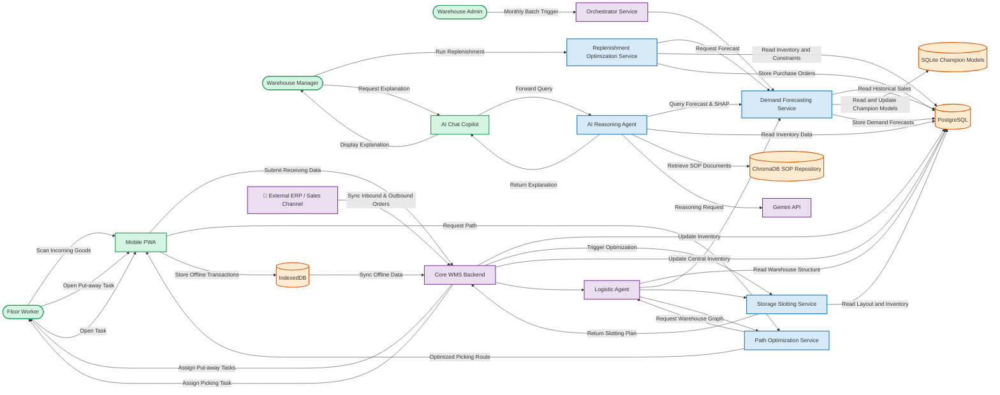

# OptiWMS - End-to-End Core WMS & AI Workflows

This document serves as the comprehensive manual for the operational and artificial intelligence workflows within the **OptiWMS** ecosystem. It details how transactional states in the Java backend map to mathematical calculation engines in Python, specifying triggers, inputs, outputs, database tables, and state transitions.

---

## 🌐 System Topology & Flowchart

The diagram below outlines the system-wide integration across the **Client Tier**, **Core Monolith**, **AI Advisory Tiers**, and **Storage Tier**:



---

## 📥 Section 1: Inbound Operations Workflows

The inbound lifecycle governs the receipt, quality verification, and optimal storage layout calculation of incoming inventory.

```
[ERP Purchase Order] ──(Sync)──> [Spring Boot WMS] ──> [Create Task (Pending)]
                                     │
                             (Mobile worker scans)
                                     ▼
[PostgreSQL DB] <──(Receive)── [Mobile PWA (Dexie)]
       │
 (Trigger AI Slotting)
       ▼
[FastAPI Slotting] ──(MILP/Heuristic)──> [WMS Put-away Tasks] ──> [Staged Bin]
```

### 1.1 Inbound Order Integration & Scheduling
* **Trigger**: A Purchase Order (PO) is generated in the **External ERP** and synchronized to the WMS Core backend via `POST /api/orders` (type: `inbound`). 
* **State Transition**: `CREATED` $\rightarrow$ `PENDING`.
* **Database Updates**: Writes to the `orders` and `order_items` tables.
* **Task Generation**: [`InboundOrderWorkflowService.java`](file:///c:/Users/User/Documents/GitHub/OptiWMS/backend/core-app/src/main/java/com/optiwms/coreapp/orders/InboundOrderWorkflowService.java) catches the order event and creates unassigned `receiving` tasks (status: `pending`) for each order line.

### 1.2 Blind Receiving & Inspection
* **Trigger**: A worker opens the Mobile PWA, clicks `Inbound Tasks`, and assigns a pending task to themselves.
* **Worker Execution**: The worker performs **blind receiving** (expected quantities are hidden from the UI to prevent lazy verification). The worker scans the barcodes, entering the physical counts manually.
* **State Transition**: Order status changes from `PENDING` $\rightarrow$ `RECEIVING` $\rightarrow$ `RECEIVED` (or `PARTIALLY_RECEIVED` if counts mismatch).
* **Database Updates**: `tasks` table updates (`status = 'completed'`, `assigned_to = worker_id`). Mismatches create discrepancy records in `discrepancy_logs`.

### 1.3 Quality Control & Returns
* **Trigger**: If receiving counts fail tolerances or products are flagged as damaged, a discrepancy is logged.
* **Worker Execution**: Damaged items are staged in a **QC Hold Zone** (Zone `QC`).
* **Java Logic**: [`ReturnService.java`](file:///c:/Users/User/Documents/GitHub/OptiWMS/backend/core-app/src/main/java/com/optiwms/coreapp/operations/ReturnService.java) initializes a return workflow, prompting the supervisor to review the discrepancy logs and approve quarantine, scrap, or return to vendor.

### 1.4 Storage Slotting Optimization (Heuristics & MILP)
* **Trigger**: Upon PO completion, the supervisor clicks **"Run Slotting Optimization"** on the admin portal.
* **FastAPI Call**: Spring Boot triggers `POST /api/v1/slotting/plan/optimize` with `use_milp_a_class=true` in [`SlottingPlanClient.java`](file:///c:/Users/User/Documents/GitHub/OptiWMS/backend/core-app/src/main/java/com/optiwms/coreapp/slotting/SlottingPlanClient.java).
* **AI Execution**:
  1. **ABC-FMS Heuristics**: Pre-slots all incoming SKUs based on historical sales velocity class (Fast $\rightarrow$ Zone A pick-face; Slow $\rightarrow$ Zone D/Level 5).
  2. **MILP Refinement**: Runs a Mixed-Integer Linear Program (using PuLP) to assign fast-moving A-class SKUs to golden pick-face racks, minimizing travel time under volume/weight limits.
  3. **Offline GA Simulator**: Evaluates alternative trade-offs using a Genetic Algorithm (DEAP) for planning.
* **Output**: A collection of suggested layout changes limited by the relocation move budget percentage.
* **State Transition**: Creates put-away tasks (`task_type = 'putaway'`, `status = 'pending'`) mapping the staged pallet to the selected optimal bin location.

---

## 📤 Section 2: Outbound Operations Workflows

The outbound lifecycle handles order ingestion, picker route optimization, packing verification, and shipment dispatch.

```
[ERP Sales Order] ──(Sync)──> [Spring Boot WMS] ──> [Auto-Allocate Inventory]
                                                         │
                                               (Trigger A* Pathfinder)
                                                         ▼
[PWA Route Screen] <──(Sequence Bins)── [FastAPI Path Optimization]
       │
 (Pick Items)
       ▼
[Packing Verification] ──> [Ready to Ship] ──> [Carrier Handover]
```

### 2.1 Outbound Order Ingestion & Inventory Allocation
* **Trigger**: Customer sales orders are synced from the **External ERP** via `POST /api/orders` (type: `outbound`).
* **State Transition**: `CREATED` $\rightarrow$ `PENDING`.
* **Allocation Logic**: [`OutboundOrderWorkflowService.java`](file:///c:/Users/User/Documents/GitHub/OptiWMS/backend/core-app/src/main/java/com/optiwms/coreapp/orders/OutboundOrderWorkflowService.java) reads order items, checks active inventory positions, and creates `picking` tasks. It locks stock in PostgreSQL using a FIFO algorithm (`locationAllocationComparator`) to avoid double-allocation.

### 2.2 Path Optimization (A*)
* **Trigger**: A picker assigns an outbound order on their Mobile PWA.
* **FastAPI Call**: The PWA requests the pick route. The WMS backend calls `POST /api/orders/process` on the `logistic-agent` coordinator, which calls `path-optimization-service`.
* **AI Execution**:
  - The pathfinder reads the warehouse map graph (nodes = aisles, bays; edges = travel segments).
  - It runs the **A\* Search Algorithm** (`astar.py`) using Euclidean distance heuristics, outputting the shortest sequential path visiting all pick nodes without backtracking.
* **Output**: An ordered location list (e.g. `[A-01, A-04, B-02]`), estimated travel times, and directions.

### 2.3 Task Execution & Offline Sync
* **Trigger**: The worker picks items physically following the PWA route directions.
* **PWA Offline Mode**: If the worker loses network connection in aisle blind spots, the PWA intercepts requests, queues transaction details in **IndexedDB (Dexie.js)**, and allows execution to proceed.
* **Sync Trigger**: Once Wi-Fi reconnects, the PWA background worker uploads queued items to Spring Boot.
* **Database Updates**: Decrements stock from `inventory_items` and updates the pick task to `completed`.

### 2.4 Packing & Carrier Shipping
* **Trigger**: Items are brought to the packing station.
* **Execution**: The packer scans items into shipping cartons. The WMS matches dimensions against packaging rules.
* **State Transition**: `PICKED` $\rightarrow$ `PACKING` $\rightarrow$ `READY_TO_SHIP`.
* **Handover**: The WMS generates shipping labels (via Apache PDFBox/JasperReports) and hands over the load to delivery partners. The order state transitions to `SHIPPED`.

---

## 🔄 Section 3: Inventory Control Workflows

Inventory control preserves physical-to-digital database synchronization through counts and relocations.

### 3.1 Cycle Counting
* **Trigger**: Scheduled by the Admin (e.g., ABC-class frequency) or triggered on-demand (e.g., negative stock warnings).
* **Task Creation**: Spring Boot creates `cycle_count` tasks.
* **Worker Execution**: The worker counts items in specific locations. Mismatches trigger a discrepancy state (`status = 'discrepancy'`).
* **Approval Flow**: Large variances require supervisor approval in the dashboard. Upon approval, PostgreSQL inventory records are adjusted.

### 3.2 Stock Transfer / Replenishment Pulls
* **Trigger**: When pick-face inventory falls below the replenishment threshold (derived from safety stock).
* **Task Creation**: WMS creates a relocation task (`task_type = 'replenishment'`) directing the driver to move pallets from Bulk/Reserve racks to Pick-face slots.

---

## 🧠 Section 4: AI Optimization Pipelines

The Python/FastAPI Intelligence Node hosts stateless mathematical optimization models accessed by Spring Boot via REST APIs.

### 4.1 Demand Forecasting Pipeline (`forecast-service`)
* **Core Goal**: Provide future demand projections to calculate risk-aware safety stock.
* **Pipeline Flow**:
  1. **Batch Training**: Triggered asynchronously via `Orchestrator Service`. Compares boosting models (XGBoost, CatBoost) against statistical models (ARIMA/SARIMA, ETS) using rolling-origin cross-validation.
  2. **Champion Registry**: Evaluates candidates against strict acceptance gates (WAPE $\le$ 0.135, absolute bias $\le$ 0.10). Promotes the best model to the **SQLite Model Registry**.
  3. **Live Online Inference**: Spring Boot calls `/artifacts/infer-boosting-online` during reviews. If model artifacts fail to load, the service triggers a statistical fallback baseline (`snaive12` or `last_value`).

### 4.2 Replenishment Optimization Pipeline (`replenishment-service`)
* **Core Goal**: Minimize holding and procurement costs.
* **Pipeline Flow**:
  1. **Safety Stock calculation**: Evaluates SKU demand volatility (XYZ) and value (ABC) to determine target service levels. Computes:
     $$SS = Z \times \sqrt{L \times \sigma_d^2 + d^2 \times \sigma_L^2}$$
     where $L$ is lead time, $\sigma_d$ is demand variance, and $\sigma_L$ is lead-time variance.
  2. **MIP Optimization Solver**: Solves a Mixed-Integer Linear Program (MILP) using Python-MIP:
     - **Objective**: Minimize procurement costs + holding costs.
     - **Constraints**: Enforces MOQ limits, supplier capacity limits, bulk-discount tiers, and warehouse physical bin capacities.
  3. **Explanations**: Runs `explainer.py` to compile cost/benefit waterfalls, detailing why orders were scaled up/split.

### 4.3 AI Chat Copilot & Reasoning (`ai-agent`)
* **Core Goal**: Conversational operations support and report generation.
* **Pipeline Flow**:
  1. **SOP Lookup (RAG)**: Uses LangChain to chunk and embed warehouse SOP markdown files. When a user asks about rules, it queries a **Chroma Vector DB** and prints a Gemini-grounded response.
  2. **Natural-Language-to-SQL (Text-to-SQL)**: Converts queries like *"Show me the fastest-moving SKUs"* into clean SQL commands, executes them against PostgreSQL, and formats the output into tables or Matplotlib graphs.
  3. **Google Gemini Integration**: Uses Gemini 1.5 Flash (via Google GenAI SDK) to orchestrate conversational prompts.

### 4.4 Forecast Explanation Pipeline (SHAP & Gemini Integration)
* **Core Goal**: Explain the underlying drivers of demand forecasts to planners.
* **Pipeline Flow**:
  1. **Pre-computation (SHAP)**: During the forecast execution run, the `shap_service.py` module in the `forecast-service` loads the active model artifact (XGBoost/CatBoost) and initializes a `shap.TreeExplainer` on the model internals.
  2. **Attribution persistence**: It computes SHAP feature attributions on the live inference rows, maps technical feature names (e.g. `lag_1`, `roll_mean_6`, `stockout_days_lag1`) to human-readable terms, filters out categorical dummies, and persists the top-N driving features to the `forecast_shap_explanations` table.
  3. **Explanation API Routing**: When a user clicks "Explain Forecast" on the UI, the frontend queries the AI Agent's `explain_router.py` endpoint (`POST /api/explain/forecast`).
  4. **LLM Synthesis**: The AI agent queries the SHAP values from the `forecast-service` API (`GET /api/v1/shap/explanation`), structures the attributions, and invokes `gemini-2.5-flash` using the `google-genai` client SDK to translate the mathematical vectors into a 3-6 sentence plain English supply chain explanation.
