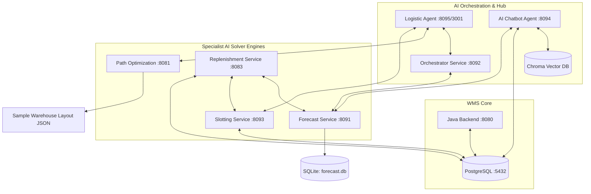

# OptiWMS AI Microservices Hub

Welcome to the **OptiWMS AI Microservices** documentation repository. This directory serves as a centralized hub for all AI-powered services within the OptiWMS ecosystem. These services are written in Python (using FastAPI) and interface with the main Java WMS backend and database to offer real-time analytics, forecasting, routing, and location layout suggestions.

---

## 🏗️ Architecture & Interaction Diagram

The AI services interact with each other and the main WMS infrastructure through HTTP REST APIs, shared databases, and background workers. The central **Logistic Agent** acts as a coordinator for runtime data flows, while the **AI Agent** provides an interactive operations copilot.



---

## 🔌 Service Port Map

The following services form the core AI capabilities of OptiWMS. The default ports are configurable via environment variables in the central [`.env`](file:///c:/Users/User/Documents/GitHub/OptiWMS/ai_services/.env) file.

| Service Directory / Name | Active Port | Description | Key Tech Stack |
| :--- | :--- | :--- | :--- |
| [**`path-optimization-service`**](file:///c:/Users/User/Documents/GitHub/OptiWMS/ai-services/path-optimization-service.md) | `8081` | A* Pathfinding for picking & putaway routes | FastAPI, Python-MIP, Graph APIs |
| [**`forecast-service`**](file:///c:/Users/User/Documents/GitHub/OptiWMS/ai-services/forecast-service.md) | `8091` | Online demand forecasting & metrics | FastAPI, XGBoost/CatBoost, SHAP |
| [**`orchestrator-service`**](file:///c:/Users/User/Documents/GitHub/OptiWMS/ai-services/orchestrator-service.md) | `8092` | Forecast pipeline run triggers & polling | FastAPI, httpx, Background tasks |
| [**`slotting-service`**](file:///c:/Users/User/Documents/GitHub/OptiWMS/ai-services/slotting-service.md) | `8093` | Genetic Algorithm location scoring & optimization | FastAPI, DEAP, Genetic Algorithms |
| [**`ai-agent`**](file:///c:/Users/User/Documents/GitHub/OptiWMS/ai-services/ai-agent.md) | `8094` | RAG Copilot (SOPs) & SQL-based Data Reporter | FastAPI, LangChain, ChromaDB, Gemini |
| [**`replenishment-service`**](file:///c:/Users/User/Documents/GitHub/OptiWMS/ai-services/replenishment-service.md) | `8083` | ABC-XYZ & MILP supplier purchase optimizer | FastAPI, Python-MIP solver, XAI |
| [**`logistic-agent`**](file:///c:/Users/User/Documents/GitHub/OptiWMS/ai-services/logistic-agent.md) | `3001` | Central coordinator & data syncing hub | FastAPI, httpx integration client |

---

## 📂 Detailed Service Documentation

For a comprehensive operational breakdown of what every capability does and its business value, see the [**AI Features & Capabilities Guide**](file:///c:/Users/User/Documents/GitHub/OptiWMS/ai-services/FEATURES.md).

Please click on the links below to explore the detailed technical documentation, APIs, and setup guides for each individual AI microservice:

1. 📊 [**Forecast Service Documentation**](file:///c:/Users/User/Documents/GitHub/OptiWMS/ai-services/forecast-service.md)
   - Learns how demand forecasting is served, how offline artifacts are loaded, the implementation of production acceptance gates, and how fallback baselines are triggered.
2. 🔄 [**Orchestrator Service Documentation**](file:///c:/Users/User/Documents/GitHub/OptiWMS/ai-services/orchestrator-service.md)
   - Explains how cyclical forecast runs are triggered and monitored asynchronously without blocking the UI.
3. 🎯 [**Slotting Service Documentation**](file:///c:/Users/User/Documents/GitHub/OptiWMS/ai-services/slotting-service.md)
   - Details the Genetic Algorithm (using DEAP) that optimizes products placement across racks based on weight, volume, velocity, and hazard constraints.
4. 🗺️ [**Path Optimization Service Documentation**](file:///c:/Users/User/Documents/GitHub/OptiWMS/ai-services/path-optimization-service.md)
   - Explains the A\* search implementation for finding the shortest warehouse routing paths, batch path optimization, and turn-by-turn navigation.
5. 📈 [**Replenishment Service Documentation**](file:///c:/Users/User/Documents/GitHub/OptiWMS/ai-services/replenishment-service.md)
   - Documents the Mixed-Integer Linear Programming (MILP) optimization solver for supplier procurement split decisions, bulk discount calculations, and the Explainable AI (XAI) engine.
6. 💬 [**AI Agent Service Documentation**](file:///c:/Users/User/Documents/GitHub/OptiWMS/ai-services/ai-agent.md)
   - Reviews the operational chat copilot, combining RAG vector stores for SOP queries and NL-to-SQL logic for real-time warehouse data reporting.
7. 🔌 [**Logistic Agent Service Documentation**](file:///c:/Users/User/Documents/GitHub/OptiWMS/ai-services/logistic-agent.md)
   - Describes the central hub designed to synchronize data and coordinate calls between the various isolated solver services.

---

## 🚀 Running the AI Services Locally

### Docker Compose (Recommended)
A consolidated Docker Compose file is located at [`ai_services/docker-compose.ai.yml`](file:///c:/Users/User/Documents/GitHub/OptiWMS/ai_services/docker-compose.ai.yml). It starts the forecast, orchestrator, slotting, and AI agent services.

1. **Configure Environment Variables**:
   Copy the example environment file and edit it:
   ```bash
   cp ai_services/.env.example ai_services/.env
   ```
2. **Start Services**:
   ```bash
   docker compose -f ai_services/docker-compose.ai.yml up --build -d
   ```
3. **Interactive Documentation**:
   - Forecast API: `http://localhost:8091/docs`
   - Orchestrator API: `http://localhost:8092/docs`
   - Slotting API: `http://localhost:8093/docs`
   - AI Agent API: `http://localhost:8094/docs`

### Manual Execution (Python Environment)
Individual services can be run manually. Make sure to activate your Python virtual environment (e.g. `conda activate optiwmsenv`) and install dependencies:
```bash
# Example: Running the AI Agent manually
cd ai_services/ai-agent
pip install -r requirements.txt
uvicorn api:app --reload --host 0.0.0.0 --port 8094
```
