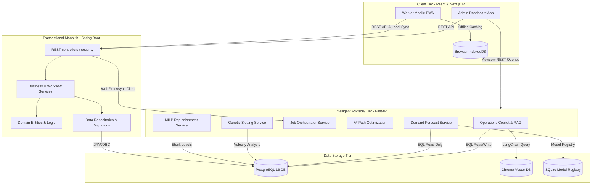
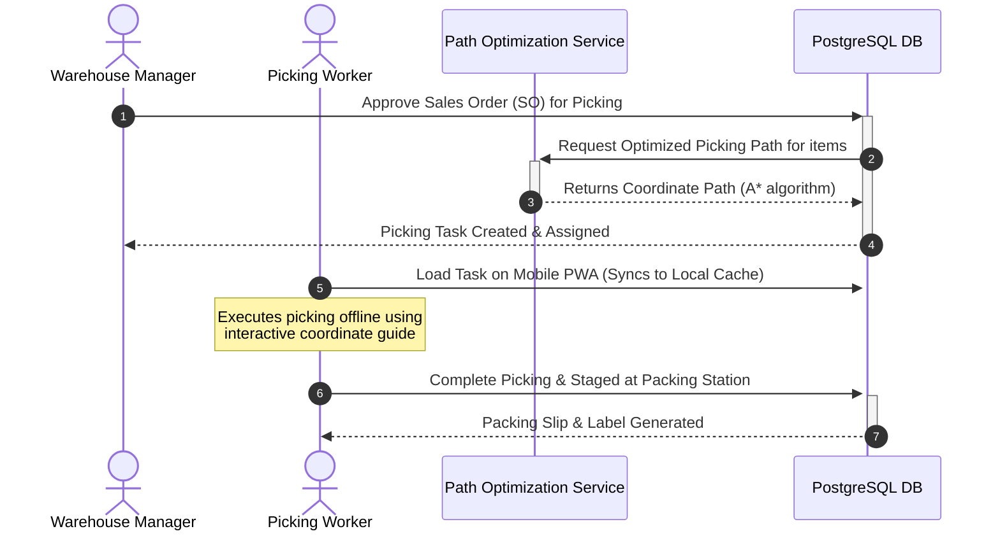
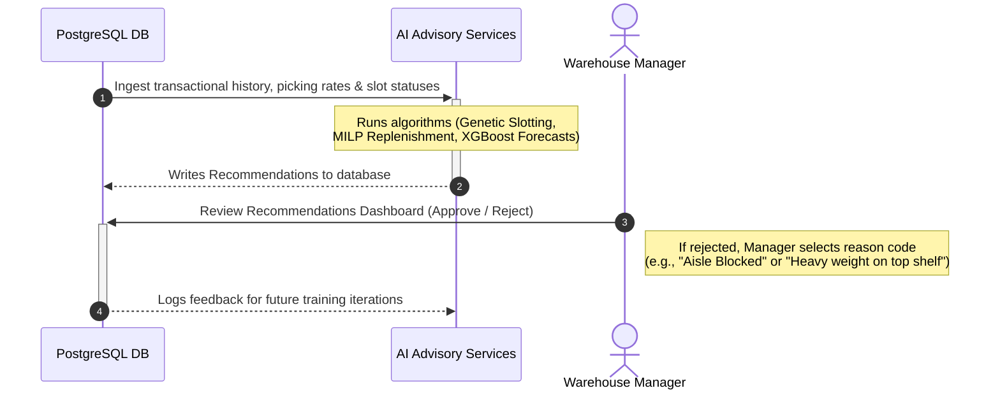

# OptiWMS - System Overview

This document provides a high-level comprehensive overview of the **OptiWMS** Warehouse Management System. It is designed to act as the introduction and architectural foundation for the final project report.

---

## 🌐 Project Introduction & Core Purpose

**OptiWMS** is an enterprise-ready, offline-resilient Warehouse Management System (WMS) integrated with advanced Artificial Intelligence (AI) advisory microservices. Traditional warehouses often suffer from manual entry errors, inefficient picking routes, overstocking, or complete workflow paralysis during network outages. OptiWMS addresses these challenges by:

1. **Optimizing Operational Workflows**: Providing end-to-end coverage of warehouse inventory lifecycles, from supplier dock scheduling to customer package shipment.
2. **Ensuring High Availability & Resilience**: Implementing an offline-first Progressive Web Application (PWA) that allows floor workers to execute tasks (Receiving, Picking, Cycle Counts) even in network blind spots.
3. **Injecting Pluggable AI Intelligence**: Incorporating an advisory layer powered by machine learning and mathematical solvers to optimize demand forecasting, storage slotting, picking routes, and stock replenishment.
4. **Enforcing Governance & "Human-in-the-Loop" Oversight**: Following a design philosophy where AI recommends and predicts, but human managers evaluate, approve, or reject suggestions—ensuring safety and continuous learning.

---

## 🏗️ Core Architecture & Topology

OptiWMS adopts a hybrid architectural blueprint that blends a robust monolithic transaction layer with lightweight, modular Python optimization microservices.



---

## 🔄 High-Level Data & Process Flows

The warehouse workflow is integrated across the Monolith, PWA, and AI layers.

### 1. Inbound Ingestion Flow
```mermaid
sequenceDiagram
    autonumber
    actor IC as Inbound Coordinator
    actor RW as Receiving Worker
    participant DB as PostgreSQL DB
    
    IC->>+DB: Create Purchase Order (PO) & Dock Appointment
    DB-->>-IC: PO Scheduled & Yard Queue updated
    Note over RW, DB: Delivery Truck Arrives at Gate
    RW->>+DB: Perform Vehicle Safety & Temp Inspection
    DB-->>-RW: Inspection Approved, Staged at Dock Door
    RW->>+DB: Fetch Active PO Lines & Execute Blind Receiving
    Note right of RW: Quantity is hidden on screen;<br/>Counts entered manually.
    DB-->>-RW: Flags Discrepancies (if any) for QC
    RW->>+DB: Initiate Putaway Task
```

### 2. Outbound Fulfillment Flow


### 3. AI Feedback Loop (Continuous Optimization)


---

## 🛠️ Main Technology Matrix

* **Backend Transaction Server**:
  - **Language & Framework**: Java 21, Spring Boot 3.3.0
  - **Security**: Spring Security (JWT Session Handling & Role Verification)
  - **Database Persistence**: Spring Data JPA (Hibernate)
  - **Schema Migrations**: Flyway (Schema version history, auto-seeders)
  - **Document Compilation**: Apache PDFBox (physical prints)
* **Databases**:
  - **Relational**: PostgreSQL 16 (core relational data ledger)
  - **Vector Storage**: ChromaDB (standard operating procedures semantic storage)
  - **Local Model Registry**: SQLite (ML model runs, thresholds, status metadata)
* **Frontend Web Application & Mobile PWA**:
  - **Framework**: Next.js 14 (App Router)
  - **UI Libraries**: React 18, Tailwind CSS, DaisyUI, Recharts (responsive analytics)
  - **Client Storage & Offline Capability**: Browser Service Workers & IndexedDB
* **AI & Optimization Microservices**:
  - **Language & Framework**: Python 3.11+, FastAPI, Uvicorn
  - **Machine Learning**: Scikit-Learn, LightGBM, XGBoost, CatBoost, Statsmodels, Prophet
  - **Explainability**: SHAP (Shapley Additive exPlanations)
  - **Operational Solvers**: DEAP (Genetic Algorithms), PuLP (Constraint LP), Python-MIP (Mixed-Integer Linear Programming)
  - **Conversational Engine**: LangChain, Google Generative AI SDK (Gemini APIs)
