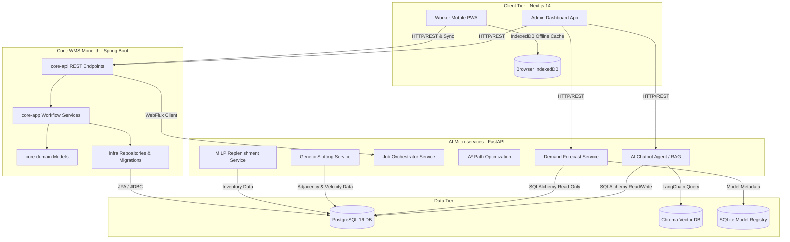

# OptiWMS Technical Stack & Feature Library Mapping

This document provides a comprehensive map of the technology stack, environment configurations, and specific software libraries used by each functional area and service in the **OptiWMS** repository.

---

## 🏛️ System Architecture Overview

OptiWMS is built as a **hybrid layered monolith** supplemented by **Python AI microservices**:
1. **Core WMS Monolith (`backend`)**: Built using Java 21 and Spring Boot 3.3. It handles transaction management, business workflows, database persistence, and API routing.
2. **Frontend Applications (`frontend`)**: Single codebase Next.js 14 App Router application serving:
   - An **Admin Web App** (for management, planning, heatmaps, and scheduling).
   - A **Worker Mobile-First PWA** (offline-first task execution for warehouse floor operations).
3. **AI Microservices Layer (`ai_services`)**: A pluggable advisory layer built on FastAPI (Python) executing machine learning, pathfinding, genetic slotting, linear replenishment optimization, and conversational retrieval.



---

## 💻 Technology Stack Summary

| Layer / Service | Core Technologies | Ports | Primary Data Source |
| :--- | :--- | :--- | :--- |
| **Backend Monolith** | Java 21, Spring Boot 3.3.0, Spring Security, JPA/Hibernate, Flyway | `8080` | PostgreSQL 16 |
| **Frontend Web/PWA** | Next.js 14 (App Router), React 18, TypeScript, Tailwind CSS, DaisyUI | `3000` | Core WMS API, IndexedDB |
| **AI Chatbot Agent** | Python 3.11+, FastAPI, LangChain, ChromaDB, Gemini APIs | `8000` / `8094` | PostgreSQL, Chroma Vector DB |
| **Forecast Service** | Python 3.11+, FastAPI, Scikit-Learn, LightGBM, XGBoost, CatBoost | `8091` | PostgreSQL, SQLite (local) |
| **Orchestrator Service** | Python 3.11+, FastAPI, HTTPX | `8092` | Forecast Service API |
| **Path Optimization** | Python 3.10+, FastAPI, Native A* Algorithm | `8081` | In-memory Coordinate Grids |
| **Slotting Service** | Python 3.11+, FastAPI, DEAP (Genetic Algorithms), PuLP | `8093` | PostgreSQL |
| **Replenishment Service**| Python 3.11+, FastAPI, Python-MIP (MILP solver), SciPy | `8083` | PostgreSQL |

---

## ⚙️ Environment Configurations

Across development and production environments, the system utilizes configuration settings declared in `.env` files.

### 1. Frontend Environment (`frontend/.env`)
* **`NEXT_PUBLIC_API_URL`**: Base URL of the core backend API (`http://localhost:8080/api`).
* **`NEXT_PUBLIC_WAREHOUSE_AI_URL`**: Endpoint for the AI agent conversation routing (`http://localhost:8094/ask`).
* **`AI_AGENT_URL` / `NEXT_PUBLIC_AI_AGENT_URL`**: Base address of the FastAPI AI Chatbot Agent.
* **`NEXT_PUBLIC_AI_SERVICES_URL`**: URL pointing to the optimization services gateway (`http://localhost:8083/api/v1`).

### 2. AI Services Environment (`ai_services/.env`)
* **`WMS_API_BASE_URL`**: Core API REST base path (`http://host.docker.internal:8080/api`).
* **`RUNTIME_DATA_SOURCE_MODE`**: Determines where modeling data is read (`wms_db` or `csv`).
* **`WMS_RUNTIME_DATABASE_URL`**: Database connection string to retrieve actual transactions from PostgreSQL.
* **`FORECAST_SERVICE_PORT` / `ORCHESTRATOR_SERVICE_PORT` / `SLOTTING_SERVICE_PORT` / `AI_AGENT_SERVICE_PORT`**: Port allocations (`8091`, `8092`, `8093`, `8094` respectively).
* **`DATABASE_URL`**: Local forecast engine registry (`sqlite:///./forecast_service.db`).
* **`GATE_ENFORCE_ON_PROMOTION` / `GATE_PROMOTION_SOAK_HOURS`**: MLOps promotion rules for models.
* **`SHAP_EXPLAINER_ENABLED`**: Toggles SHAP feature importance calculation (`true`).

### 3. AI Agent Environment (`ai_services/ai-agent/.env`)
* **`GOOGLE_API_KEY`**: Authenticated API Key to leverage Gemini models.
* **`DB_HOST` / `DB_PORT` / `DB_NAME` / `DB_USER` / `DB_PASSWORD`**: Directly connects to the core PostgreSQL instance for metadata retrieval and dynamic SQL execution.

---

## 🛠️ Feature-by-Feature Library Mapping

Below is the exhaustive breakdown of each WMS feature, detailing the functional responsibilities, underlying technologies, libraries utilized, and associated database schemas.

### 1. Operations Copilot & SOP Lookup (AI Chatbot Agent)
* **Description**: Natural language chatbot enabling users to query live inventory statistics (DATA mode) or search and ask questions on warehouse Standard Operating Procedures (SOP mode).
* **Technologies**: Python, LangChain, Chroma Vector DB, Gemini LLM Engine.
* **Libraries & Packages Used**:
  - **`google-genai` / `langchain-google-genai` / `google-api-core`**: Invoking Gemini Flash (`gemini-2.5-flash` / `gemini-3.1-flash-lite`) and generating embeddings (`models/gemini-embedding-001`).
  - **`langchain-core` / `langchain-community`**: Orchestrating agents, parsing outputs, and formatting tool schemas.
  - **`chromadb` / `langchain-chroma`**: Local on-disk vector database storing chunks of Standard Operating Procedures (SOPs).
  - **`SQLAlchemy` / `psycopg2-binary`**: Connecting to PostgreSQL, fetching database metadata, and executing translated SQL queries.
  - **`plotly` / `matplotlib` / `seaborn`**: Visualizing data and saving chart image bytes on-the-fly.
  - **`reportlab`**: Compiling dynamic, downloadable PDF analysis reports containing tables and system analytics.
  - **`fastapi` / `uvicorn[standard]`**: Serving API endpoints and handling cross-origin resource sharing (CORS).
* **Database Tables**: `sops`, `chat_sessions`, `chat_messages`, and structural schemas from tables like `materials`, `inventory`, `locations`, `users`.

### 2. Demand Forecasting Engine
* **Description**: Model training, registration, validation, and inference of materials demand schedules. Contains baseline modeling (SARIMA) alongside advanced ensemble models (XGBoost, CatBoost, LightGBM).
* **Technologies**: Python, FastAPI, SQLite, Scikit-Learn.
* **Libraries & Packages Used**:
  - **`catboost` / `xgboost` / `lightgbm` / `scikit-learn`**: Training and serving machine learning regression models.
  - **`statsmodels` / `pmdarima` / `prophet`**: Calculating statistical baselines (ARIMA/SARIMA) when ML pipelines fallback.
  - **`pandas` / `numpy` / `pyarrow`**: Time-series preprocessing, sliding window feature construction, and Parquet data ingestion.
  - **`shap`**: Attributing prediction outcomes to underlying inputs (e.g. historical sales, promotion cycles).
  - **`mlflow`**: Tracking ML experiments, runs, parameters, and generated forecast artifacts (Champion/Challenger tracking).
* **Database Tables**: `ai_demand_forecasts`, `forecast_run_summaries`.

### 3. Inventory Optimization & Replenishment Planning
* **Description**: Mathematical solver adjusting optimal safety stock buffers, reorder thresholds, and economic order quantities (EOQ).
* **Technologies**: Python, Mixed-Integer Linear Programming (MILP).
* **Libraries & Packages Used**:
  - **`mip` (Python-MIP)**: High-performance linear and integer programming solver targeting replenishment order scheduling constraints.
  - **`scipy` / `numpy` / `pandas`**: Performing operations on inventory matrices, standard deviations, and lead-time demand calculations.
  - **`shap`**: Attributing model outputs to risk variables.
* **Database Tables**: `ai_sourcing_recommendations`.

### 4. Path Optimization Service
* **Description**: Computes shortest-distance routes for picking and putaway operations on dynamic warehouse layouts.
* **Technologies**: Python, FastAPI, In-Memory A* Search.
* **Libraries & Packages Used**:
  - **`fastapi` / `uvicorn`**: Exposing calculation endpoints (`/api/pathfinding/find-path` and `/api/pathfinding/find-path-batch`).
  - **`pydantic`**: Validating input coordinate grids, start/end points, and coordinates of blocked racks (obstacles).
  - **Custom Code Implementation**: A* (A-Star) search with Manhattan distance heuristics and diagonal movement costs ($\sqrt{2} \approx 1.414$).
* **Database Tables**: `ai_path_recommendations`.

### 5. Warehouse Layout & Velocity Heatmap Visualization
* **Description**: Responsive 2D map rendering warehouse grids, rack occupancy statuses, and velocity-based heat signatures.
* **Technologies**: React 18, Next.js 14 App Router, SVGs.
* **Libraries & Packages Used**:
  - **React Inline SVGs**: Dynamic generation of aisles, levels, slot grids, and color scales representing occupancy or frequency.
  - **Tailwind CSS & DaisyUI**: Structuring UI layout, tooltips, modals, filters, and color transitions.
  - **`@tanstack/react-query`**: Fetching real-time warehouse metadata and caching layout requests.
* **Database Tables**: `warehouses`, `zones`, `locations`, `racks`, `inventory`.

### 6. Slotting Optimization Service
* **Description**: Intelligent bin placement recommendations to place highly picked materials close to shipping lanes, matching warehouse constraints.
* **Technologies**: Python, Genetic Algorithms.
* **Libraries & Packages Used**:
  - **`deap` (Distributed Evolutionary Algorithms in Python)**: Genetic algorithms optimizing slot locations against fitness functions (picking velocity, safety rules, and SKU affinities).
  - **`pulp`**: Solving physical constraints (capacity limits, height constraints).
  - **`sqlalchemy`**: Database access interface.
* **Database Tables**: `ai_slotting_recommendations`.

### 7. Offline-First Worker PWA Execution
* **Description**: Worker app for mobile terminal scanning, receiving, picking, counting, and quality checking under spotty Wi-Fi connections.
* **Technologies**: Next.js 14 (Worker Router), Service Workers, Browser Local Storage.
* **Libraries & Packages Used**:
  - **IndexedDB (Native / IDB wrappers)**: Local client caching of active tasks (e.g. cycle count lists, purchase order lines). Holds transactional data while offline.
  - **Service Workers**: Intercepting network requests, caching static assets, and managing background synchronization queues when network connections are restored.
  - **`clsx` / `daisyui` / `lucide-react`**: Compact, mobile-first design controls, buttons, tables, and scanning icons.
* **Database Tables**: `tasks`, `inventory`, `cycle_counts`, `receiving_transactions` (cached locally, then synced).

### 8. Analytics & Labor Productivity Dashboards
* **Description**: Admin and Manager panels monitoring key warehouse indicators, picking velocities, worker picks/packs per hour (PPH), leaderboards, and gamified worker scores.
* **Technologies**: Next.js 14, React 18, CSS.
* **Libraries & Packages Used**:
  - **`recharts`**: Rendering responsive, interactive charts (line, bar, pie, areas) displaying hourly throughput, error rates, and historical demand.
  - **`@tanstack/react-query`**: Handling REST queries, background polling, and data stale-time checks for live charts.
* **Database Tables**: `users`, `tasks`, `receiving_transactions`, `picking_tasks`, `packing_records`, `cycle_count_audit_logs`.

### 9. Core Transaction & Inventory Monolith
* **Description**: Core engine managing inventory ledger, inbound schedules, sales orders, cycle counting recounts, returns, and security access control.
* **Technologies**: Java 21, Spring Boot 3.3.0, Spring Data JPA, Flyway, Spring Security.
* **Libraries & Packages Used**:
  - **`spring-boot-starter-web`**: Mapping REST endpoints (`/api/orders`, `/api/operations/*`, etc.) and processing HTTP payloads.
  - **`spring-boot-starter-data-jpa`**: Mapping domain entities to database schemas via Hibernate.
  - **`spring-boot-starter-security`**: Securing routes, verifying JSON Web Tokens (JWT), and evaluating method-level permissions.
  - **`io.jsonwebtoken:jjwt-api` / `jjwt-impl` / `jjwt-jackson`**: Formulating and verifying JWT session authorization tokens.
  - **`com.github.ben-manes.caffeine:caffeine`**: High-performance local cache manager used to rate limit requests and hold permissions to minimize DB roundtrips.
  - **`org.postgresql:postgresql`**: PostgreSQL database connectivity driver.
  - **`org.flywaydb:flyway-core` / `flyway-database-postgresql`**: Executing SQL migrations (`V1__init.sql`, etc.) on start.
  - **`org.apache.pdfbox:pdfbox`**: Assembling printable shipping documentation, commercial invoices, and picking slips.
  - **`spring-boot-starter-webflux`**: Non-blocking client (`WebClient`) used in integration services to invoke Python AI engines.
* **Database Tables**: Implements the entire schema containing ~50 tables (e.g. `users`, `materials`, `inventory`, `locations`, `purchase_orders`, `sales_orders`, `cycle_counts`, `dock_doors`, `appointments`).

---

## 🗂️ Unified Dependency Index

Below is a consolidated directory of the exact library dependencies declared in the configuration files of the project.

### 1. Java Dependencies (`backend/build.gradle.kts`)
```kotlin
dependencies {
    // Shared Monolith Dependencies
    testImplementation("org.junit.jupiter:junit-jupiter-api:5.10.2")
    testRuntimeOnly("org.junit.jupiter:junit-jupiter-engine:5.10.2")
    testImplementation("org.mockito:mockito-core:5.12.0")

    // core-api Specific
    implementation("org.springframework.boot:spring-boot-starter-web")
    implementation("org.springframework.boot:spring-boot-starter-data-jpa")
    implementation("org.springframework.boot:spring-boot-starter-security")
    implementation("org.springframework.boot:spring-boot-starter-validation")
    implementation("org.springframework.boot:spring-boot-starter-actuator")
    implementation("io.jsonwebtoken:jjwt-api:0.12.3")
    implementation("io.jsonwebtoken:jjwt-impl:0.12.3")
    implementation("io.jsonwebtoken:jjwt-jackson:0.12.3")
    implementation("com.github.ben-manes.caffeine:caffeine:3.1.8")
    testImplementation("org.springframework.boot:spring-boot-starter-test")
    testImplementation("org.springframework.security:spring-security-test")

    // core-app Specific
    implementation("org.springframework.boot:spring-boot-starter")
    implementation("org.apache.pdfbox:pdfbox:2.0.32")

    // infra Specific
    implementation("org.postgresql:postgresql:42.7.3")
    implementation("org.flywaydb:flyway-core:10.21.0")
    implementation("org.flywaydb:flyway-database-postgresql:10.21.0")

    // integration Specific
    implementation("org.springframework.boot:spring-boot-starter-webflux")
}
```

### 2. Frontend Dependencies (`frontend/package.json`)
```json
"dependencies": {
  "next": "14.2.5",
  "react": "18.3.1",
  "react-dom": "18.3.1",
  "typescript": "^5.5.0",
  "@tanstack/react-query": "^5.90.16",
  "recharts": "^2.12.7",
  "tailwindcss": "^3.4.11",
  "daisyui": "^4.12.10",
  "lucide-react": "^1.16.0",
  "@heroicons/react": "^2.1.5",
  "clsx": "^2.1.1",
  "react-hot-toast": "^2.6.0",
  "react-markdown": "^10.1.0",
  "remark-gfm": "^4.0.1",
  "libphonenumber-js": "^1.12.33",
  "postal-codes-js": "^2.5.2"
}
```

### 3. AI Copilot Agent Dependencies (`ai_services/ai-agent/requirements.txt`)
* `fastapi`
* `uvicorn[standard]`
* `python-dotenv`
* `psycopg2-binary`
* `sqlalchemy`
* `pandas`
* `langchain-core`
* `langchain-community`
* `google-genai`
* `google-api-core`
* `langchain-google-genai`
* `chromadb`
* `langchain-chroma`
* `plotly`
* `matplotlib`
* `seaborn`
* `reportlab`

### 4. Forecasting Engine Dependencies (`ai_services/forecast-service/pyproject.toml`)
* `fastapi>=0.115`
* `uvicorn[standard]>=0.30`
* `pydantic-settings>=2.4`
* `httpx>=0.27`
* `sqlalchemy>=2.0`
* `psycopg2-binary>=2.9`
* `pandas>=2.0`
* `numpy>=1.26`
* `statsmodels>=0.14`
* `xgboost>=2.0`
* `catboost>=1.2`
* `lightgbm>=4.0`
* `scikit-learn>=1.4`
* `shap>=0.45.0`

### 5. Optimization & Operations Python Dependencies (`replenishment`, `path`, `slotting`)
* **Replenishment Engine (`replenishment-service/requirements.txt`)**:
  - `fastapi>=0.104.0`, `uvicorn>=0.23.2`
  - `sqlalchemy>=2.0.23`, `alembic>=1.12.1`
  - `pandas>=2.1.2`, `numpy>=1.26.1`, `scipy>=1.11.3`
  - `mip>=1.15.0` (MILP solver)
  - `shap>=0.43.0`
* **Path Optimization (`path-optimization-service/requirements.txt`)**:
  - `fastapi==0.109.0`, `uvicorn==0.27.0`
  - `pydantic>=2.3.0,<3.0.0`
* **Slotting Service (`slotting-service/requirements.txt`)**:
  - `fastapi>=0.100.0`, `uvicorn>=0.23.0`
  - `pydantic>=2.0.0`, `sqlalchemy>=2.0.0`, `psycopg2-binary>=2.9.0`
  - `deap>=1.3.3` (Genetic algorithms library)
  - `pulp>=2.7.0` (Linear programming wrapper)
  - `python-dotenv>=1.0.0`
