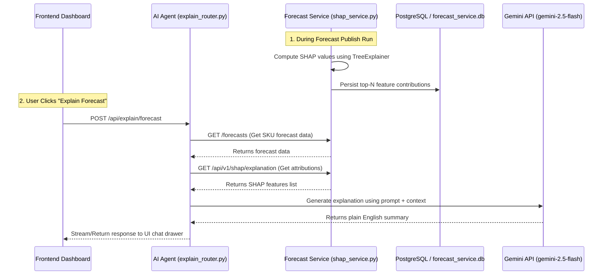

# OptiWMS Forecast Explainer (SHAP & Gemini Integration)

The Forecast Explainer system helps warehouse managers and demand planning teams understand *why* a particular forecast prediction is high or low. It does this by combining machine learning model feature attributions (using SHAP values) with LLM summarization (using Google Gemini).

---

## 🔄 System Architecture & Flow



---

## 📂 Core Components & Files Created

This system spans both the **forecast-service** and the **ai-agent** microservices. Below is a comprehensive list of the files involved:

### 1. Forecast Service (SHAP Pre-computation & REST API)
- [**`app/services/shap_service.py`**](file:///c:/Users/User/Documents/GitHub/OptiWMS/ai_services/forecast-service/app/services/shap_service.py)
  - Core logic that loads trained Tree-based models (XGBoost, CatBoost, LightGBM, RandomForest) from production artifacts.
  - Computes `shap.TreeExplainer` values for dataset features (e.g. `lag_1`, `roll_mean_6`, `stockout_days_lag1`).
  - Maps technical features to human-readable explanations (`_FEATURE_LABELS`).
  - Filters out SKU dummies/one-hot encoding variables and persists the top-N driving features to the database.
- [**`app/api/v1/routes/shap.py`**](file:///c:/Users/User/Documents/GitHub/OptiWMS/ai_services/forecast-service/app/api/v1/routes/shap.py)
  - Controller exposing `GET /api/v1/shap/explanation` which queries pre-computed feature attributions for a given SKU and horizon.
- [**`app/db/models.py` (line 176)**](file:///c:/Users/User/Documents/GitHub/OptiWMS/ai_services/forecast-service/app/db/models.py#L176)
  - Implements the SQLAlchemy model for the `forecast_shap_explanations` table where SHAP expected values, predictions, and top features JSON are persisted.

### 2. AI Agent Service (LLM Prompt Builder & Explain Route)
- [**`explain_router.py`**](file:///c:/Users/User/Documents/GitHub/OptiWMS/ai_services/ai-agent/explain_router.py)
  - Exposes the public endpoints `/api/explain/forecast` (unary) and `/api/explain/forecast/stream` (streaming response).
  - Fetches forecast data and SHAP values from the `forecast-service` APIs.
  - Assembles a structured system prompt that matches the dashboard inputs and model internals.
  - Invokes `gemini-2.5-flash` using the modern `google-genai` client SDK (`genai.Client`) to write a 3-6 sentence supply chain explanation.

---

## 🔍 How SHAP Features Map to Explanations

The AI model translates mathematical feature labels into standard operational terms using the dictionary mapping in `shap_service.py`:

| Model Feature | Human Label / Operational Meaning | Explainer Context Interpretation |
| :--- | :--- | :--- |
| `lag_1` | demand 1 month ago | High lag_1 indicates that last month's momentum carried forward. |
| `roll_mean_6` | 6-month average demand | Large roll_mean_6 indicates an upward or downward 6-month trend. |
| `month_num` / `quarter` | season indicators | Positive values show seasonal changes driving the forecast up. |
| `stockout_days_lag1` | stockout days (prior month) | Past supply shortages creating pent-up demand. |
| `supplier_otif_lag1` | supplier OTIF (prior month) | Supplier delivery performance and its impact on product availability. |

---

## 🧪 Quick Test

To verify if the explaining system is active, you can send a POST request directly to the AI Agent API:

```bash
curl -X POST http://localhost:8000/api/explain/forecast \
  -H "Content-Type: application/json" \
  -d '{
    "sku": "SKU-300001",
    "forecastPoints": [{"month": "2026-07", "p50": 450.0}],
    "userMessage": "Why is the forecast high for next month?",
    "predictedUnits": 450.0,
    "confidence": 95.0,
    "mape": 8.5
  }'
```
