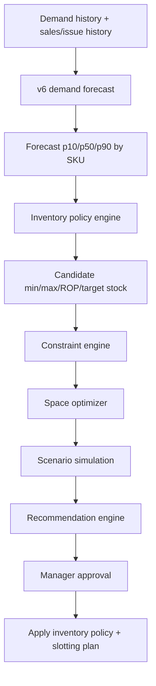

# Forecast To Space Optimization Core Plan

## Corrected Problem Statement

The core problem is not pallet asset lifecycle or labeling workflow.

The core problem is this:

Warehouses often hold extra buffer stock because of delivery delays, sudden demand spikes, supplier issues, MOQ rules, discount rules, and fear of production stoppage. This creates a saw-tooth inventory pattern: order near reorder point, receive a large quantity, consume stock, then repeat.

That traditional method is safe but expensive. It can create:

- Excess inventory holding cost.
- Occupied warehouse space.
- Expiry/write-off risk.
- Higher handling cost.
- Poor use of high-quality rack locations.
- Less space for items that are forecasted to grow.

The OptiWMS core solution should use demand forecasting, supplier constraints, expiry constraints, inventory policy, and warehouse storage compatibility to recommend:

- Which items can safely reduce buffer stock.
- Which items need more stock.
- Which items should not be overstocked due to expiry or low movement.
- Which released space can be reused by growing/high-value/high-movement items.
- Which items should move to front, middle, deep, ground, or reserve locations.
- What min stock, max stock, reorder point, and target stock should be for the next 3-6 months.

## Alignment With Hemas Reports

This is aligned with the Hemas reports.

The Hemas reports focused on:

- Statistical inventory model for RM/PM/FG.
- Reorder point and maximum stock calculations.
- Safety stock and lead-time demand assumptions.
- Reducing unnecessary stock and pallet usage.
- Selective racking.
- ABC/FMS classification.
- Within-aisle storage.
- Matching storage allocation to value, volume, and movement frequency.

OptiWMS can extend that into a stronger digital solution:

- Replace fixed assumptions with forecast uncertainty.
- Replace static Excel decisions with repeatable monthly/quarterly planning.
- Replace one-item reorder logic with multi-item space trade-off optimization.
- Add constraint checks before recommendations are shown.
- Provide confidence, risk explanation, and manager approval.

## Feasibility Assessment

This is feasible.

But it should not be implemented as a simple "AI predicts, system orders" flow. Because a wrong decision can stop production, the correct design is:

- Forecasting model gives demand distribution.
- Inventory policy engine calculates candidate min/max/ROP/target stock.
- Constraint engine checks MOQ, lead time, expiry, supplier rules, storage compatibility, rack capacity, and service level.
- Optimizer evaluates trade-offs across items.
- Simulation/stress test checks worst-case demand and delay scenarios.
- Recommendation engine produces explainable actions.
- Manager approves before changing policies or locations.

The system should be decision-support first, not full autopilot.

## Existing Repo Foundation

The repo already has strong foundations:

- v6 demand forecasting pipeline: `Ai miroservices/modeling/v6_academic_final`
- Forecast storage with `p10`, `p50`, `p90`: `forecast_results`
- Demand history table: `demand_history`
- Inventory planning fields: `min_stock`, `max_stock`, `reorder_point`, `lead_time_days`, `pallet_requirement`
- Supplier constraints: MOQ, lead time, supplier-specific rules
- Replenishment service with probabilistic safety stock, ROP, EOQ, MOQ, supplier constraints
- ABC/FMS rollups: `material_issue_stats_rollup`
- Demand-space planning: `DemandSpacePlanningService`
- Space reclaim from falling-demand SKUs: `StockPlacementPlanner.planReclaim`
- Slotting plan workflow: `slotting_plans`, `slotting_plan_lines`, `slotting_plan_reserve_lines`
- Capacity-aware placement: `StockPlacementPlanner.planPlacement`
- Rack/location compatibility through dimensions, weight, pallet capacity, and location levels

So the work is not starting from zero. The missing piece is integration and decision quality.

## Core System Design



## Decision Engine Responsibilities

The decision engine should answer:

1. Can item 1 reduce stock safely?
2. How much stock can be reduced?
3. What money/space is saved?
4. What service-level risk is added?
5. Can released space be used for item 2?
6. Is item 2 allowed in that rack/location?
7. Should item 2 stock increase given forecast, MOQ, lead time, and expiry?
8. What happens if demand spikes or supplier delivery is late?
9. What action should the manager approve?

## How To Handle Thousands Of Conditions

Do not hard-code every possible case manually.

Use a layered decision model:

### 1. Hard Constraints

These cannot be violated.

- Rack weight capacity.
- Rack volume/cube capacity.
- Pallet capacity.
- Material storage type compatibility.
- Hazard/temperature/quality restrictions.
- Expiry/FEFO rules.
- MOQ.
- Supplier max order quantity.
- Lot size or order multiple.
- Approved supplier/material relationship.
- Minimum service level for production-critical items.

If hard constraints fail, the recommendation is infeasible.

### 2. Soft Constraints

These can be traded off with penalty cost.

- Holding cost.
- Travel distance.
- Handling effort.
- Overstock cost.
- Understock risk.
- Discount opportunity.
- Relocation effort.
- Preference for current location.
- Preference for high-demand items near dispatch.

Soft constraints go into the optimizer objective.

### 3. Scenario Simulation

Every recommendation should be tested against scenarios:

- Base demand: forecast `p50`.
- High demand: forecast `p90`.
- Low demand: forecast `p10`.
- Supplier delay: lead time + delay percentile.
- MOQ forced order.
- Expiry risk scenario.
- No-free-space scenario.

If a recommendation fails a critical scenario, it should be marked high risk or rejected.

### 4. Explainability

Every recommendation must include:

- Forecast basis.
- Current stock.
- Proposed min/max/ROP.
- MOQ impact.
- Lead-time impact.
- Expiry risk.
- Space saved/needed.
- Compatible location options.
- Confidence score.
- Risk score.
- Reason for recommendation.

## Inventory Policy Engine

For each item and warehouse, calculate:

- Forecast demand for next 1, 3, and 6 months.
- Demand uncertainty from `p10/p50/p90`.
- Lead-time demand.
- Lead-time uncertainty.
- Safety stock.
- Reorder point.
- Target stock.
- Max stock.
- Min stock.
- Expiry-adjusted max stock.
- MOQ-adjusted order quantity.
- Discount-adjusted order quantity.
- Space requirement in pallet positions.

Recommended formulas:

- `lead_time_demand = daily_forecast_p50 * lead_time_days`
- `safety_stock = z(service_level) * combined_demand_and_lead_time_variance`
- `ROP = lead_time_demand + safety_stock`
- `target_stock = forecast_cover_period + safety_stock`
- `max_stock = min(expiry_safe_stock, space_feasible_stock, supplier_feasible_stock)`
- `order_qty = max(MOQ, target_stock - current_stock)` rounded to supplier order multiple

For high-risk production-critical materials, use conservative values:

- Use `p90` demand.
- Use higher service level.
- Use lead-time delay buffer.

For low-risk or slow-moving materials:

- Use `p50` or lower service level.
- Limit max stock by expiry-safe quantity.
- Prefer smaller target stock unless MOQ forces more.

## Space Optimization Engine

The storage optimizer should work for a 3-month or 6-month planning horizon.

Inputs:

- Forecasted demand.
- Issue frequency/FMS.
- Value or volume/ABC.
- Product volume.
- Product weight.
- Pallet spaces or units per pallet.
- Current stock and current location.
- Rack capacity.
- Rack distance to dispatch/production.
- Rack level.
- Storage compatibility.
- Expiry/FEFO constraints.
- Proposed inventory policy from the inventory engine.

Outputs:

- Recommended primary pick location.
- Recommended reserve locations.
- Required active pick pallet positions.
- Required reserve pallet positions.
- Reclaimable pallet positions.
- Suggested moves.
- Distance saved.
- Space saved.
- Risk explanation.

## ABC/FMS Storage Logic

The rough business logic should be:

| Profile | Storage Direction |
|---|---|
| High demand + high volume | Front / near dispatch / strong active pick allocation |
| High demand + low volume | Front-middle; movement is high but space burden is low |
| Low demand + high volume/weight | Not too deep if movement cost is high; prefer accessible lower/middle levels |
| Low demand + low volume | Deep reserve / upper / lower-priority zone |
| Falling demand + excess stock | Candidate for stock reduction and space reclaim |
| Rising demand + compatible storage available | Candidate for more active pick and reserve allocation |
| High demand but expiry constrained | Increase only up to expiry-safe stock |
| MOQ high but demand low | Order only when necessary, flag MOQ overstock risk |

This should be converted into objective weights, not only static rules.

## Optimization Objective

The optimizer should minimize total expected cost:

```text
total_cost =
  holding_cost
  + stockout_risk_cost
  + expiry_risk_cost
  + travel_cost
  + relocation_cost
  + space_opportunity_cost
  + supplier_penalty_cost
  - discount_benefit
```

Subject to hard constraints:

```text
stock >= minimum_service_stock
stock <= expiry_safe_stock
stock <= available_compatible_space
order_qty = 0 OR order_qty >= MOQ
order_qty <= supplier_max_qty
order_qty follows order_multiple
assigned_location compatible with material
assigned_location capacity not exceeded
```

## Confidence And Risk

Each recommendation should have:

- `confidence_score`: model/data reliability.
- `stockout_risk_score`: risk of production shortage.
- `expiry_risk_score`: risk of dead/expired stock.
- `space_feasibility_score`: probability space plan can be executed.
- `financial_impact`: estimated saving or cost.

Recommendation statuses:

- `SAFE_TO_APPLY`
- `APPLY_WITH_APPROVAL`
- `HIGH_RISK_REVIEW`
- `INFEASIBLE`
- `DATA_INSUFFICIENT`

## MVP Scope

The MVP should not try to solve everything at once.

### MVP Goal

For a selected warehouse and 3-6 month horizon, generate recommendations:

- Reduce stock for falling/slow items.
- Increase stock for rising/high-demand items only if constraints allow.
- Reallocate released pallet positions to better candidates.
- Produce new min/max/ROP/target stock.
- Produce slotting plan changes.
- Explain why.

### MVP Inputs

- Forecast results.
- Current inventory.
- Material dimensions and units per pallet.
- Lead time.
- MOQ.
- Expiry dates.
- Current locations.
- Location capacity.
- ABC/FMS classification.

### MVP Outputs

- SKU-level policy recommendation.
- Space release recommendation.
- Space allocation recommendation.
- Slotting plan draft.
- Risk/confidence explanation.
- Manager approval workflow.

## Implementation Plan

### Phase 1: Data Readiness

Create or verify canonical data contracts:

- `material_id`
- `warehouse_id`
- `forecast_p10/p50/p90`
- `current_stock`
- `available_stock`
- `expiry_date`
- `lead_time_days`
- `lead_time_std_days`
- `moq`
- `order_multiple`
- `unit_cost`
- `holding_cost_rate`
- `stockout_penalty`
- `units_per_pallet`
- `material_volume`
- `material_weight`
- `storage_type`
- `location_capacity`
- `location_compatibility`
- `current_location`

Deliverable:

- Data readiness report for all SKUs.
- Block recommendations for SKUs missing critical data.

### Phase 2: Inventory Policy Recommendation Service

Build a backend service:

- `InventoryPolicyRecommendationService`

It should calculate:

- Proposed min stock.
- Proposed max stock.
- Proposed ROP.
- Proposed target stock.
- Proposed order quantity.
- Stock reduction quantity.
- Additional stock quantity.
- Pallet positions saved/required.
- Expiry risk.
- MOQ risk.
- Confidence.

Deliverable:

- API endpoint to return policy recommendations by warehouse and horizon.

### Phase 3: Space Trade-Off Engine

Build a service:

- `ForecastSpaceOptimizationService`

It should combine:

- Inventory policy recommendations.
- Current location usage.
- Stock placement planner.
- Demand-space planning.
- Slotting optimizer.

It should detect:

- Which SKUs release space.
- Which SKUs need space.
- Which released spaces are compatible.
- Which moves are feasible.
- Which moves need manual review.

Deliverable:

- Draft space optimization plan.

### Phase 4: Scenario Testing

For every recommendation, simulate:

- Normal demand.
- High demand.
- Supplier delay.
- MOQ overstock.
- Expiry-limited demand.
- No relocation applied.

Deliverable:

- Risk grade and explanation.

### Phase 5: Manager Approval UI

Create an admin view:

- Policy change table.
- Space release table.
- Space allocation table.
- Risk flags.
- Before/after stock curve.
- Before/after pallet positions.
- Before/after location map.
- Approve/reject/override.

Deliverable:

- Human-in-the-loop recommendation workflow.

### Phase 6: Apply Approved Changes

Approved recommendations should update:

- Inventory min/max/ROP fields.
- Slotting plan draft/active plan.
- Material default locations.
- Putaway recommendations.

Do not auto-change production policies without approval.

## What Not To Build First

Do not build these first:

- Pallet asset lifecycle.
- Manufacturing labeling workflow.
- Chatbot integration.
- Fully autonomous auto-ordering.

They are useful later, but they are not the core research solution.

## Later Chatbot Role

The chatbot should be a presentation and decision-support layer, not the decision engine.

Later it can answer:

- "Why are we reducing item 1 max stock?"
- "Which SKUs release the most space?"
- "What happens if supplier X is delayed by 10 days?"
- "Which item should move to Zone A?"
- "Show me high-risk recommendations."

But first the functional recommendation engine must be correct.

## Final Direction

The correct core thesis/product direction is:

> Forecast-driven inventory policy and warehouse space optimization under MOQ, lead-time, expiry, capacity, compatibility, and service-level constraints.

This is feasible with the current repo foundation.

The repo needs integration, constraint hardening, scenario simulation, and manager approval workflows to make the recommendations trustworthy enough for real warehouse and production use.
