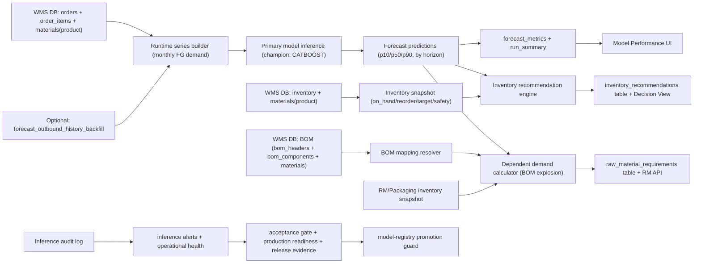

# Forecast Platform: Supervisor Technical Q&A

Last updated: 2026-04-21 (Asia/Colombo)

This document answers the common technical review questions for the current OptiWMS forecasting platform.

## 1) What exactly was built?

We built an end-to-end forecasting platform integrated into WMS with:

- FastAPI `forecast-service` for forecasts, metrics, inventory recommendations, artifact inference, acceptance gates, readiness, evidence, governance, and raw-material requirements.
- FastAPI `orchestrator-service` for trigger/publish workflow.
- Spring Boot `core-api` proxy (`/api/ai/*`) that scopes by role/warehouse and exposes forecast APIs to frontend.
- Forecast UI with:
  - `Decision View` (operational planning)
  - `Model Performance` (quality + operational health)
- Runtime contract checks for WMS DB schema/data.
- Acceptance gate + production-readiness gate + soak-window checks.
- Model registry + champion promotion guardrails.
- Release evidence bundle generation.

## 2) Where are endpoints?

### Public app-facing endpoints (Spring Boot)

Base: `/api/ai`  
File: `/Users/k.e.oshada/Documents/OptiWMS/backend/core-api/src/main/java/com/optiwms/coreapi/ai/AiProxyController.java`

Key routes:
- `GET /health`
- `GET /health/runtime-contract`
- `GET /forecasts`
- `GET /forecast-metrics`
- `GET /forecast-run-summary`
- `GET /forecast-dashboard-summary`
- `GET /inventory-recommendations`
- `GET /raw-material-requirements`
- `GET /bom-mappings`
- `PUT /bom-mappings`
- `POST /jobs/forecast-run`
- `POST /artifacts/infer-boosting-online`
- `GET /artifacts/inference-audit`
- `GET /artifacts/inference-alerts`
- `GET /artifacts/acceptance-gate`
- `GET /artifacts/production-readiness`
- `GET /artifacts/release-evidence`
- `GET /artifacts/operational-health`
- `GET /artifacts/operational-health/history`
- `POST /artifacts/operational-health/refresh`
- `GET /artifacts/governance/status`
- `POST /artifacts/governance/tick`

### Forecast-service internal routes (FastAPI)

Files:
- `/Users/k.e.oshada/Documents/OptiWMS/ai-services/forecast-service/app/main.py`
- `/Users/k.e.oshada/Documents/OptiWMS/ai-services/forecast-service/app/api/v1/routes/artifacts.py`
- `/Users/k.e.oshada/Documents/OptiWMS/ai-services/forecast-service/app/api/v1/routes/model_registry.py`
- `/Users/k.e.oshada/Documents/OptiWMS/ai-services/forecast-service/app/api/v1/routes/raw_materials.py`

Primary path groups:
- `/health`, `/health/runtime-contract`
- `/forecasts`, `/forecast-metrics`, `/inventory-recommendations`, `/dashboard/summary`
- `/runs`, `/runs/{id}/publish`
- `/artifacts/*` (inference, monitoring, gates, evidence, governance)
- `/model-registry/*`
- `/bom-mappings`, `/raw-material-requirements`

## 3) Where are models stored? In what format?

### Physical artifact location

Configured at:
- `/Users/k.e.oshada/Documents/OptiWMS/ai-services/forecast-service/app/core/config.py`
  - `artifact_dir`

Container mount:
- `/Users/k.e.oshada/Documents/OptiWMS/ai-services/docker-compose.ai.yml`
  - Host: `../Ai miroservices/modeling/outputs/artifacts`
  - Container: `/model-artifacts`

### Directory pattern

`<artifact_dir>/<dataset>/<artifact_name>/production/...`

Examples:
- Boosting per horizon: `catboost_h1`, `xgboost_h12`
- Classical per series: `arima_<series_id>`, `sarima_<series_id>`

### Supported model files

From:
- `/Users/k.e.oshada/Documents/OptiWMS/ai-services/forecast-service/app/services/artifact_service.py`

- `XGBOOST` -> `model.json`
- `CATBOOST` -> `model.cbm`
- `LIGHTGBM` / `RANDOM_FOREST` -> `model.pkl`
- Classical fallback artifacts -> `model.pkl`
- All require `metadata.json` per artifact folder.

## 4) What data is used? train/test/eval meaning?

### Runtime inference data (online mode)

Source tables (WMS DB contract):
- `orders`
- `order_items`
- `materials`
- `inventory`
- optional `forecast_outbound_history_backfill` (history augmentation)

Contract logic:
- `/Users/k.e.oshada/Documents/OptiWMS/ai-services/forecast-service/app/services/runtime_contract_service.py`

### Train/test/eval

- Training is done in DS workflows/notebooks and scripts under:
  - `/Users/k.e.oshada/Documents/OptiWMS/Ai miroservices/modeling/`
- Runtime service does **not retrain** on Run Forecast.
- `split=test` metrics are published/evaluated and used by acceptance gate.

## 4A) What exactly is being forecast right now?

Current production path forecasts **finished-good product SKU demand** (materials where `material_type='product'`) and then computes dependent raw/packaging demand.

Primary demand forecast source logic:
- `/Users/k.e.oshada/Documents/OptiWMS/ai-services/forecast-service/app/services/runtime_data_source.py`
  - `fetch_online_history_series_from_wms_db(...)`
  - uses outbound order lines from `orders + order_items + materials`
  - filters to `order_type='outbound'`, allowed statuses, and `materials.material_type='product'`
  - monthly aggregates demand per SKU for online inference input
- optional backfill table is unioned in:
  - `forecast_outbound_history_backfill`

Inventory recommendations source logic:
- same service file:
  - `fetch_inventory_snapshot_from_wms_db(...)`
  - reads `inventory + materials` for `material_type='product'`

So the direct ML forecast target is **product demand**; it is not directly forecasting raw material lines as the primary model target.

## 4B) How BOM CRUD interacts with forecasting

### BOM data sources used by forecast service

Runtime resolver:
- `/Users/k.e.oshada/Documents/OptiWMS/ai-services/forecast-service/app/services/runtime_data_source.py`
  - `resolve_bom_mappings(...)`
  - prefers WMS BOM master tables:
    - `bom_headers`
    - `bom_components`
    - `materials`
  - only active/effective BOMs are selected
  - component types constrained to raw/packaging categories

Fallback if WMS BOM is unavailable:
- local table `bom_component_mappings` in forecast service DB
- model/table code:
  - `/Users/k.e.oshada/Documents/OptiWMS/ai-services/forecast-service/app/db/models.py`
  - `/Users/k.e.oshada/Documents/OptiWMS/ai-services/forecast-service/app/services/raw_material_service.py`

### BOM CRUD APIs

Through Spring proxy:
- `GET /api/ai/bom-mappings`
- `PUT /api/ai/bom-mappings`

Forecast service endpoints:
- `GET /bom-mappings`
- `PUT /bom-mappings`
- File: `/Users/k.e.oshada/Documents/OptiWMS/ai-services/forecast-service/app/api/v1/routes/raw_materials.py`

UI page:
- `/Users/k.e.oshada/Documents/OptiWMS/frontend/app/admin/bom-master/page.tsx`

### How BOM affects output

After product forecast is produced, dependent demand is computed:
- `/Users/k.e.oshada/Documents/OptiWMS/ai-services/forecast-service/app/services/raw_material_service.py`
  - `persist_raw_material_requirements(...)`

Formula per RM component:
- `gross_requirement = forecast_fg_demand * qty_per_fg_unit * (1 + scrap_rate)`
- then adjusts with on-hand RM snapshot and safety/reorder policy to produce:
  - `net_requirement_qty`
  - `suggested_procure_qty`

Raw-material snapshot source:
- `inventory + materials` where material_type in:
  - `raw_material`, `packaging_material`, `packaging`

Key point:
- BOM CRUD changes directly alter dependent RM planning outputs, without retraining the primary product-demand model.

## 4C) End-to-end architecture flow (implemented)



Notes:
- If primary model/artifact fails for a series, inference falls back (`ARIMA` artifact fallback or baseline method).
- If WMS BOM is unavailable, resolver falls back to local `bom_component_mappings`.
- `Run Forecast` triggers publish flow; it does not retrain models.

## 5) What does “soak 24h” mean?

Definition:
- For the last 24 hours, the system checks count of `critical` operational-health snapshots.
- Pass condition: `critical_count == 0`.

Code:
- `/Users/k.e.oshada/Documents/OptiWMS/ai-services/forecast-service/app/services/production_readiness_service.py`
  - check name: `soak_window_no_critical`

## 6) What is in the UI?

File:
- `/Users/k.e.oshada/Documents/OptiWMS/frontend/app/admin/forecasts/page.tsx`

### Decision View (operational)
- Run status
- Horizon + Warehouse filters
- KPIs: latest run, reorder now, overstock risk, covered above target, total suggested qty
- Product forecast chart (`Product Forecast Detail`)
- Inventory card (`Inventory Position`)
- Top reorder priorities chart + table
- Inventory recommendations table (search/sort/pagination/export)

### Model Performance (governance/quality)
- Run status + deployed model context
- KPIs: WAPE, MASE, RMSE, RMSE/AvgDemand, fallback/error rates
- `Model Quality Snapshot`
- `Inference Path Mix`
- `Model Evaluators By Horizon`
- Export metrics CSV

## 7) Which model is currently inferencing?

From current evidence snapshot:
- Dataset: `B`
- Champion model: `CATBOOST`
- Model version: `v1`
- Registry entry id: `1`

Evidence file:
- `/Users/k.e.oshada/Documents/OptiWMS/ai-services/forecast-service/artifacts/evidence/post_load_validation_20260420T022233Z.json`

## 8) Current status (as of evidence file)

From the same evidence file:
- Runtime contract: `ok` (`mode: wms_db`)
- Acceptance gate: `ready=true`
- Production readiness: `ready=true`
- Soak-window check: passed (`soak_window_no_critical`)
- Inference alerts: `status=ok`
- Serving window: `count=200`, `fallback_rate=0`, `hard_error_rate=0`, `p95_latency_ms ≈ 409`

## 9) Latest experiment cycle (external-signals A/B)

Supervisor trace file:
- `/Users/k.e.oshada/Documents/OptiWMS/docs/ai/FORECAST_EXPERIMENT_TRACE_20260421.md`

Primary evidence outputs:
- `/Users/k.e.oshada/Documents/OptiWMS/Ai miroservices/modeling/outputs/reports/pv2_external_ablation_full_leaderboard.csv`
- `/Users/k.e.oshada/Documents/OptiWMS/Ai miroservices/modeling/outputs/reports/pv2_external_ablation_full_p_metrics.csv`
- `/Users/k.e.oshada/Documents/OptiWMS/Ai miroservices/modeling/outputs/reports/pv2_external_ablation_full_pv2_metrics.csv`
- `/Users/k.e.oshada/Documents/OptiWMS/Ai miroservices/modeling/outputs/reports/history/leaderboards/20260420T200411Z_pv2_external_ablation_full_leaderboard.csv`

Decision from this cycle:
- `PV2` (enriched dataset) outperformed `P` on WAPE/RMSE.
- champion candidate: `CATBOOST`
- fallback candidate: `ARIMA`

## 9) Where are DB/state tables for AI service?

File:
- `/Users/k.e.oshada/Documents/OptiWMS/ai-services/forecast-service/app/db/models.py`

Core tables:
- `forecast_runs`
- `forecast_predictions`
- `forecast_metrics`
- `inventory_recommendations`
- `raw_material_requirements`
- `forecast_run_summaries`
- `publish_jobs`
- `model_registry_entries`
- `operational_health_snapshots`
- `bom_component_mappings` (local fallback BOM map)

WMS-side runtime history helper:
- `forecast_outbound_history_backfill`
- `forecast_backfill_load_audit`

Bootstrap SQL:
- `/Users/k.e.oshada/Documents/OptiWMS/ai-services/forecast-service/scripts/sql/wms_forecast_runtime_bootstrap.sql`

## 10) Remaining gaps (platform vs data science)

### Platform (mostly done)
- Core runtime, gates, promotion guardrails, rollback hooks, UI visibility, and evidence generation are implemented.

### Data science/business data (still ongoing)
- Better real history depth and seasonality realism.
- Real BOM master replacement (instead of starter/demo mappings).
- Periodic retraining cadence with challenger evaluations.
- Business plausibility sign-off from planners (not only technical pass/fail).

## 11) Next approach (recommended execution order)

1. Keep current champion/fallback serving in WMS DB mode.
2. Replace starter BOM mappings with business BOM master and validate lead times/scrap.
3. Expand real historical outbound coverage and inventory movement fidelity.
4. Re-run DS model bakeoff on refreshed data; register challenger.
5. Run acceptance + 24h soak + release evidence.
6. Promote only through `/model-registry/promote` gate flow.
7. Keep governance tick + alerting enabled for continuous drift/freshness/inference monitoring.

## 12) Quick command references

### Get readiness
```bash
curl "http://localhost:8091/artifacts/acceptance-gate?dataset=B&model_name=CATBOOST&split=test&inference_window=200"
curl "http://localhost:8091/artifacts/production-readiness?dataset=B&model_name=CATBOOST&split=test&inference_window=200&soak_hours=24"
```

### Get release evidence
```bash
curl "http://localhost:8091/artifacts/release-evidence?dataset=B&model_name=CATBOOST&split=test&inference_window=200&soak_hours=24&history_limit=50"
```

### Trigger forecast run
```bash
curl -X POST "http://localhost:8092/jobs/forecast-run?dataset=B&model_name=CATBOOST&mode=online"
```

### Registry checks/promote
```bash
curl "http://localhost:8091/model-registry?dataset=B"
curl "http://localhost:8091/model-registry/promotion-check?entry_id=1&split=test&inference_window=200&soak_hours=24"
curl -X POST "http://localhost:8091/model-registry/promote" \
  -H "Content-Type: application/json" \
  -d '{"entry_id":1,"split":"test","inference_window":200}'
```

## 13) Full KPI + metric dictionary (UI + backend)

Primary UI implementation:
- `/Users/k.e.oshada/Documents/OptiWMS/frontend/app/admin/forecasts/page.tsx`

Primary metric computation/persistence:
- `/Users/k.e.oshada/Documents/OptiWMS/ai-services/forecast-service/app/services/run_summary_service.py`
- `/Users/k.e.oshada/Documents/OptiWMS/ai-services/forecast-service/app/services/artifact_service.py`
- `/Users/k.e.oshada/Documents/OptiWMS/ai-services/forecast-service/app/api/v1/routes/metrics.py`

### Decision View KPIs

- `Latest Run`
  - Latest `run_id` in loaded forecast rows.
- `Reorder Now`
  - Count of SKUs where `on_hand_inventory < reorder_point`.
- `Overstock Risk`
  - Count of SKUs where `on_hand_inventory > target_max`.
- `Covered Above Target`
  - Count of SKUs where `on_hand_inventory >= target_max`.
- `Total Suggested Qty`
  - Sum of `suggested_order_qty` over recommendations.

### Decision View visual logic

- `Product Forecast Detail` chart
  - Series: `p10`, `p50`, `p90`, and `actual(y_true)` if available.
  - Grouped by horizon (`H+1 ... H+12`) for selected SKU.
- `Inventory Position` card
  - Status rules:
    - `CRITICAL`: on_hand < reorder
    - `REORDER`: on_hand < reorder * 1.1
    - `OVERSTOCK`: on_hand > target
    - else `HEALTHY`
  - Displays `Gap to Reorder = on_hand - reorder`
  - Displays `Gap to Target = on_hand - target`
- `Top Reorder Priorities`
  - Sorted by largest `suggested_order_qty`, with additional gap/context.
- `Inventory Recommendations` table
  - Supports risk/suggested/SKU sorting + search + pagination.

### Model Performance KPIs

- `Forecast Rows`
  - Count of forecast points in selected scope.
- `Avg WAPE (test)`
  - Mean of `WAPE` across filtered horizons.
- `Avg RMSE (test)`
  - Mean of `RMSE` across filtered horizons.
- `Avg MASE`
  - Mean of `MASE_mean` across filtered horizons.
- `Bias`
  - Available per horizon table; run summary uses average absolute bias.
- `RMSE vs Avg Demand`
  - UI: `(avg_rmse / avg_actual_demand) * 100`
  - If no actual demand in filtered rows, UI uses `p50` proxy demand.
- `Fallback Rate`
  - `fallback_count / series_count` from inference audit window.
- `Error Rate`
  - `errors_count / series_count` from inference audit window.
- `Primary Rate`
  - `(series_count - fallback_count - errors_count) / series_count`.
- `P95 Latency`
  - 95th percentile latency from inference audit events.

### Acceptance Gate metrics (go/no-go)

From `/artifacts/acceptance-gate`:

- Quality checks:
  - `wape <= gate_max_wape` (default `0.135`)
  - `bias_abs_pct <= gate_max_abs_bias` (default `0.10`)
  - `under_forecast_rate <= gate_max_under_forecast_rate` (default `0.60`)
  - `mase_mean <= gate_max_mase_mean` (default `1.10`)
- Serving checks:
  - `serving_window_count >= 1`
  - `fallback_rate <= gate_max_fallback_rate` (default `0.05`)
  - `hard_error_rate <= gate_max_hard_error_rate` (default `0.01`)
  - `p95_latency_ms <= gate_max_p95_latency_ms` (default `2500`)

Threshold source:
- `/Users/k.e.oshada/Documents/OptiWMS/ai-services/forecast-service/app/core/config.py`

### Production Readiness checks

From `/artifacts/production-readiness`:

- `runtime_contract_ok`
- `latest_published_run_exists`
- `acceptance_gate_ready`
- `inference_not_critical`
- `soak_window_no_critical` (critical count in trailing soak window, default 24h)

### Operational health dimensions

From `/artifacts/operational-health`:

- `status` (overall)
- `inference_status`
- `drift_status`
- `freshness_status`
- plus details payload:
  - inference summary (`count`, `fallback_rate`, `avg_latency_ms`, `p95_latency_ms`, `total_errors`)
  - drift summary (`current_wape`, `baseline_wape`, increase ratio)
  - freshness summary (`age_minutes`, threshold, latest_run_id)

## 14) Full MLOps side (what is implemented)

### A) Build/train (Data Science layer)

- DS notebooks/scripts generate artifacts + reports under:
  - `/Users/k.e.oshada/Documents/OptiWMS/Ai miroservices/modeling/`
- Output contracts consumed by services:
  - report CSVs
  - model artifact folders per dataset/model/horizon/series

### B) Serve/inference layer

- Forecast-service serves API and loads model artifacts.
- Online inference endpoint:
  - `/artifacts/infer-boosting-online`
- Fallback behavior:
  - artifact-based classical fallback if available
  - otherwise `last_value`/`snaive12` from series history
  - response carries `fallback_used`, `fallback_reason`, `fallback_count`, `fallback_methods`

### C) Publish orchestration

- Orchestrator triggers forecast-service run + publish.
- Async publish lifecycle:
  - `created -> publishing -> published|failed`
- Publish completeness gates enforce non-empty forecast/inventory and metrics requirements before `published`.

### D) Registry + promotion governance

- Registry API:
  - `/model-registry`
  - `/model-registry/champion`
  - `/model-registry/promotion-check`
  - `/model-registry/promote`
- Promotion is blocked unless acceptance/readiness checks pass (config-enforced).

### E) Runtime contract & data readiness

- Startup/runtime DB contract verification for required WMS tables/columns.
- Endpoint:
  - `/health/runtime-contract`
- Runtime data readiness checks include:
  - history rows
  - non-zero inventory on product SKUs
  - product material availability
  - warehouse scope coverage

### F) Monitoring/alerting

- Inference audit log (JSONL) with per request stats.
- Inference alerts endpoint summarizing fallback/error/latency.
- Operational health snapshots scheduled in background worker.
- Health history endpoint for trend.
- Optional webhook alerting and auto governance controls in config.

### G) Evidence and release artifacts

- `/artifacts/release-evidence` returns release bundle:
  - runtime contract
  - gate results
  - readiness checks
  - inference alerts
  - health history
  - registry state
  - warmup run results
- Example evidence file:
  - `/Users/k.e.oshada/Documents/OptiWMS/ai-services/forecast-service/artifacts/evidence/post_load_validation_20260420T022233Z.json`

## 15) What to answer if asked “is this enterprise MLOps?”

Answer:

- Yes for serving/operations/governance layer:
  - contract checks, quality gates, readiness gates, soak checks, promotion guardrails, rollback path, evidence bundle, UI observability.
- Still data-science maturity work remains:
  - stronger real-history depth, real BOM curation, retraining cadence and challenger cycles with business sign-off.

## 16) What techniques/process were used to diagnose forecast issues? What did we find?

This section is the technical trail for the recent PV2 troubleshooting cycle, focused on why WAPE/RMSE/Bias were not meeting gate expectations.

### A) Techniques applied

- Fair-play controlled A/B protocol:
  - always restore baseline dataset first
  - apply one change only per run
  - retrain with identical model/search settings
  - compare against baseline on `test,horizon=0` and horizon-wise diagnostics
- Data diagnostics:
  - duplicate/null/coverage checks
  - volatility/outlier profiling per SKU
  - contribution decomposition of WAPE by SKU/category/horizon
- Progressive targeted interventions:
  - localized winsorization on top error-contributing SKUs
  - sequence tested: top-2 -> top-5 -> top-10 -> top-15 contributors
- Bias calibration diagnostics:
  - learned additive offsets from validation split
  - applied to non-train predictions
  - evaluated with offset caps for stability
- Pipeline hardening:
  - implemented script-level calibration support in tuning pipeline:
    - file: `/Users/k.e.oshada/Documents/OptiWMS/Ai miroservices/modeling/scripts/tune_pv2_catboost.py`
    - args: `--bias-calibration {none|fg_code|series_id}` and `--bias-calibration-max-offset-pct`

### B) Process followed (repeatable)

1. Establish baseline and archive metrics.
2. Decompose error (SKU/category/horizon) to identify concentration.
3. Run one targeted change; retrain; compare.
4. Expand scope only if previous step improves.
5. Add calibration layer and re-evaluate normalized metrics.
6. Export evidence artifacts for reviewer/statistician validation.

### C) Main findings

- Error concentration is real: a small SKU subset drives a large share of total error.
- Global preprocessing changes were weaker or harmful; targeted interventions were consistently beneficial.
- Progressive targeted winsorization improved WAPE monotonically in this cycle:
  - baseline: `0.223448`
  - top-2: `0.217112`
  - top-5: `0.213674`
  - top-10: `0.211121`
  - top-15: `0.208943`
- Built-in script calibration further improved RMSE/Bias while keeping WAPE near best:
  - calibrated top-15 run: `WAPE=0.208842`, `RMSE=2404.254`, `Bias=+20.393`
  - baseline reference: `WAPE=0.223448`, `RMSE=2833.195`, `Bias=-178.227`
- Relative stability also improved:
  - baseline `RMSE/mean_demand` ~ `1.31`
  - top-15 raw ~ `1.17`
  - top-15 calibrated ~ `1.11`

### D) What issues remain

- Acceptance quality gate still fails on WAPE threshold (`<= 0.135`) in this experimental PV2 track.
- Synthetic data appears only partially realistic:
  - some demand dynamics are too smooth/regular for robust stress behavior
  - this likely limits generalization and inflates horizon-tail errors
- Bias is materially improved but needs controlled promotion path validation before production adoption.

### E) Evidence artifacts (recent)

- Main experiment notebook:
  - `/Users/k.e.oshada/Documents/OptiWMS/Ai miroservices/modeling/notebooks/04_fair_play_model_comparison.ipynb`
- Calibrated run outputs:
  - `/Users/k.e.oshada/Documents/OptiWMS/Ai miroservices/modeling/outputs/reports/pv2_control_ab_top15_sku_winsor_calibrated_leaderboard.csv`
  - `/Users/k.e.oshada/Documents/OptiWMS/Ai miroservices/modeling/outputs/reports/pv2_control_ab_top15_sku_winsor_calibrated_pv2_metrics.csv`
  - `/Users/k.e.oshada/Documents/OptiWMS/Ai miroservices/modeling/outputs/reports/pv2_control_ab_top15_sku_winsor_calibrated_pv2_forecasts.csv`
- Statistician summary exports:
  - `/Users/k.e.oshada/Documents/OptiWMS/Ai miroservices/modeling/outputs/reports/pv2_statistician_pack_top15_bias_calibration.csv`
  - `/Users/k.e.oshada/Documents/OptiWMS/Ai miroservices/modeling/outputs/reports/pv2_horizon_stability_top15_bias_calibration.csv`

### F) Recommended next technical step

- Keep targeted contributor-driven correction + capped calibration path.
- Re-run full gate checks and release evidence bundle with calibrated configuration.
- In parallel, improve synthetic realism constraints and rerun bakeoff to close the remaining WAPE gap.

## 17) Gap-Closure Plan (Non-Data, Immediate)

Even before dataset realism is upgraded, we can close a major set of statistical and process gaps now.

### A) Immediate controls to keep

- Enforce fair-play A/B discipline (single-change, baseline restore, same search space).
- Keep contributor-targeted correction path (top-N SKU focus based on contribution decomposition).
- Keep capped validation-based bias calibration enabled for PV2 tuning runs.

### B) Statistical sign-off checks (must pass together)

- `WAPE <= threshold` (current experimental target remains strict).
- `abs(Bias_pct_of_mean_demand) <= threshold`.
- `RMSE_over_mean_demand <= threshold`.
- `horizon_wape_cv <= threshold` (stability across horizons).

### C) Automation added

New script:
- `/Users/k.e.oshada/Documents/OptiWMS/Ai miroservices/modeling/scripts/statistical_readiness_check.py`

Purpose:
- computes normalized forecast quality metrics from forecast outputs
- evaluates pass/fail checks for statistician sign-off
- writes both machine-readable JSON and reviewer-friendly Markdown

### D) Run commands (example)

```bash
/Users/k.e.oshada/Documents/OptiWMS/.venv/bin/python \
  "/Users/k.e.oshada/Documents/OptiWMS/Ai miroservices/modeling/scripts/tune_pv2_catboost.py" \
  --dataset PV2 \
  --feature-profile full \
  --max-trials 12 \
  --horizons 1,2,3,4,5,6,7,8,9,10,11,12 \
  --tune-horizons 1,3,6,12 \
  --tag pv2_control_ab_top15_sku_winsor_calibrated \
  --bias-calibration fg_code \
  --bias-calibration-max-offset-pct 0.25
```

```bash
/Users/k.e.oshada/Documents/OptiWMS/.venv/bin/python \
  "/Users/k.e.oshada/Documents/OptiWMS/Ai miroservices/modeling/scripts/statistical_readiness_check.py" \
  --forecasts-csv "/Users/k.e.oshada/Documents/OptiWMS/Ai miroservices/modeling/outputs/reports/pv2_control_ab_top15_sku_winsor_calibrated_pv2_forecasts.csv" \
  --pred-col y_pred \
  --output-json "/Users/k.e.oshada/Documents/OptiWMS/Ai miroservices/modeling/outputs/reports/pv2_statistical_readiness_top15_calibrated.json" \
  --output-md "/Users/k.e.oshada/Documents/OptiWMS/Ai miroservices/modeling/outputs/reports/pv2_statistical_readiness_top15_calibrated.md"
```

### E) Current status from automated check

- Statistical readiness automation is in place and running.
- Latest calibrated PV2 check output exists, but `overall_pass=false` under current strict thresholds.
- Interpretation: process quality and statistical governance are now stronger, while primary remaining blocker is still data realism/coverage.
