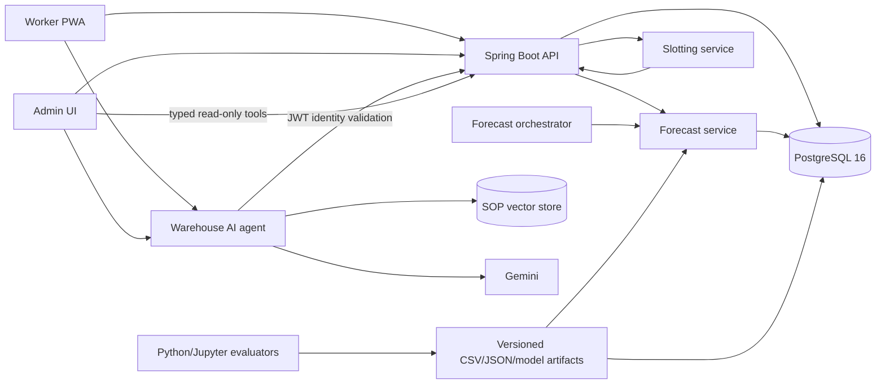
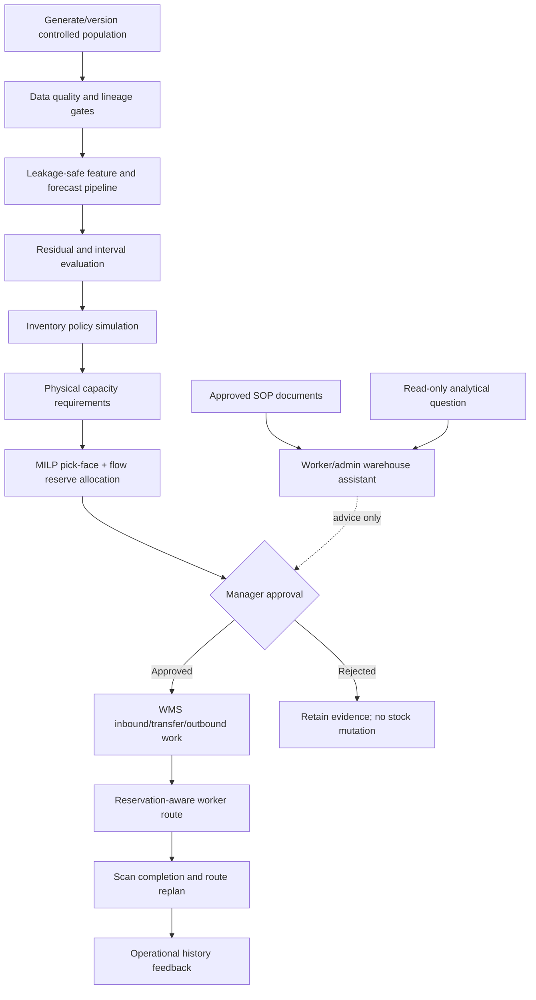
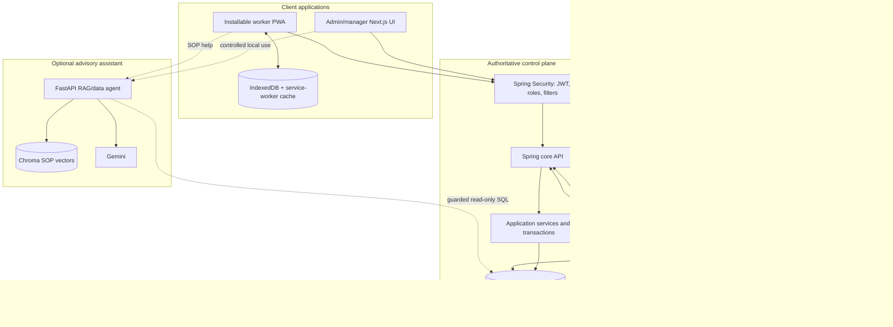
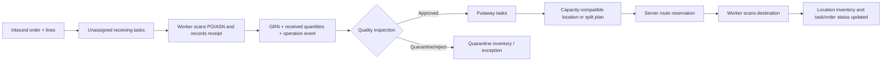
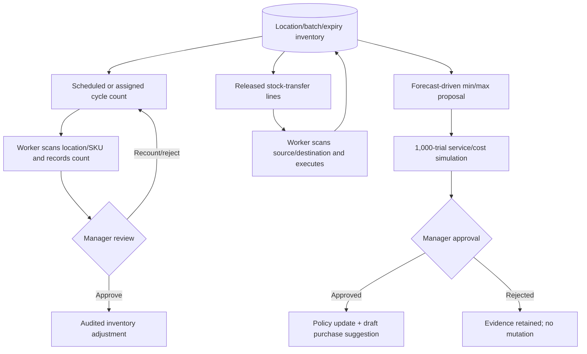
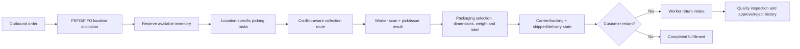
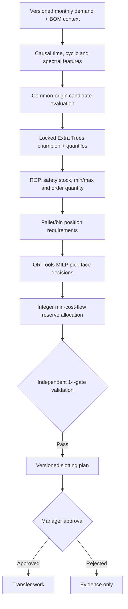
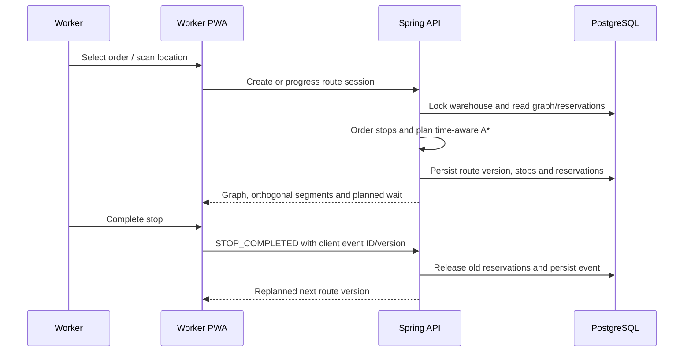
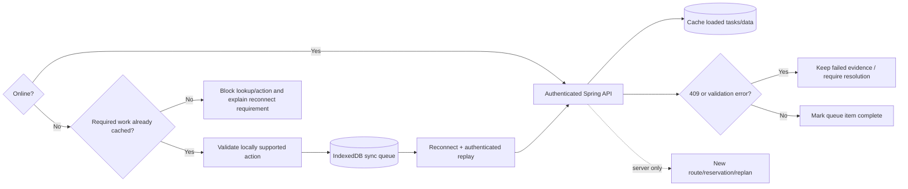
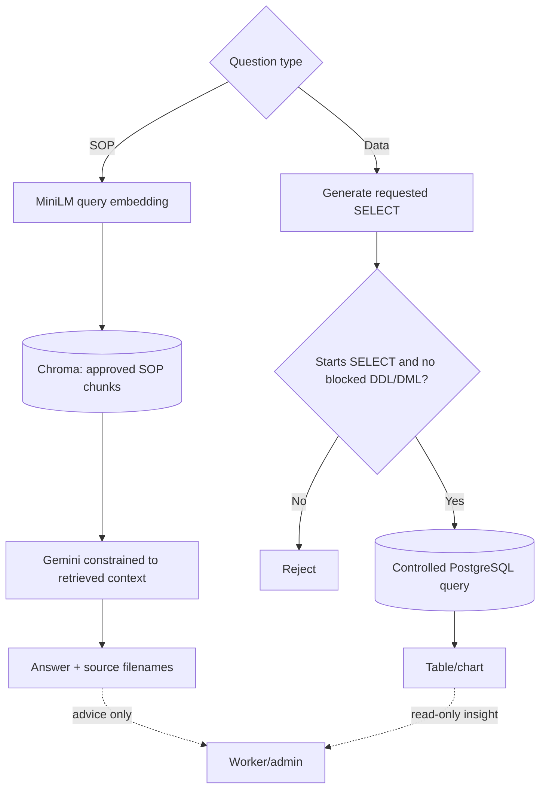

# OptiWMS: Forecast-Driven Warehouse Management, Inventory and Storage Optimization, Conflict-Aware Routing and Warehouse Assistance

## Final Project Report

**Project:** OptiWMS

**Report status:** Final controlled-project implementation report

**Operational dataset:** `PROJECT_OPERATIONAL_SIMULATION_V8`

**Last verified:** 2026-07-28

**Evidence boundary:** Controlled synthetic project population; external
population validity and physical-site safety certification are not claimed.

---

## Evaluator Coverage Sheet

Markdown does not have fixed page numbers. The links below replace the page
column in the supplied evaluation sheet and take the evaluator directly to each
required section.

| Item | Material covered in point form | Report location |
| --- | --- | --- |
| Abstract | WMS, forecasting, min/max, MILP, routing, assistant, quantitative results and evidence boundary | [Abstract](#abstract) |
| Chapter 1 — Introduction | Objectives, problem, motivation, novelty, resources and report structure | [Chapter 1](#chapter-1--introduction) |
| Chapter 2 — Literature Review | WMS research, enterprise product benchmark, forecasting, inventory, slotting, routing, RAG, feature gaps and project problem | [Chapter 2](#chapter-2--literature-review) |
| Chapter 3 — Technology Adopted | Technology selection, justification, stack and novelty | [Chapter 3](#chapter-3--technology-adopted) |
| Chapter 4 — Approach | Hypotheses, inputs/outputs, end-to-end workflow, target users and features | [Chapter 4](#chapter-4--approach) |
| Chapter 5 — Analysis & Design | Requirements, architecture, data flow, modules, security and decision controls | [Chapter 5](#chapter-5--analysis-and-design) |
| Chapter 6 — Implementation | Module-wise implementation, algorithms, integrations and incremental testing | [Chapter 6](#chapter-6--implementation) |
| Chapter 7 — Evaluation | Experimental setup, datasets, test cases, metrics, results and comparisons | [Chapter 7](#chapter-7--evaluation) |
| Chapter 8 — Conclusion and Future Work | Achievements, quantitative summary, limitations and future work | [Chapter 8](#chapter-8--conclusions-and-further-work) |
| References | Research and technology references | [References](#references) |
| Appendix A | Implemented test inventory, commands, AI gates and missing non-AI/PWA acceptance backlog | [Appendix A](#appendix-a--test-catalogue-and-execution) |
| Appendix B | Notebook, artifact, implementation and documentation index | [Appendix B](#appendix-b--evidence-and-file-index) |

---

## Abstract

OptiWMS is an end-to-end warehouse management and decision-support system that
connects warehouse/location/material/supplier/customer master data, inbound
orders, receiving/GRN, quality/quarantine, putaway,
location/LPN inventory, cycle counting, replenishment, stock transfer,
outbound allocation, picking, packing, shipping, returns, tasks,
notifications, analytics and reporting with demand
forecasting, stochastic inventory policy, physical storage optimization and
conflict-aware mobile worker routing. It also provides an advisory warehouse
assistant for worker/admin SOP questions and read-only WMS analytics. The
current project-operational source of truth is a deterministic, explicitly
labelled synthetic population because representative external warehouse
history was not available.

The v8 population contains 144 active materials—90 raw materials, 30 packaging
materials and 24 finished goods—together with 24 effective finished-good BOMs,
211 BOM component rows, 10,368 monthly demand rows and 1,440 forward H1-H12
RM/PM forecasts. Its physical warehouse contains 4,200 storage positions and
six stations. All materials have physical properties, 3,257 primary/reserve
capacity assignments and 2,921 occupied inventory rows.

The forecasting protocol uses causal, leakage-safe time splits and compares
classical, tree and neural methods. The served recursive Extra Trees model
achieved 8.7452% WAPE, 772.95 MAE, 1,559.64 RMSE and -0.4877% bias on the
untouched recursive test. The Conv1D-attention challenger achieved 9.8996%
WAPE; Extra Trees was retained with an 11.66% relative WAPE advantage,
circular block-bootstrap monthly absolute-error confidence interval
[-178.72, -16.07] and HAC/Holm p=0.0197.

Physical storage validation passed 14/14 checks. The OR-Tools MILP/flow model
found an optimal complete assignment for all 144 materials and 3,257 required
pallet positions. The worker-routing graph contains 956 nodes, 1,980 directed
edges and 280 rack-bay obstacles. In controlled concurrency experiments,
independent A* produced conflicts from five workers onward, whereas
time-reservation A* produced zero tested conflicts through 50 workers. A live
two-worker database test also produced zero overlapping reservations.

Inventory planning produces 120 RM/PM policy rows containing reorder point,
safety stock, proposed minimum/maximum stock and MOQ/order-multiple rounded
order quantities. Spring adds simulation, fill-rate, cost/capacity gates,
approval and rollback. The assistant exposes worker mobile and manager
full-screen interfaces backed by eight SOP documents, a local Chroma vector
store, Gemini and a guarded read-only SQL analytics path.

The forecast-to-policy-to-slotting-to-routing workflow has reproducible
controlled evidence. The wider WMS/PWA feature set is implemented but does not
yet have uniform automated end-to-end regression coverage. None of this is
evidence that forecast accuracy, generated geometry or forklift safety
generalizes to an external warehouse. Real issue history, full WMS journey
tests, a physical survey, RTLS validation, shadow operation and site safety
approval remain mandatory before external production use.

---

# Chapter 1 — Introduction

## 1.1 Introduction

Warehouse operations are often implemented as separate transactional and
planning systems. Receiving, inventory, picking and shipping may be recorded
correctly while forecasting, reorder decisions, slotting and worker movement
are performed in spreadsheets or isolated tools. This separation makes it
difficult to prove that a recommendation uses the same materials, BOMs,
inventory and locations that operators actually execute.

OptiWMS addresses this by maintaining PostgreSQL as the operational authority,
using Spring for business controls, Python services for specialist numerical
work and a shared Next.js interface for managers and workers.

## 1.2 Objectives

The project objectives are:

1. implement secure master-data, inbound, quality, storage,
   inventory, cycle-count, transfer, outbound, return, task, notification,
   analytics and reporting workflows;
2. generate a deterministic, internally consistent operational population when
   external customer history is unavailable;
3. forecast direct RM/PM demand over H1-H12 without future leakage;
4. compare classical, tree and neural models under identical time origins;
5. test assumptions, residuals, uncertainty and decision costs rather than
   reporting accuracy alone;
6. calculate evidence-backed min/max and `(s,S)` inventory recommendations;
7. solve physical, compatibility and capacity-constrained multi-bin slotting;
8. provide an installable role-filtered PWA for receiving, putaway, picking,
   cycle count, stock transfer, packing, shipping and returns;
9. guide putaway and picking workers along rack-safe paths;
10. prevent tested multi-worker aisle-time conflicts through server-side
   reservations;
11. provide SOP-grounded assistance to workers and read-only analytics to
    administrators;
12. retain lineage, model, approval and execution evidence for evaluation.

## 1.3 Problem in Brief

The core problem is not simply “predict demand.” The operational decision chain
is:

```text
demand evidence
  -> forecast and uncertainty
  -> inventory policy
  -> physical pallet/bin requirement
  -> compatible slotting plan
  -> approved warehouse work
  -> conflict-aware worker execution
  -> actual operational feedback
```

A failure at any boundary can invalidate the next stage. Examples include using
future actuals in features, treating a unit weight as pallet weight, assigning
two materials to one physical bin, presenting an infeasible solver fallback as
optimal, or allowing two forklifts to reserve the same narrow aisle at the same
time.

## 1.4 Background and Motivation

The project was motivated by four recurring warehouse-planning limitations:

- demand decisions disconnected from BOM and operational history;
- static reorder values without uncertainty, MOQ or service-cost analysis;
- storage suggestions that ignore physical dimensions and multi-bin capacity;
- mobile path displays that calculate independent shortest paths without
  coordinating concurrent workers;
- warehouse assistance that is disconnected from approved SOP sources or
  allowed to bypass operational decision controls.

The lack of representative external history created an additional research
problem. The project therefore uses controlled synthetic ground truth as the
declared project data, preserves its seed and lineage, and explicitly refuses
to convert method validation into an external accuracy claim.

## 1.5 Novel Approach

OptiWMS combines several controls that are normally evaluated separately:

- one versioned material/BOM/demand/inventory/location population across WMS,
  forecasting, policy, slotting and routing;
- locked temporal selection followed by an untouched test;
- annual and semiannual cyclic and spectral features calculated only from
  trailing history;
- a Conv1D/self-attention challenger evaluated against classical and tree
  candidates rather than declared the winner in advance;
- assumption and claim-evidence registries with explicit
  `SUPPORTED`, `REJECTED`, `NOT_REQUIRED` and `UNVERIFIED` states;
- physical layout generation followed by independent capacity and OR-Tools
  feasibility validation;
- canonical edge-time reservations for worker routing, including
  opposite-direction use of the same aisle;
- manager approval boundaries between recommendation and stock movement;
- one assistant UI for worker SOP help and manager analytics while keeping the
  forecast, min/max, MILP and routing engines authoritative.

## 1.6 Resource Requirements

| Resource | Project requirement |
| --- | --- |
| Host runtime | macOS/Linux/Windows capable of Docker Compose |
| Java | 21 |
| Node.js | 20 recommended; 18 minimum for the current frontend |
| General Python | Repository `.venv`; current local environment is preserved |
| Evaluator Python | Clean Python 3.12 environment in `.venv-evaluator` |
| Database | PostgreSQL 16 |
| Container runtime | Docker Desktop or compatible Compose v2 runtime |
| Recommended RAM | At least 8 GB; more for evaluator/neural reruns |
| Optional acceleration | TensorFlow-compatible CPU/GPU for neural replication |

## 1.7 Structure of the Report

Chapter 2 reviews the relevant methods. Chapter 3 justifies the technology
stack. Chapter 4 states the experimental and operational approach. Chapter 5
describes the architecture and design. Chapter 6 maps the design to source
implementation. Chapter 7 presents tests and quantitative results. Chapter 8
states achievements, limitations and future work. Appendices provide direct
commands and evidence links.

## 1.8 Summary

OptiWMS is defined as an integrated, evidence-controlled WMS project rather
than an isolated prediction notebook. The next chapter positions that approach
against existing forecasting, inventory, slotting and routing methods.

---

# Chapter 2 — Literature Review

## 2.1 Introduction and Review Method

The review covers both warehouse-management practice and the analytical
methods used by the project. Sources were selected in two groups:

1. peer-reviewed or university-hosted research for warehouse operations,
   forecasting, inventory, storage assignment, routing and intelligent
   warehouses; and
2. current first-party product documentation for enterprise WMS capability
   benchmarking.

Vendor pages are used only to establish advertised capability presence. They
are not independent proof of performance, cost or implementation success, and
available functions can depend on edition, configuration and separately
licensed modules. The comparison therefore avoids claiming that OptiWMS is a
drop-in replacement for an enterprise product.

## 2.2 Chronological Review of Prior Work

### 2.2.1 Warehouse operations and order picking

Gu, Goetschalckx and McGinnis organize warehouse research around receiving,
storage, order picking and shipping, and emphasize the gap between component
planning models and practical warehouse control. Their comprehensive review
provides the operational foundation for treating WMS as more than an inventory
table. De Koster, Le-Duc and Roodbergen show that order picking combines
layout, storage assignment, batching, zoning and routing; optimizing only the
shortest path cannot optimize the full picking system.

These findings directly inform OptiWMS: inbound, quality, putaway, inventory,
cycle count, replenishment, transfer, picking, packing, shipping and returns
are represented as stateful workflows, while routing is attached to work
rather than presented as an isolated map.

Sources:

- [Gu, Goetschalckx and McGinnis (2007), Research on warehouse operation](https://doi.org/10.1016/j.ejor.2006.02.025)
- [de Koster, Le-Duc and Roodbergen (2007), Design and control of warehouse order picking](https://repub.eur.nl/pub/11877)

### 2.2.2 From transactional WMS to enterprise execution

Enterprise WMS products extend basic stock/location control with mobile work,
labor management, waves/order streaming, transport staging, automation,
flow-through handling, value-added services, analytics, integration and
security.
Current official documentation illustrates this breadth:

- SAP EWM documents inbound processing, stock ownership, physical inventory,
  cycle counting, waves, picking, packing, shipping, labor, kitting and
  robotics integration.
- Oracle WMS Cloud describes a configurable cloud-native, multi-tenant WMS
  with mobile/RF execution, real-time capture, automation, reporting, APIs,
  security and workforce management.
- Manhattan Active WM combines warehouse, labor, slotting,
  transportation and an embedded WES for human/robot orchestration.
- Blue Yonder describes warehouse operations, resource forecasting and
  orchestration, labor, advanced slotting, robotics, returns and
  warehouse execution.
- Microsoft Dynamics 365 documents a configurable warehouse mobile
  application for receiving/putaway, picking, movement and multiple cycle-count
  modes.

This enterprise pattern is the correct benchmark for OptiWMS. It shows that
core transaction screens alone do not establish enterprise readiness.

### 2.2.3 Intelligent and human-centered warehousing

Industry 4.0 warehouse reviews identify real-time data, digital integration,
IoT, cloud services, robotics, augmented interfaces and decision support as
important smart-warehouse enablers. They also identify barriers such as
integration complexity, cost, cybersecurity, data quality and workforce
adaptation. The intelligent-warehouse literature therefore supports a
human-in-the-loop architecture: algorithms propose or coordinate, while
authoritative business controls and safe work procedures remain visible.

Sources:

- [Applications of Industry 4.0 Technologies in Warehouse Management (2023)](https://doi.org/10.3390/logistics7020024)
- [Intelligent Warehouse in Industry 4.0—Systematic Literature Review (2023)](https://doi.org/10.3390/s23084105)
- [Warehouse Management Systems for Social and Environmental Sustainability (2023)](https://doi.org/10.3390/logistics7030040)

### 2.2.4 Forecasting, inventory, slotting, routing and assistance

Classical time-series work established trend, seasonal, intermittent-demand
and autocorrelation models. Modern practice adds global tree/boosting and deep
sequence models, rolling-origin evaluation, quantile forecasts and
dependence-aware comparison. Forecast uncertainty becomes operational only
when it is connected to service level, shortage, holding, lead time, MOQ and
capacity.

Storage-location assignment research treats SKU-to-location allocation as a
constrained optimization problem; order-picking research shows its interaction
with travel. Dijkstra supplies an optimal non-negative shortest-path reference,
while A* reduces search with an admissible heuristic. Concurrent workers add a
different requirement: independently optimal paths can conflict, so shared
space-time reservations or a multi-agent method are required.

Retrieval-augmented generation can ground answers in approved text, but
retrieval does not itself provide authorization or factual guarantee.
Natural-language SQL improves accessibility but introduces prompt-injection,
scope and data-exfiltration risks. The assistant must therefore remain outside
the WMS transaction/approval authority.

## 2.3 Enterprise WMS Benchmark

### 2.3.1 Systems reviewed

| Enterprise system | Capabilities evidenced by first-party source | Source |
| --- | --- | --- |
| SAP Extended Warehouse Management | Inbound/outbound, physical inventory, cycle count, waves, packing/shipping, labor, kitting and robotics | [SAP EWM features](https://www.sap.com/products/scm/extended-warehouse-management/features.html) |
| Oracle Fusion Cloud Warehouse Management | Cloud-native multi-tenant WMS, real-time capture/visibility, mobile/RF, automation, reports, APIs, security and workforce management | [Oracle WMS introduction](https://docs.oracle.com/en/cloud/saas/warehouse-management/25d/owmol/introduction.html), [documentation catalogue](https://docs.oracle.com/en/cloud/saas/warehouse-management/25d/owmcg/documentation.html) |
| Manhattan Active Warehouse Management | Inventory visibility, order streaming, labor, slotting, transport and embedded WES/robot orchestration | [Manhattan Active WM](https://www.manh.com/en-in/our-solutions/supply-chain-management-software/warehouse-management-system) |
| Blue Yonder Warehouse Management | Operations, AI agents, resource forecasting/orchestration, robotics, labor, advanced slotting, load building, returns and execution | [Blue Yonder WMS](https://blueyonder.com/solutions/warehouse-management) |
| Microsoft Dynamics 365 Warehouse Management | Configurable mobile receiving/putaway, picking, movement, cycle counting and work sequencing | [Warehouse mobile app](https://learn.microsoft.com/en-us/dynamics365/supply-chain/warehousing/install-configure-warehouse-management-app), [cycle counting](https://learn.microsoft.com/en-us/dynamics365/supply-chain/warehousing/cycle-counting) |

### 2.3.2 Feature-wise comparison and gap analysis

“Enterprise pattern” below means at least one or more of the reviewed suites
documents a mature capability. It is not a statement that every product
contains every feature in its base edition.

| Capability | Enterprise pattern | OptiWMS current state | Gap/interpretation |
| --- | --- | --- | --- |
| Master and facility model | Multi-facility/company, zones, locations, products and partners | Warehouse, rack/level/bin, material, supplier, customer, delivery partner and user masters | Project population is single canonical warehouse; multi-company isolation is not proven |
| Inbound execution | ASN/PO, receiving, quality and directed putaway | Orders, normal/blind receipt, GRN, quality/quarantine and putaway from inbound staging | Supplier portal/EDI and full ASN integration remain gaps |
| Inventory control | LPN/license plate, batch/serial, status/ownership, counting and replenishment | Location inventory, LPN records, batch/expiry, quarantine, cycle count and min/max | Serial/catch-weight/owner inventory depth and FEFO governance are incomplete |
| Outbound fulfillment | Allocation, waves/streaming, picking modes, pack, load and ship | FEFO/FIFO allocation, task picking, packing and shipment workflow | No wave engine, cartonization solver, parcel-rate shop or omnichannel orchestration |
| Returns | Inspection and disposition workflows | Intake, inspection, approve/reject, assignment and status history | No advanced disposition, repair/refurbishment or supplier-return orchestration |
| Labor/work execution | Engineered standards, resource forecasting, orchestration and performance | Tasks, role filtering, worker availability, achievements, leaderboard and productivity | No engineered standards, shift planning or enterprise labor optimization |
| Worker mobility | Configurable RF/mobile flows, device/user security and scanning | Installable Next.js PWA, QR scan, IndexedDB and supported offline mutation queue | Offline behavior differs by operation; no managed-device/SSO deployment |
| Slotting | Demand/velocity-based continuous re-slotting | ABC/FMS plus physical MILP/min-cost-flow target allocation | Strong transparent project evidence; no continuous production learning or automated execution |
| Routing/execution | Dynamic task/path sequencing and human/automation orchestration | Server A* with multi-worker time reservations and live map | No MHE/WCS/robot fleet interface, RTLS or safety certification |
| Planning/AI | Forecast/resource planning, agents and actionable analytics | Leakage-safe demand forecast, min/max, MILP, routing and controlled assistant | Research evidence is unusually visible; enterprise scale/reliability and assistant security are not established |
| Integration | ERP/TMS/MHE APIs, EDI, extensibility and event integration | REST services, PostgreSQL, CSV loaders and limited service composition | No production ERP/TMS/EDI/MHE connector certification |
| Security/operations | SSO/OAuth/MFA, tenancy, fine-grained roles, audit, HA/DR and vendor operations | JWT, BCrypt, filters, selected role rules and local Compose | SSO/MFA, consistent warehouse row scoping, HA/DR, centralized audit/SIEM and penetration testing remain gaps |
| Localization/support | Multiple languages, time zones, regulatory/industry configuration and support | Single project configuration | Not an enterprise localization/support offering |

The appropriate conclusion is not that OptiWMS “beats” these suites. OptiWMS
demonstrates a transparent research-to-operation chain—forecast evidence to
min/max, MILP and conflict-aware routes—that is useful for evaluation and
custom development. The enterprise suites provide much broader operational
depth, scale, integration, configuration and support.

## 2.4 Comparative Analysis of Adopted Methods

| Method | Strength | Limitation | OptiWMS use |
| --- | --- | --- | --- |
| Seasonal naive | Transparent seasonal baseline | Cannot adapt to complex causal signals | Mandatory benchmark |
| Moving average | Simple smoothing | Lags trend and seasonal changes | Benchmark |
| Croston-SBA | Useful for intermittent demand | Limited rich-covariate support | Intermittent benchmark |
| ETS | Interpretable level/trend/seasonality | Local model scaling and nonlinear limits | Statistical benchmark |
| LightGBM | Efficient nonlinear global model | Requires careful leakage and tuning controls | Challenger |
| Extra Trees | Robust nonlinear interactions and low tuning burden | Intervals require separate calibration | Current v8 champion |
| Conv1D-attention | Learns local and longer-range interactions | Higher variance/cost; attention is not causal proof | Five-seed challenger |
| `(s,S)` policy | Links uncertainty to reorder/target levels | Depends on cost and service assumptions | Inventory policy |
| MILP + min-cost flow | Explicit constraints and complete allocation | Requires valid physical master data | Slotting |
| Dijkstra | Optimal reference | Expands more nodes | Routing reference |
| Independent A* | Fast optimal static path | Does not coordinate workers | Rejected for concurrent control |
| Reservation A* | Adds time-aware conflict control | Prioritized planning can create fairness issues | Current routing control |
| SOP RAG | Grounds answers in approved local documents | Retrieval/source quality still requires review | Worker/admin SOP assistant |
| Natural-language SQL | Makes WMS analytics accessible | Requires authentication, row scoping and SQL controls | Controlled read-only analytics |

## 2.5 Strengths and Limitations of Current Technologies

Tree and neural models do not require stationary raw demand or Gaussian
residuals to predict, but diagnostics still affect interpretation and interval
methods. MILP can prove feasibility only against supplied constraints; it
cannot prove that generated dimensions match a real site. Reservation A*
prevents modeled edge/node-time overlap, but is not a forklift
collision-avoidance controller. A PWA can preserve loaded work offline, but
server-authoritative allocation and route reservations cannot safely be
invented offline. RAG can reduce unsupported SOP answers, but only source
governance, authentication, scoped retrieval/querying and audit can make it
production-safe.

## 2.6 Discussion of Research and Implementation Gaps

The combined literature and enterprise benchmark identify three gaps.

First, academic component models are often evaluated separately. A good
forecast does not prove a good inventory decision; a feasible slotting result
does not prove executable warehouse work; a shortest path does not prove safe
concurrent movement.

Second, enterprise products integrate broad functionality, but their public
materials generally do not expose the full datasets, statistical assumptions,
ablation evidence or solver verification needed for an academic evaluator to
reproduce a result.

Third, a research prototype can expose evidence while still lacking enterprise
operational qualities. OptiWMS specifically lacks proven high availability,
SSO/MFA, uniform row-level authorization, MHE/robot integration, full
wave/labor/TMS depth, real-site validation and comprehensive
non-AI journey automation tests.

### 2.6.1 Problem Definition

The project problem is therefore:

> Can one reproducible, human-governed WMS connect ordinary warehouse
> transactions to leakage-safe demand evidence, service/cost-aware inventory,
> physically feasible storage and conflict-aware worker guidance, while making
> every assumption, limitation and execution boundary visible?

OptiWMS addresses this engineering/research question with one versioned
population, explicit service/database contracts and machine-readable evidence.
It does not claim enterprise product parity or external production validity.

## 2.7 Summary

Prior research supports the adopted component methods, while current
enterprise products define the breadth and operational-quality benchmark. The
resulting design goal is an evaluator-reproducible integrated WMS with honest
gaps, not a feature-count claim against commercial suites.

---

# Chapter 3 — Technology Adopted

## 3.1 Introduction

The technology stack separates transactional authority from specialist
computation while keeping contracts testable.

## 3.2 Revisiting the Research Problem

The solution requires:

- transactional integrity and schema evolution;
- authenticated operational APIs;
- responsive desktop and mobile interfaces;
- statistically reproducible Python workflows;
- mathematical optimization;
- retrieval and read-only analytics assistance;
- repeatable local deployment.

No single framework is optimal for all six responsibilities.

## 3.3 Justification for the Choice of Technologies

| Layer | Technology | Reason |
| --- | --- | --- |
| Operational database | PostgreSQL 16 | Transactions, constraints, indexes, ranges and advisory locks |
| Core business API | Java 21, Spring Boot 3.3 | Typed modular services, security and transaction management |
| Authentication | Spring Security, JJWT 0.12.3, BCrypt and Caffeine rate limiting | Stateless access/refresh flow and request filtering |
| Schema management | Flyway 10.21 | Versioned, auditable database migrations |
| Frontend/PWA | Next.js 14.2.5, React 18.3, TypeScript | Shared manager/worker UI, PWA and standalone runtime |
| Offline worker runtime | Service Worker, Web App Manifest and IndexedDB | Cached application shell, loaded work and supported mutation queue |
| Live monitoring | Server-Sent Events plus recovery polling | Admin route/fleet updates without browser-owned routing state |
| Forecast service | FastAPI, Python 3.12 | Statistical/model ecosystem and typed service endpoints |
| Modeling | pandas, NumPy, scikit-learn, LightGBM, statsmodels | Reproducible feature, model and diagnostic pipelines |
| Neural evaluator | Keras 3.15, TensorFlow 2.20 | Conv1D and multi-head attention implementation |
| Optimization | OR-Tools 9.10+ | MILP and integer min-cost flow |
| Warehouse assistant | FastAPI, LangChain, Chroma, MiniLM and Gemini | SOP-grounded answers and read-only WMS analytics |
| Packaging | Docker Compose | Repeatable database/API/frontend/service runtime |
| Evidence | Jupyter, CSV, JSON and PNG artifacts | Visible and machine-readable evaluator outputs |
| Verification | JUnit 5.10, Mockito 5.12, pytest, TypeScript and production builds | Unit/contract/integration checks with explicit manual gaps |

The current Next.js version reports a published security warning during build.
The project is functionally verified, but a framework upgrade and regression
cycle remains a hardening action.

## 3.4 Brief Overview of the Selected Technology

Spring is divided into domain, application, API, infrastructure and integration
modules. Python services are independent processes, but PostgreSQL remains the
business source of truth. The frontend calls authenticated Spring APIs.
Modeling notebooks are generated/executed from Python pipelines so visible
results and persisted artifacts stay consistent.

## 3.5 Technology Adoption for the Solution



## 3.6 Novelty of the Intended Solution

The novelty is primarily architectural and evidential:

- statistical proof is persisted as part of the system;
- a neural network is treated as a challenger, not marketing;
- the physical population is validated before optimization;
- the route shown to a worker is the same route reserved in PostgreSQL;
- recommendations and execution are explicitly separated;
- the assistant explains SOP/data evidence but cannot replace the forecast,
  inventory, MILP, approval or routing engines.

## 3.7 Summary

The selected technologies support a modular but unified control plane. Chapter
4 describes how the data, models, decisions and operations are evaluated.

---

# Chapter 4 — Approach

## 4.1 Introduction

The approach combines controlled-data generation, causal time-series
evaluation, decision simulation, constrained optimization and live operational
acceptance tests.

## 4.2 Hypotheses and Their Inspiration

| ID | Hypothesis | Evaluation |
| --- | --- | --- |
| H1 | Leakage-safe nonlinear global models can improve RM/PM forecasting over seasonal naive on the controlled population | Rolling origins, untouched test, WAPE/bias |
| H2 | The neural challenger should replace the tree model only if selection and dependence-aware evidence support it | Five seeds, bootstrap CI, HAC/Holm |
| H3 | Forecast uncertainty can produce service/cost-aware inventory decisions | Interval calibration and policy simulation |
| H4 | Complete physical attributes enable a feasible multi-bin storage assignment | 14 validation gates and OR-Tools solution |
| H5 | A* preserves Dijkstra distance with less search | 160 paired routes and statistical tests |
| H6 | Independent paths are unsuitable for concurrent forklifts | 1/5/10/25/50-worker scenarios |
| H7 | Time reservations prevent modeled edge/node-time conflicts | Evaluator and live database overlap checks |
| H8 | SOP retrieval and guarded read-only analytics can assist users without becoming a decision engine | Source display, SELECT-only guard and UI integration review |

## 4.3 Inputs and Outputs of the Solution

### Inputs

- material master and physical properties;
- effective-dated FG BOMs;
- monthly FG/RM/PM demand;
- production plans, promotions, shutdowns and disruption indicators;
- supplier lead times, MOQ and order multiples;
- inventory, locations, rack capacity and compatibility;
- orders, tasks, worker identity and current route progress;
- warehouse SOP documents and authorized analytical questions.

### Outputs

- P10/P50/P90 and H1-H12 forecasts;
- model leaderboard, diagnostics, assumptions and hypothesis tests;
- reorder point, safety stock, minimum/maximum and target stock;
- physical pallet-position requirements;
- primary/reserve slotting plan and transfer work;
- versioned worker route, stops, arrows and timed reservations;
- SOP-grounded answers, source labels, read-only result tables and charts;
- approval, execution and audit evidence.

### Operational workflow requirements

| Workflow | Required state transition/control | Worker/admin surface |
| --- | --- | --- |
| Inbound | Order/task → receipt/GRN → quality pending | Admin order; worker receiving |
| Quality | Inspection → approve/quarantine/reject → release when authorized | Admin quality/inventory |
| Putaway | Approved/eligible receipt → suggested or split bin → scan-confirmed placement | Worker putaway; admin inventory |
| Inventory | Location/batch/expiry/reservation truth with controlled quantity changes | Admin inventory; worker lookup |
| Cycle count | Schedule/assign → scan/count → review/recount → approved adjustment | Worker count; admin review |
| Replenishment | Forecast/policy evidence → proposed min/max → manager decision | Admin replenishment |
| Slotting/transfer | Feasible plan → approval → released transfer lines → scan-confirmed movement | Admin slotting; worker transfer |
| Outbound | Order → allocation/reservation → pick tasks → picked | Admin order; worker picking |
| Packing/shipping | Picked → packed/labelled → ready to ship → shipped/delivered | Worker/admin packing and shipment |
| Returns | Intake → quality inspection → approve/reject/disposition state | Worker intake; admin return review |
| Work management | Create/claim/assign/start/complete/error with worker and warehouse context | Worker tasks; admin tasks/workers |
| Assistance | SOP question → retrieved sources; data question → guarded read-only result | Worker overlay; admin assistant |

## 4.4 Process Workflow in the Solution



## 4.5 Justification for the Technology Adopted

The workflow needs database transactions for operational consistency,
scientific Python for statistical evaluation, OR-Tools for explicit
optimization constraints, a PWA for mobile execution and RAG for source-backed
assistance. The separation is therefore responsibility-driven rather than
arbitrary microservice splitting.

## 4.6 Target Users

| User | Main interaction |
| --- | --- |
| Administrator | Master data, users, evidence, analytics assistant and system configuration |
| Warehouse manager | Orders, inventory, quality, forecast/policy/MILP review, labor visibility, live route control and assistant analytics |
| Inbound coordinator | Receiving, quality and putaway coordination |
| Forklift/stacker/pallet-truck operator | PWA receiving, putaway, transfer, route progress and equipment SOPs |
| Receiver/unloading worker | PWA inbound receipt and putaway work |
| Quality/cycle-count/safekeeping worker | PWA scheduled count and inventory verification |
| Picker | PWA outbound collection, source-bin confirmation, issue reporting and route progress |
| Packer | PWA picked-order verification, packaging, dimensions, weight and completion |
| Shipment worker | PWA ready-to-ship queue, carrier/tracking and shipment confirmation |
| Returns worker | PWA outbound-return intake and handoff to quality review |
| Planner/evaluator | Notebook evidence, assumptions, comparisons and artifacts |

## 4.7 Novelty and Features of the Solution

- causal FG-to-RM/PM demand generation and complete BOM closure;
- monthly cyclic sin/cos and trailing spectral features;
- direct H1-H12 quantile-capable neural challenger;
- tree champion retained through statistical evidence;
- `(s,S)` policy with decision-cost sensitivity;
- 144-material physical layout and complete multi-bin allocation;
- route-focus and overview modes for large rack systems;
- rack-safe orthogonal arrows and WEST/EAST access faces;
- heartbeat, lease, idempotency and stale-version controls;
- authenticated SSE fleet monitoring and recovery polling;
- SOP RAG with cited sources and read-only WMS analytics tables/charts.

## 4.8 Summary

The project evaluates the complete decision chain rather than a standalone
algorithm. Chapter 5 defines the resulting system design.

---

# Chapter 5 — Analysis and Design

## 5.1 Introduction

The design is based on one operational authority, versioned evidence and
explicit boundaries between recommendation and execution.

## 5.2 Rationale for Design

The main design rules are:

1. PostgreSQL owns business state.
2. Spring owns authorization, transactions and approval rules.
3. Python owns computation but not competing operational truth.
4. The frontend does not independently calculate authoritative routes.
5. Synthetic provenance is never removed.
6. Every optimization result is independently validated.
7. Unsafe or stale actions fail closed.
8. The assistant is advisory and may not approve or execute operational
   decisions.

## 5.3 Top-Level Architecture



The solid path is the operational authority. The assistant’s dashed path is
advisory and is excluded from the production-security claim until it is
proxied through Spring with scoped authorization.

### 5.3.1 Preprocessing Module

The v8 pipeline validates schema, material/BOM closure, history coverage,
feature availability and temporal origin rules. Feature groups include lags,
rolling statistics, trend, ACF/PACF/STL evidence, month sin/cos, detrended
periodograms, Fourier coefficients, power ratios and spectral entropy.
Normalization is fit using training data only.

### 5.3.2 ML Engine

Candidates include seasonal naive, moving average, Croston-SBA, Holt/ETS,
linear models, LightGBM, Random Forest, Extra Trees and Conv1D-attention. Model
selection occurs before the untouched test. The served recursive model and the
neural challenger are compared again under the same H1-H12 rows.

### 5.3.3 Extended Modules

- inventory policy simulation;
- ABC/FMS classification;
- physical layout and capacity generation;
- MILP/flow slotting;
- worker routing and live admin monitoring;
- SOP retrieval and read-only data assistance;
- report/export and evidence governance.

## 5.4 Data Flow and Interaction Design

### 5.4.1 Inbound, receiving, quality and putaway



The receipt and final placement are separate controls. A receipt creates stock
and quality/putaway context; it does not justify an arbitrary storage
location. Blind receiving is an explicit worker preference path and has weaker
order validation, so it must remain controlled.

### 5.4.2 Inventory, cycle count, replenishment and transfer



Inventory changes occur through a transaction, approved adjustment, receipt,
pick or executed transfer—not by displaying a forecast, policy or slotting
recommendation.

### 5.4.3 Outbound, picking, packing, shipping and returns



The current project allocates across available locations and records FEFO when
expiry data exists. It is not a wave/order-streaming or parcel-rate-shopping
engine.

### 5.4.4 Forecast-to-policy-to-physical-slotting



This is the main analytical contribution: statistical model evidence is not
the end product; it is transformed into governed inventory and space
decisions.

### 5.4.5 Concurrent worker routing and admin monitoring



The admin subscribes to authenticated server-sent route events and recovers by
polling the current fleet state. Route progress releases obsolete future
reservations so later workers can reuse completed aisle segments.

### 5.4.6 PWA offline and synchronization boundary



Receiving, putaway, picking, cycle count, stock-transfer and selected packing/
shipment mutations have queue mappings. Returns intake and new shipment
creation are online-only. Cached route display does not authorize offline
replanning.

### 5.4.7 Warehouse assistant



This design currently lacks Spring JWT proxying and server-enforced
warehouse/role scoping for the assistant data path. The diagram documents the
implemented controlled path, not a production security claim.

## 5.5 Positioning the Novelty within the Design

The evidence pipeline is not separate documentation added after development.
Model results, normalization files, assumption states, physical validations,
route reservations and manager decisions are persisted artifacts or database
records consumed by the application.
The assistant is positioned above these records as an explanation/query layer;
it is not permitted to become an alternative transactional authority.

## 5.6 Summary

The design joins statistical and operational controls without allowing either
the browser or a Python cache to replace the business authority.

---

# Chapter 6 — Implementation

## 6.1 Introduction

This chapter maps the design to the repository.

## 6.2 Overall System Development

The implementation uses a modular Spring backend, Next.js frontend, FastAPI
forecast/orchestration/slotting/assistant services, PostgreSQL and reproducible
modeling packages. Flyway migrations currently include the routing schema
through version 79.

## 6.3 Hardware and Software Platforms

Development and verification were completed locally with Docker Desktop.
PostgreSQL, Spring and the standalone Next.js frontend are currently healthy in
Docker. The evaluator uses the locked Python 3.12 environment listed in
[`requirements-evaluator-lock.txt`](Ai%20miroservices/modeling/requirements-evaluator-lock.txt).

### 6.3.1 Reproducible startup sequence

From the repository root:

```bash
# 1. Build/start PostgreSQL and the Spring runtime; Flyway runs on startup.
./scripts/build_backend_runtime.sh

# 2. Publish the consistent v8 project population into the WMS database.
./.venv/bin/python scripts/load_project_operational_simulation.py

# 3. Build and start the admin/worker frontend.
cd frontend
npm install
npm run build
cd ..
docker compose -f infra/docker-compose.yml \
  -f infra/docker-compose.runtime.yml up -d --build frontend

# 4. Start the three current numerical services.
test -f ai_services/.env || cp ai_services/.env.example ai_services/.env
cd ai_services
docker compose -f docker-compose.ai.yml up -d --build \
  forecast-service orchestrator-service slotting-service
cd ..
```

The assistant is optional because it needs an external key and has a separate
security boundary:

```bash
test -f ai_services/ai-agent/.env || \
  cp ai_services/ai-agent/.env.example ai_services/ai-agent/.env
cd ai_services/ai-agent
../../.venv/bin/pip install -r requirements.txt
../../.venv/bin/python -m uvicorn api:app --host 0.0.0.0 --port 8000
```

The canonical URLs, development credentials, first-time versus day-to-day
steps, health commands and warnings are maintained in the root
[`README.md`](README.md#build-and-run). Production deployments must replace
all fallback credentials/secrets and add the controls listed in Chapter 8.

## 6.4 Module-wise Implementation of the Design

| Module | Principal implementation |
| --- | --- |
| Core API/security | [`backend/core-api`](backend/core-api) |
| Business services | [`backend/core-app`](backend/core-app) |
| Persistence/migrations | [`backend/infra`](backend/infra) |
| Forecast runtime | [`ai_services/forecast-service`](ai_services/forecast-service) |
| Forecast orchestration | [`ai_services/orchestrator-service`](ai_services/orchestrator-service) |
| Slotting solver | [`ai_services/slotting-service`](ai_services/slotting-service) |
| Warehouse assistant | [`ai_services/ai-agent`](ai_services/ai-agent) |
| Admin/worker UI | [`frontend`](frontend) |
| v8 forecasting/physical pipeline | [`v8_controlled_synthetic_validation`](Ai%20miroservices/modeling/v8_controlled_synthetic_validation) |
| Shared evaluator | [`evaluator_forecasting`](Ai%20miroservices/modeling/evaluator_forecasting) |
| Routing evaluator | [`warehouse_routing_evaluation`](Ai%20miroservices/modeling/warehouse_routing_evaluation) |
| v8 publisher | [`load_project_operational_simulation.py`](scripts/load_project_operational_simulation.py) |

### Core WMS execution

The operational backend is not a forecast-only shell. It contains controllers,
application services, domain models and repositories for the following:

| Operation | Main backend implementation | Main frontend implementation |
| --- | --- | --- |
| Authentication/users | [`AuthController.java`](backend/core-api/src/main/java/com/optiwms/coreapi/auth/AuthController.java), [`SecurityConfig.java`](backend/core-api/src/main/java/com/optiwms/coreapi/config/SecurityConfig.java), [`UserController.java`](backend/core-api/src/main/java/com/optiwms/coreapi/users/UserController.java) | [`admin/login`](frontend/app/admin/login), [`worker/login`](frontend/app/worker/login), admin/workers/admins |
| Warehouse/location/material masters | Controllers under [`coreapi/master`](backend/core-api/src/main/java/com/optiwms/coreapi/master) | admin/warehouses, materials, raw-materials, products, suppliers, customers and delivery-partners |
| BOM/supply planning | [`BomMasterController.java`](backend/core-api/src/main/java/com/optiwms/coreapi/planning/BomMasterController.java), [`SupplyPlanController.java`](backend/core-api/src/main/java/com/optiwms/coreapi/planning/SupplyPlanController.java) | [`admin/bom-master`](frontend/app/admin/bom-master), [`admin/supply-plans`](frontend/app/admin/supply-plans) |
| Orders/tasks | [`OrderController.java`](backend/core-api/src/main/java/com/optiwms/coreapi/orders/OrderController.java), [`TaskController.java`](backend/core-api/src/main/java/com/optiwms/coreapi/tasks/TaskController.java), inbound/outbound workflow services | admin/orders/tasks; worker/tasks |
| Receiving/GRN | [`ReceivingController.java`](backend/core-api/src/main/java/com/optiwms/coreapi/operations/ReceivingController.java), [`ReceivingService.java`](backend/core-app/src/main/java/com/optiwms/coreapp/operations/ReceivingService.java), [`GrnService.java`](backend/core-app/src/main/java/com/optiwms/coreapp/operations/GrnService.java) | [`worker/receiving`](frontend/app/worker/receiving) |
| Quality/quarantine | [`QualityCheckController.java`](backend/core-api/src/main/java/com/optiwms/coreapi/quality/QualityCheckController.java), inventory quarantine/release endpoints | admin/quality-checks and admin/inventory |
| Putaway | [`PutawayController.java`](backend/core-api/src/main/java/com/optiwms/coreapi/operations/PutawayController.java), putaway/capacity/location services | [`worker/putaway`](frontend/app/worker/putaway) |
| Inventory/LPN | [`InventoryController.java`](backend/core-api/src/main/java/com/optiwms/coreapi/inventory/InventoryController.java), [`InventoryService.java`](backend/core-app/src/main/java/com/optiwms/coreapp/inventory/InventoryService.java), [`LPNService.java`](backend/core-app/src/main/java/com/optiwms/coreapp/operations/LPNService.java) | [`admin/inventory`](frontend/app/admin/inventory) |
| Cycle count | Cycle-count and schedule controllers/services, recount and audit repositories | [`worker/cycle-count`](frontend/app/worker/cycle-count), admin/cycle-counts |
| Stock transfer | [`StockTransferController.java`](backend/core-api/src/main/java/com/optiwms/coreapi/operations/StockTransferController.java), [`StockTransferService.java`](backend/core-app/src/main/java/com/optiwms/coreapp/operations/StockTransferService.java) | [`worker/stock-transfer`](frontend/app/worker/stock-transfer), admin/stock-transfers |
| Picking | [`PickingController.java`](backend/core-api/src/main/java/com/optiwms/coreapi/operations/PickingController.java), outbound allocation/workflow services | [`worker/picking`](frontend/app/worker/picking) |
| Packing | [`PackingController.java`](backend/core-api/src/main/java/com/optiwms/coreapi/operations/PackingController.java), [`PackingService.java`](backend/core-app/src/main/java/com/optiwms/coreapp/operations/PackingService.java) | [`worker/packing`](frontend/app/worker/packing), admin/packing |
| Shipping | [`ShipmentController.java`](backend/core-api/src/main/java/com/optiwms/coreapi/operations/ShipmentController.java), [`ShipmentService.java`](backend/core-app/src/main/java/com/optiwms/coreapp/operations/ShipmentService.java) | [`worker/shipments`](frontend/app/worker/shipments), admin/shipments |
| Returns | [`ReturnController.java`](backend/core-api/src/main/java/com/optiwms/coreapi/operations/ReturnController.java), [`ReturnService.java`](backend/core-app/src/main/java/com/optiwms/coreapp/operations/ReturnService.java) | [`worker/returns`](frontend/app/worker/returns), admin/returns |
| Notifications/analytics/reports/SOP | Controllers/services in notifications, analytics, reports, sops and intelligence packages | Admin dashboard, notifications, labor-productivity, reports, SOPs and assistant |

Flyway versions 1–79 define the operational evolution, including 85
`CREATE TABLE` declarations across migrations. This count includes historical
or compatibility tables and repeated `IF NOT EXISTS` declarations; it is a
schema-evolution indicator, not a count of independently verified business
modules.

### Worker PWA and offline execution

[`frontend/app/worker/layout.tsx`](frontend/app/worker/layout.tsx) registers the
service worker, initializes IndexedDB/network monitoring, starts automatic
synchronization and applies role-based navigation. The role matrix in
[`worker-roles.ts`](frontend/lib/worker-roles.ts) covers forklift, stacker,
pallet-truck, unloading, receiving, putaway, quality, cycle-count, picker,
packer, shipment, returns, vehicle-inspection and safekeeping roles.

The PWA exposes receiving, putaway, picking, cycle count, stock transfer,
packing, shipment and return screens. Offline support is deliberately
operation-specific:

- IndexedDB stores tasks, optimal paths, scans, operation logs, the sync queue
  and user context;
- the synchronization service maps supported queued actions to authenticated
  Spring endpoints and records failed retries;
- new route/reservation decisions always remain server-authoritative;
- returns intake and new shipment creation currently require connectivity;
- no automated service-worker/browser test suite is checked in.

### Forecasting and serving

- the v8 serving bundle exposes
  `PROJECT_OPS_EXTRA_TREES_CAUSAL`;
- forecast rows are published to PostgreSQL and served through Spring;
- the forecast service reports the neural comparison and no silent LightGBM
  substitution;
- quantiles and dataset/model identifiers extend the existing schema.

### Inventory min/max and replenishment policy

- [`InventoryPolicyRecommendationService.java`](backend/core-app/src/main/java/com/optiwms/coreapp/forecastspace/InventoryPolicyRecommendationService.java)
  joins forecasts, current location inventory, supplier constraints, material
  handling capacity and cost inputs;
- 120 RM/PM policy rows include reorder point, safety stock, proposed minimum,
  MOQ/order-multiple rounded order quantity and proposed maximum;
- each Spring run uses 1,000 simulation trials and persists fill-rate,
  expected-cost, stockout-day and capacity evidence;
- infeasible, data-insufficient or failed-simulation lines are blocked unless a
  manager supplies an explicit permitted override and reason;
- approval updates inventory policy fields and creates draft purchase
  suggestions; rollback uses the saved approval snapshot.

### Physical storage and MILP/flow slotting

- all 144 materials have physical properties;
- 4,200 storage positions and six stations are active;
- [`plan_optimizer.py`](ai_services/slotting-service/app/services/plan_optimizer.py)
  implements bounded deterministic candidates and the OR-Tools target-state
  MILP;
- the MILP assigns complete pallet demand under compatibility, unique-bin,
  weight, volume, temperature, hazard, fragility, stackability and relocation
  constraints;
- integer min-cost flow allocates reserve requirements over multiple bins;
- the solver creates one pick face and required reserve allocations;
- approval creates transfer work; generation alone does not mutate inventory.

### Worker routing

- [`V79__warehouse_worker_routing.sql`](backend/infra/src/main/resources/db/migration/V79__warehouse_worker_routing.sql)
  persists graphs, nodes, edges, access faces, sessions, stops, reservations
  and events;
- [`WarehouseRoutingService.java`](backend/core-api/src/main/java/com/optiwms/coreapi/routing/WarehouseRoutingService.java)
  generates and plans the authoritative route;
- [`WorkerRoutingController.java`](backend/core-api/src/main/java/com/optiwms/coreapi/routing/WorkerRoutingController.java)
  enforces actor/warehouse/session access;
- [`WorkerRouteGuide.tsx`](frontend/components/WorkerRouteGuide.tsx) and
  [`LiveWarehouseRouteMap.tsx`](frontend/components/LiveWarehouseRouteMap.tsx)
  implement worker guidance;
- [`WarehouseRouteControlPanel.tsx`](frontend/app/admin/warehouses/components/WarehouseRouteControlPanel.tsx)
  provides the manager fleet view.

### Worker/admin warehouse assistant

- [`agent.py`](ai_services/ai-agent/agent.py) implements SOP-grounded retrieval
  with MiniLM embeddings, Chroma and Gemini;
- eight warehouse SOP text files cover forklift, stacker, powered pallet truck,
  unloading, safekeeping, cycle count, vehicle inspection and pallet purchasing;
- [`api.py`](ai_services/ai-agent/api.py) exposes the authenticated,
  SOP-grounded `/ask` endpoint only; operational answers are supplied by
  Spring-owned typed business tools rather than generated SQL;
- [`AssistantToolController.java`](backend/core-api/src/main/java/com/optiwms/coreapi/assistant/AssistantToolController.java)
  exposes read-only SKU outlook, inventory-risk, recommendation-explanation
  and planning-cycle-status contracts with JWT warehouse scoping;
- [`WarehouseAssistant.tsx`](frontend/components/WarehouseAssistant.tsx)
  provides the worker mobile overlay, manager drawer and full-screen interface
  with SOP and Data & Analytics tabs.

The SOP assistant remains an optional standalone service. Live operational
facts are returned only through authenticated Spring tools, which bind the
request to the user's assigned warehouse and emit audit and correlation data.
The LLM has no SQL or schema-inspection capability and no mutating tool.

## 6.5 Algorithms and Pseudocode

### Leakage-safe forecast origin

```text
for each allowed forecast origin:
    training rows = observations strictly before origin
    fit normalization on training rows only
    compute lag/rolling/spectral features from trailing history only
    fit candidate model
    predict direct H1-H12 rows
lock preprocessing, architecture and champion before final test
evaluate final test once
```

### Inventory min/max policy

```text
for each forecasted RM/PM material:
    estimate lead-time demand from forecast distribution
    calculate reorder point and safety stock
    proposed_min = reorder point + safety stock
    calculate raw replenishment quantity
    round quantity to MOQ and order multiple
    proposed_max = proposed_min + rounded quantity
    simulate current and proposed policy over 1,000 trials
    persist fill rate, cost, stockout days and capacity feasibility
    block automatic approval when evidence fails
```

### Physical slotting

```text
validate material dimensions and location capacities
compute required pallet positions from inventory policy
MILP:
    select compatible pick-face/relocation decisions
integer min-cost flow:
    allocate every remaining pallet position to unique compatible bins
independently verify weight, volume, class, uniqueness and completeness
reject infeasible or fallback output from approval
```

### Reservation-aware worker routing

```text
lock warehouse planning scope
expire stale leases
map requested locations to rack access-face nodes
order multiple stops using graph distance
for each segment:
    run A* over space and reservation time
    reserve canonical undirected edge windows
    reserve destination-node windows with safety headway
persist route version and return orthogonal segments
on STOP_COMPLETED:
    release old future reservations
    mark stop complete
    replan from reached node
```

### Warehouse assistant safety path

```text
if SOP question:
    retrieve four relevant chunks from the local SOP vector store
    instruct the LLM to answer only from retrieved context
    return the answer and source filenames
if data question:
    provide WMS schema to the SQL model
    extract a SELECT query with a requested 500-row maximum
    reject non-SELECT and DDL/DML keywords
    execute read-only query and return table/chart
never approve or execute forecast, inventory, MILP or routing decisions
```

## 6.6 Workflow Diagrams / Flowcharts

The system and decision flow diagrams are provided in Chapters 3–5. The
worker-specific operational flow is additionally documented in
[`frontend/PATHFINDING_SETUP.md`](frontend/PATHFINDING_SETUP.md).

## 6.7 Integration of Components

Integration contracts are explicit:

- browser API URL: `http://localhost:8080/api`;
- forecast identifiers:
  `PROJECT_OPS_RM_PM` / `PROJECT_OPS_EXTRA_TREES_CAUSAL`;
- warehouse dataset: `PROJECT_OPERATIONAL_SIMULATION_V8`;
- layout: `CMB_METRIC_AISLE_V8_EXPANSION`;
- routing graph: `CMB_METRIC_AISLE_V8_ROUTING`;
- slotting solver: `ORTOOLS_MILP_FLOW_V3`;
- assistant SOP endpoint: `http://localhost:8000/ask`;
- assistant business-tool contract:
  [`docs/openapi/optiwms-assistant-tools.yaml`](docs/openapi/optiwms-assistant-tools.yaml).

## 6.8 Incremental Testing During Development

Development used:

- Java unit/controller/service tests;
- isolated FastAPI service tests;
- generated-data and notebook contract tests;
- leakage and deterministic-seed evaluator tests;
- OR-Tools feasibility integration tests;
- routing algorithm tests and live database acceptance;
- TypeScript compilation and Next.js production builds;
- authenticated browser inspection;
- Docker health checks.

The optional assistant is covered by frontend compilation/build and source
contract review, but it does not yet have a checked-in automated Python/API or
browser test suite. It is therefore reported separately from the verified core
acceptance count.

The Python services must be tested in separate processes/directories because
several services intentionally use the package name `app`. Combining them into
one pytest process causes import namespace collisions.

## 6.9 Summary

The implementation matches the design with explicit source, schema, test and
evidence contracts.

---

# Chapter 7 — Evaluation

## 7.1 Introduction

Evaluation covers predictive quality, statistical evidence, uncertainty,
inventory min/max decisions, MILP physical feasibility, route performance,
assistant safety boundaries, ordinary WMS workflow coverage, PWA/offline
behavior, software contracts and live runtime behavior.

## 7.2 Evaluation Strategy

Forecasting uses tuning origins, independent selection origins and an untouched
12-month test. The neural model uses five deterministic seeds and median
ensembling. Overlapping-horizon comparisons use dependence-aware methods.
Storage is checked both by artifact gates and an independent OR-Tools solve.
Routing compares Dijkstra, A* and reservation A* under identical graph cases.
Assistant evaluation checks documented SOP sources, the SELECT-only guard and
frontend integration; automated authorization and answer-quality evaluation
remain future work. Non-AI WMS evaluation maps source/API/UI/schema evidence
and available manual journeys separately from automated tests so that feature
presence is not misreported as full regression coverage.

## 7.3 Experimental Setup

| Item | Configuration |
| --- | --- |
| Data seed | `20260711` |
| Routing seed | `20260728` |
| Demand history | 72 months |
| Forecast target | 120 RM/PM series |
| Finished goods/BOM context | 24 FG, 211 component rows |
| Tuning | 6 months |
| Selection | 6 independent months |
| Untouched test | 12 rolling origins |
| Neural input/output | 24-month input, direct H1-H12 quantiles |
| Routing graph | 956 nodes, 1,980 directed edges |
| Routing concurrency | 1, 5, 10, 25 and 50 workers; eight replicates each |

## 7.4 Datasets and Test Cases

The current runtime dataset is v8. V3 is retained as the shared evaluator and
regression baseline, while v1–v7 directories are historical research artifacts.

| Dataset/evidence | Role |
| --- | --- |
| `PROJECT_OPERATIONAL_SIMULATION_V8` | Current project-operational population |
| `PROJECT_OPERATIONAL_BASELINE_V3` | Retained regression/evaluator baseline |
| v1–v7 modeling folders | Historical/legacy experiments; not runtime authority |
| External warehouse population | Not available; validity `UNVERIFIED` |

The complete test-case catalogue and commands are in
[Appendix A](#appendix-a--test-catalogue-and-execution).

### 7.4.1 Controlled generation and data-quality protocol

Data generation is an evaluated component, not an invisible precondition.
`00_Controlled_Data_Generation.ipynb` and
`07_Synthetic_Data_Generation_Methods_And_Proof.ipynb` persist the seed,
generator equations/distributions, FG production-plan and promotion/holiday/
shock structure, complete versioned BOMs, yield/scrap conversion to RM/PM
demand, supplier/lead-time and inventory constraints, hashes and provenance.

The two complementary controlled populations are:

| Contract | Population | Purpose |
| --- | --- | --- |
| v8 controlled benchmark | 120 RM/PM series, 24 FG, 72 months, 144 physical materials | Current serving, policy and physical/MILP evidence |
| Shared operational baseline | 48 RM + 32 PM, 16 FG, 72 months, 600 storage positions, 5,000 orders, 15,000 lines and 30,000 movements/tasks/events | Independent evaluator replication and integrated WMS transaction population |

Mandatory generator/data gates check fixed-seed reproducibility, schema and row
counts, missingness/duplicates, non-negative demand, complete monthly panels,
BOM parent/component closure, current inventory and policy capacity, pallet
weight/volume limits, all physical classes, connected aisle graph, unique
inventory locations and retained `GENERATED`/`SYNTHETIC` lineage. The current
baseline manifest reports every declared validation as `true`. The v8 quality
report has no duplicates and no missing cells except 211 intentionally nullable
BOM fields across 211 component rows; that structural nullable field is not
silently imputed or misreported as observed data.

### 7.4.2 Leakage, residual and decision guardrails

The following are mandatory acceptance gates for forecast, inventory and MILP
claims:

| Gate | Required proof |
| --- | --- |
| Temporal isolation | Expanding/rolling origins only; no random K-fold; changing future actuals cannot change origin features |
| Feature causality | Lags/rolling/STL/Fourier values use trailing history only; known-future fields require origin-time availability or missingness indicators |
| Normalization | Each origin persists train-only fitting statistics |
| Equal comparison | Every candidate receives identical series, origins and H1-H12 horizons |
| Final test | January–December 2025 is untouched until preprocessing, architecture and champion are locked |
| Inference | HAC/DM tests for overlapping horizons, paired block-bootstrap CI and Holm correction |
| Residuals | HAC mean/bias, Jarque–Bera, Ljung–Box, Breusch–Pagan and scale-error association |
| Calibration | Empirical interval coverage and block-bootstrap confidence interval from pre-test calibration only |
| Decision utility | Shortage, holding, safety stock, fill-rate and 1:1/2:1/3:1/5:1 cost sensitivity |
| MILP/flow | Complete assignment, unique positions, one pick face, capacity and all physical/class compatibility constraints |

## 7.5 Participants

There was no human-subject experiment. The software evaluates deterministic
synthetic materials, simulated demand, modeled worker routes and authenticated
development users. Therefore “participants” means modeled worker agents and
software test actors, not human research participants.

## 7.6 Evaluation Metrics

### Core WMS and PWA

- valid versus invalid state transitions;
- inventory conservation across receipt, putaway, pick, adjustment and
  transfer;
- warehouse/role authorization and cross-warehouse denial;
- idempotency, duplicate task/movement prevention and concurrent update
  behavior;
- scan/location/material validation and exception handling;
- offline queue success, retry, conflict and permanent-failure behavior;
- order-to-receipt, receipt-to-putaway and order-to-delivery completion;
- cycle-count variance/recount/approval evidence;
- response success/error rate, transaction rollback and audit completeness.

The repository currently proves only part of this metric set automatically.
Missing cases are enumerated in Appendix A rather than assigned invented pass
values.

### Forecasting

- WAPE, MAE and RMSE;
- normalized bias and under-forecast rate;
- shock/disruption WAPE;
- interval empirical coverage and width;
- slice metrics by horizon, material type/class, demand scale and disruption.

### Statistical tests

- ADF and KPSS;
- STL/AR(1)-bootstrap seasonality evidence;
- HAC bias and model comparisons;
- Jarque–Bera, Ljung–Box and Breusch–Pagan;
- paired circular block-bootstrap confidence intervals;
- Holm multiplicity correction.

### Inventory/slotting

- fill rate, shortage quantity, safety stock, holding and total-cost
  sensitivity;
- complete allocation, unique positions, weight/volume capacity,
  temperature/hazard/class compatibility and objective value.

### Warehouse assistant

- SOP document and source coverage;
- read-only SQL guard behavior;
- table/chart rendering and service availability;
- authentication, role/warehouse scoping, audit and automated answer-quality
  status.

### Routing

- shortest-path distance equality;
- expanded nodes and planning runtime;
- node/edge-time conflicts;
- planning P95 under concurrency;
- live reservation overlap and stale-version behavior.

## 7.7 Results and Analysis

### Synthetic-data quality, leakage and statistical result

The evidence was retained; it is not optional or removed:

| Evidence | Current result | Consequence |
| --- | --- | --- |
| Baseline generator contract | Fixed seed `20260715`, dataset hash and every manifest validation `true` | Reproducible controlled population |
| v8 quality report | All six tables have zero duplicate rows; structural BOM nullable cells explicitly reported | Quality exceptions remain visible |
| No-random-K-fold and temporal ordering | `SUPPORTED` | Keep expanding-origin protocol |
| Annual seasonality | `SUPPORTED` for a tested subset, not asserted for every series | Retain cyclic/spectral features and ablations |
| Stationarity | `NOT_REQUIRED`; 69.8% pass joint ADF/KPSS evidence | Diagnose regimes; do not reject tree/neural models |
| Mean residual equals zero | `REJECTED`, HAC p=0.0192 | Bias remains in selection score and horizon monitoring |
| No residual autocorrelation | `SUPPORTED`, Ljung–Box p=0.0678 | Still use HAC/block inference for overlapping forecasts |
| Gaussian residuals | `NOT_REQUIRED`, Jarque–Bera p≈0 | Use empirical/quantile intervals, not Gaussian claims |
| Constant variance | `REJECTED`, Breusch–Pagan p=6.57×10⁻¹² | Use scale-normalized calibration and slice metrics |
| Scale-independent error | `REJECTED`, Spearman ρ=0.856 | Report demand-scale slices and robust intervals |
| 80% Extra Trees interval | 81.51% empirical coverage, block CI [78.47%, 84.51%] | Calibration gate supported on controlled test |
| External population validity | `UNVERIFIED` | No claim of real-customer predictive validity |

The locked evaluator champion, Extra Trees, was statistically distinguishable
from the Conv1D-attention challenger: mean absolute-error difference -148.60,
HAC/DM p=5.11×10⁻²⁷, Holm p=3.07×10⁻²⁶ and paired block-bootstrap 95% CI
[-234.94, -72.41]. Negative differences favor the champion. The neural model
therefore remains a challenger; it is not renamed or hosted as the champion.
Cost-ratio results remain sensitivity proxies until actual shortage and holding
costs are supplied.

### Core WMS functional result

Repository inspection confirms API/service/persistence and admin/worker
surfaces for master data, BOM/supply plans, inbound receipt/GRN,
quality/quarantine, putaway, inventory/LPN, cycle count, min/max,
slotting/transfer, outbound allocation/picking/packing/shipping, returns,
tasks, notifications, analytics, reports and SOPs.

| Functional group | Source/UI presence | Automated result | Project conclusion |
| --- | --- | --- | --- |
| Security and selected core services | Present | 23 Spring tests across eight classes passed | Verified only for tested contracts; complete endpoint/row-scope authorization remains unproven |
| Master/BOM/physical population | Present | v8/V3 integrity, BOM closure, pallet physics and location contracts passed | Strong controlled-population evidence |
| Inbound/quality/putaway | Present | No dedicated end-to-end automated suite | Implemented; manual/integration verification required |
| Inventory/cycle count/transfer | Present | Policy/capacity supporting contracts; no full transaction suite | Implemented with material automated gap |
| Outbound/packing/shipping/returns | Present | No dedicated allocation-to-delivery/return automated suite | Implemented; manual/integration verification required |
| Notifications and analytics | Present | Report service tests only in this group | Implemented with limited automated coverage |

This result changes the report’s completion language: the declared features
are implemented, but the project cannot claim uniformly tested enterprise
end-to-end WMS operations.

### Worker PWA result

The worker application is installable and role-filtered, with eight operation
screens, a web manifest, service worker, IndexedDB stores, network monitoring
and a mutation synchronization queue. TypeScript and the production build
passed. Routing also passed algorithm and live database tests.

Offline semantics are not uniform: supported receipt, putaway, pick, count and
transfer actions can be queued after required data is available; new routing
decisions stay online; return intake and new shipment creation are online-only.
There is no checked-in Playwright/Cypress suite to prove install, cache
invalidation, browser restart recovery, retry conflict resolution or every
mobile operation. Those items remain acceptance gaps.

### Forecasting results

| Model/protocol | WAPE | Interpretation |
| --- | ---: | --- |
| Served recursive Extra Trees | 8.7452% | Current project champion |
| Conv1D-attention challenger | 9.8996% | Retained as challenger |
| Relative champion advantage | 11.66% | Favors Extra Trees |

Additional served recursive results:

- MAE: 772.95;
- RMSE: 1,559.64;
- bias: -0.4877%;
- under-forecast rate: 47.71%;
- neural comparison block-bootstrap CI:
  [-178.72, -16.07] monthly absolute-error difference;
- HAC/Holm p-value: 0.0197;
- decision: `RETAIN_EXTRA_TREES`.

The controlled direct-test interval evidence has 92.08% empirical coverage for
a nominal 90% interval. This supports project use while remaining synthetic
evidence.

### Inventory min/max and policy results

The v8 artifact contains 120 non-empty RM/PM policy rows. Every row includes
P50/P90 demand, service target, lead time, MOQ, order multiple, reorder point,
safety stock, proposed minimum, rounded order quantity, proposed maximum and
the `CONTROLLED_SYNTHETIC_CONFORMAL_P90` policy lineage.

Spring extends the offline artifact with 1,000-trial current-versus-proposed
simulation evidence, fill-rate/expected-cost/capacity gates, approval snapshots,
manager override reasons, draft purchase suggestions and rollback. This is the
implemented min/max decision path, not only a notebook calculation.

### Physical storage and MILP/flow slotting

| Measure | Result |
| --- | ---: |
| Materials with physical population | 144/144 |
| Storage positions | 4,200 |
| Station rows | 6 |
| Required assignments | 3,257 |
| Occupied inventory rows | 2,921 |
| Unused positions | 943 |
| Artifact validation | 14/14 passed |
| OR-Tools status | `OPTIMAL` |
| Verified objective | 109,468.4609 |

The result covers complete target-state allocation for all 144 materials and
3,257 required positions. It is independently checked rather than inferred
only from the solver status.

### Routing

| Algorithm | Paired routes | Median runtime | Median expansions |
| --- | ---: | ---: | ---: |
| A* | 160 | 0.205 ms | 181.0 |
| Dijkstra | 160 | 0.351 ms | 485.5 |

A* matched Dijkstra distance in every static case. Mean runtime saved was
0.0959 ms with paired bootstrap 95% CI [0.0737, 0.1189] and one-sided paired
Wilcoxon p=1.76e-15. Mean node expansions saved were 265.23 with bootstrap
95% CI [237.31, 293.92].

| Workers | Independent A* maximum conflicts | Reservation A* maximum conflicts |
| ---: | ---: | ---: |
| 1 | 0 | 0 |
| 5 | 365 | 0 |
| 10 | 1,076 | 0 |
| 25 | 6,768 | 0 |
| 50 | 32,988 | 0 |

The live two-worker test returned first-route wait 0 seconds, second-route wait
approximately 21.1 seconds and zero database reservation overlaps. Stop
completion advanced route version 1 to 2; stale progress and rebuild during
active work returned HTTP 409.

### Warehouse assistant implementation result

The assistant source and frontend integration provide:

- eight indexed warehouse SOP documents;
- worker mobile overlay;
- manager drawer and full-screen page;
- retrieved source filenames with SOP answers;
- `SELECT`-only analytics with DDL/DML keyword rejection;
- result-table and chart rendering.

The assistant service is optional and was not part of the final healthy core
Docker set. No checked-in automated agent tests, JWT enforcement, warehouse
row-level scoping or role-specific data-tab enforcement currently exist.
Accordingly, the report classifies it as implemented controlled-demo assistance
with production security/testing `UNVERIFIED`, not as an autonomous operational
decision maker.

### Software verification

| Suite | Latest verified result |
| --- | --- |
| Spring backend | 22 test methods; `BUILD SUCCESSFUL` |
| Forecast service | 13 passed |
| Slotting service | 6 passed |
| v8 forecast/physical contracts | 4 passed |
| V3 baseline contract | 14 passed, including 156 notebook subtests |
| Shared evaluator contracts | 8 passed |
| Routing evaluator | 5 passed |
| Frontend TypeScript | Passed |
| Frontend production build | Passed with existing lint/security warnings documented |
| Routing live acceptance | Passed; temporary sessions cleaned up |
| Docker core runtime | PostgreSQL, backend and frontend healthy |
| Authenticated UI | `WH-001`, 280 racks, 956 nodes, 1,980 edges, no page error |
| Warehouse assistant | UI/source integration present; automated service/security suite not yet present |

## 7.8 Comparison of the Solution with Existing Methods

- Compared with the enterprise products reviewed in Chapter 2, OptiWMS covers
  the principal receipt-to-ship transaction chain and adds transparent
  forecast/min-max/MILP/routing evidence. It does not match their proven
  high-availability operations, multi-company configuration, engineered
  labor, wave breadth, MHE/robotics, transport integration,
  SSO/MFA, localization or support ecosystem.
- Extra Trees outperformed the neural challenger under the locked recursive
  test; the system therefore avoids a complexity-driven neural promotion.
- A* reduced graph search relative to Dijkstra without changing distance.
- Independent A* failed the concurrent-control requirement; reservation A*
  passed all tested concurrency cases.
- MILP/flow provides a complete constrained allocation, unlike simple nearest
  empty-bin or unbounded knapsack demonstrations.
- The project links accuracy to inventory and physical decisions rather than
  treating WAPE as sufficient proof.
- The assistant uses retrieved SOP context and a read-only SQL guard rather
  than being presented as an unrestricted autonomous WMS controller.

## 7.9 Discussion of Findings

The results support the internal correctness of the controlled project
workflow. They also demonstrate why “latest” or “neural” is not automatically
better: the lower-complexity Extra Trees model was statistically superior in
the locked comparison. Similarly, shortest static paths were insufficient for
concurrent worker control until reservations were introduced.

The inventory and slotting results also show why forecasting cannot be the
only highlighted contribution: forecasts become operationally meaningful only
after service, MOQ, cost and capacity constraints are converted into min/max
policy and a feasible physical allocation. The assistant improves access to
SOP and analytical information but deliberately remains outside this
authoritative decision chain.

Rejected assumptions were not hidden. Non-Gaussian/autocorrelated residuals
lead to robust intervals and dependence-aware inference rather than invalidating
tree/neural prediction. External population validity remains unverified.

## 7.10 Summary

All current controlled-project acceptance paths have non-empty evidence and
passing software checks. Remaining work concerns external validation,
hardening and safety certification rather than a missing synthetic project
population.

---

# Chapter 8 — Conclusions and Further Work

## 8.1 Introduction

This chapter evaluates the project against its original objectives and
separates completed scope from external deployment work.

## 8.2 Overall Conclusion

OptiWMS implements an integrated WMS, forecasting, inventory min/max, physical
MILP/flow slotting, worker routing and warehouse-assistant workflow for the
controlled v8 project population. The running core application, database,
models, solver and mobile/admin interfaces use consistent identifiers and
persisted evidence. The optional assistant is integrated in the UI but retains
the security/testing boundary stated below.

## 8.3 Objectives-wise Achievements

| Objective | Status | Evidence |
| --- | --- | --- |
| Core WMS master/inbound/inventory/outbound/return features | Implemented in project scope; automated coverage uneven | Spring/frontend modules and Appendix A |
| Worker PWA eight-operation surface | Implemented; offline behavior operation-specific | Worker routes, manifest, service worker and IndexedDB |
| Deterministic operational population | Completed | v8 generator, seed and hash |
| Leakage-safe H1-H12 forecasting | Completed | v8 and shared evaluator notebooks |
| Neural challenger | Completed; not promoted | Statistical comparison |
| Uncertainty and assumption tests | Completed | Evaluator artifacts |
| Inventory policy evidence | Completed | Policy simulation outputs |
| Physical slotting population | Completed | 14/14 validation |
| MILP/flow solve | Completed | Optimal complete assignment |
| Worker PWA routing | Completed | Live route sessions and map |
| Multi-worker conflict control | Completed for tested model | Reservation A* and live DB test |
| Worker/admin warehouse assistant | Implemented for controlled demo | SOP RAG, guarded analytics and shared UI |
| Assistant production security/evaluation | Not completed | JWT/scoping/audit/automated tests required |
| External production validation | Not completed | Explicitly `UNVERIFIED` |

## 8.4 Summary of Quantitative Performance

- recursive forecast WAPE: 8.7452%;
- recursive forecast bias: -0.4877%;
- neural challenger WAPE: 9.8996%;
- RM/PM min/max policy rows: 120;
- physical materials: 144;
- physical layout: 4,200 storage positions plus six stations;
- slotting validation: 14/14 checks;
- routing graph: 956 nodes and 1,980 directed edges;
- routing concurrency: zero reservation conflicts through 50 tested workers;
- worker PWA operation areas: eight across 14 role definitions;
- Flyway schema evolution: versions 1–79;
- assistant knowledge sources: eight warehouse SOP documents;
- core automated test methods/cases: 73 top-level tests plus 156 baseline
  notebook subtests, frontend compilation/build and live acceptance checks.

The 73 top-level count is:
23 Spring + 13 forecast service + 6 slotting service + 4 v8 + 14 baseline +
8 evaluator + 5 routing.

## 8.5 Challenges and Limitations

- all current demand and warehouse geometry evidence is controlled synthetic;
- no external issue-history population has passed the locked protocol;
- generated rack coordinates and capacities have not been physically surveyed;
- route reservations are not a safety-certified collision-avoidance system;
- the configured 1.5 m/s travel speed is simulated;
- long-running route fairness/starvation has not been proven;
- worker position is progress/scan driven until RTLS is integrated;
- the assistant requires a configured external Gemini service and can be
  unavailable because of network, key or quota state;
- assistant endpoints currently lack Spring JWT, role/warehouse row scoping,
  query audit/rate limits and automated agent tests;
- the shared assistant header currently exposes the Data & Analytics tab in the
  worker overlay; production deployment must restrict this by server-enforced
  role policy;
- automated frontend browser tests are not checked in; verification currently
  uses TypeScript, production build and authenticated browser inspection;
- receiving-to-putaway, count-adjustment, transfer execution,
  allocation-to-delivery and returns do not yet have dedicated
  automated end-to-end regression suites;
- the core API has selected role rules, but uniform object/warehouse-level
  authorization has not been demonstrated across every controller;
- the project lacks enterprise HA/DR, SSO/MFA, multi-company tenancy,
  wave/value-added-service depth, engineered labor management,
  ERP/TMS/EDI/MHE/robot certification, localization and 24/7 support;
- the old `scripts/smoke_test.sh` checks a legacy v1/MLflow artifact path and is
  not part of the current v8 acceptance contract;
- Next.js 14.2.5 requires a security upgrade and full regression test;
- FastAPI startup/shutdown uses deprecated `on_event` hooks and should migrate
  to lifespan handlers.

## 8.6 Future Work

1. collect representative timestamped material-issue and production-plan
   history;
2. rerun the same locked rolling-origin protocol without changing test-driven
   architecture;
3. perform a professional warehouse survey and import measured aisle widths,
   rack envelopes and traffic rules;
4. integrate RTLS/UWB or approved indoor-position telemetry;
5. add route aging/priority fairness and evacuation/emergency stop rules;
6. add Spring-authenticated assistant proxying, role/warehouse row-level
   scoping, parsed SQL allowlists, query audit/rate limits and prompt-injection
   tests;
7. add seeded Testcontainers/API integration tests for inbound-quality-putaway,
   inventory/cycle count, transfer, outbound-pack-ship and returns;
8. add Playwright PWA tests for install/cache, every worker role/operation,
   offline replay, retry/conflict behavior and admin/worker authorization;
9. add assistant retrieval/answer-quality, SQL-parser and security tests;
10. upgrade Next.js and migrate FastAPI lifecycle handlers;
11. add SSO/MFA, consistent warehouse row scoping, audit/SIEM, backup/restore,
    HA/load/failover tests and production observability;
12. implement or integrate missing enterprise wave, labor,
    transport/EDI and MHE/robot functions only when business scope requires;
13. conduct shadow-mode forecast, policy, slotting, routing and assistant trials;
14. require manager and site-safety approval before external decision
    eligibility.

## 8.7 Summary

The declared forecast-to-policy-to-slotting-to-routing path has reproducible
controlled evidence. The wider WMS and PWA feature set is implemented, but its
automated end-to-end regression coverage is not yet uniform. The next phase is
to close those software-quality gaps, collect external evidence and obtain
operational certification—not to relabel synthetic results as real-world
proof.

---

# References

1. Petropoulos, F. et al. (2022). “Forecasting: theory and practice.”
   *International Journal of Forecasting*, 38, 705–871.
   doi:10.1016/j.ijforecast.2021.11.001. Local copy:
   [`1-s2.0-S0169207021001758-main.pdf`](Resources/Reserch%20papers/1-s2.0-S0169207021001758-main.pdf).
2. Hyndman, R. J., and Athanasopoulos, G. *Forecasting: Principles and
   Practice*, 3rd edition, OTexts.
3. Diebold, F. X., and Mariano, R. S. (1995). “Comparing Predictive Accuracy.”
   *Journal of Business & Economic Statistics*.
4. Newey, W. K., and West, K. D. (1987). “A Simple, Positive Semi-definite,
   Heteroskedasticity and Autocorrelation Consistent Covariance Matrix.”
   *Econometrica*.
5. Ljung, G. M., and Box, G. E. P. (1978). “On a Measure of Lack of Fit in
   Time Series Models.” *Biometrika*.
6. Kwiatkowski, D. et al. (1992). “Testing the Null Hypothesis of Stationarity
   against the Alternative of a Unit Root.” *Journal of Econometrics*.
7. Croston, J. D. (1972). “Forecasting and Stock Control for Intermittent
   Demands.” *Operational Research Quarterly*.
8. Syntetos, A. A., and Boylan, J. E. (2005). “The Accuracy of Intermittent
   Demand Estimates.” *International Journal of Forecasting*.
9. Vaswani, A. et al. (2017). “Attention Is All You Need.” *Advances in
   Neural Information Processing Systems*.
10. Dijkstra, E. W. (1959). “A Note on Two Problems in Connexion with Graphs.”
    *Numerische Mathematik*.
11. Hart, P. E., Nilsson, N. J., and Raphael, B. (1968). “A Formal Basis for
    the Heuristic Determination of Minimum Cost Paths.” *IEEE Transactions on
    Systems Science and Cybernetics*.
12. Google. OR-Tools optimization software and documentation.
13. Gu, J., Goetschalckx, M., and McGinnis, L. F. (2007). “Research on
    warehouse operation: A comprehensive review.” *European Journal of
    Operational Research*, 177(1), 1–21.
    [doi:10.1016/j.ejor.2006.02.025](https://doi.org/10.1016/j.ejor.2006.02.025).
14. de Koster, R., Le-Duc, T., and Roodbergen, K. J. (2007). “Design and
    control of warehouse order picking: a literature review.” *European
    Journal of Operational Research*, 182(2), 481–501.
    [University repository](https://repub.eur.nl/pub/11877).
15. Rojas Reyes, J. J. et al. (2019). “The storage location assignment
    problem: A literature review.” *International Journal of Industrial
    Engineering Computations*, 10, 199–224.
    [doi:10.5267/j.ijiec.2018.8.001](https://doi.org/10.5267/j.ijiec.2018.8.001).
16. Tikwayo, L. N., and Mathaba, T. N. D. (2023). “Applications of Industry
    4.0 Technologies in Warehouse Management: A Systematic Literature
    Review.” *Logistics*, 7(2), 24.
    [doi:10.3390/logistics7020024](https://doi.org/10.3390/logistics7020024).
17. Tubis, A. A., and Rohman, J. (2023). “Intelligent Warehouse in Industry
    4.0—Systematic Literature Review.” *Sensors*, 23(8), 4105.
    [doi:10.3390/s23084105](https://doi.org/10.3390/s23084105).
18. Lewis, P. et al. (2020). “Retrieval-Augmented Generation for
    Knowledge-Intensive NLP Tasks.” *NeurIPS 2020*.
    [arXiv:2005.11401](https://arxiv.org/abs/2005.11401).
19. SAP. “Extended Warehouse Management features.”
    [Official product documentation](https://www.sap.com/products/scm/extended-warehouse-management/features.html).
20. Oracle. “Oracle Warehouse Management Cloud introduction and
    documentation.”
    [Introduction](https://docs.oracle.com/en/cloud/saas/warehouse-management/25d/owmol/introduction.html),
    [documentation catalogue](https://docs.oracle.com/en/cloud/saas/warehouse-management/25d/owmcg/documentation.html).
21. Manhattan Associates. “Manhattan Active Warehouse Management.”
    [Official product page](https://www.manh.com/en-in/our-solutions/supply-chain-management-software/warehouse-management-system).
22. Blue Yonder. “Warehouse Management.”
    [Official product page](https://blueyonder.com/solutions/warehouse-management).
23. Microsoft. “Warehouse Management mobile app” and “Cycle counting.”
    [Mobile app](https://learn.microsoft.com/en-us/dynamics365/supply-chain/warehousing/install-configure-warehouse-management-app),
    [cycle counting](https://learn.microsoft.com/en-us/dynamics365/supply-chain/warehousing/cycle-counting).
24. Enterprise product pages in references 19–23 were accessed on 2026-07-28
    and are treated as first-party capability descriptions, not independent
    performance evaluations.
25. Project architecture inputs:
    [`Core WMS guide.pdf`](Resources/Core%20WMS%20guide.pdf),
    [`Software Requirements Specification WMS (1).pdf`](Resources/Software%20Requirements%20Specification%20WMS%20%281%29.pdf)
    and [`Techtalk.pptx.pdf`](/Users/k.e.oshada/Downloads/Techtalk.pptx.pdf).

---

# Appendix A — Test Catalogue and Execution

## A.1 Important Test-Runner Rule

Run each Python service from its own directory. Do not combine forecast-service
and slotting-service tests in one pytest process because both expose a top-level
package named `app`.

## A.2 Backend Unit and API Tests

```bash
cd backend
./gradlew test --no-daemon
```

Latest result: `BUILD SUCCESSFUL`, 23 JUnit test methods.

| File | Principal test cases |
| --- | --- |
| [`AiProxyControllerTest.java`](backend/core-api/src/test/java/com/optiwms/coreapi/ai/AiProxyControllerTest.java) | PostgreSQL forecast preference, Python fallback, champion metadata, inference validation, alerts and gate response |
| [`AiProxyServiceTest.java`](backend/core-api/src/test/java/com/optiwms/coreapi/ai/AiProxyServiceTest.java) | Proxy contract, fallback flags, query forwarding, critical-health blocking and admin break-glass |
| [`ForecastSpaceOptimizationServiceTest.java`](backend/core-app/src/test/java/com/optiwms/coreapp/forecastspace/ForecastSpaceOptimizationServiceTest.java) | Operational zones and incumbent inventory-bin selection |
| [`HandlingUnitCapacityServiceTest.java`](backend/core-app/src/test/java/com/optiwms/coreapp/master/HandlingUnitCapacityServiceTest.java) | Units-per-pallet precedence and legacy fallback |
| [`MaterialDefaultLocationServiceTest.java`](backend/core-app/src/test/java/com/optiwms/coreapp/master/MaterialDefaultLocationServiceTest.java) | Pick/reserve acceptance and transit-zone rejection |
| [`WarehouseServiceTest.java`](backend/core-app/src/test/java/com/optiwms/coreapp/master/WarehouseServiceTest.java) | Active v8 warehouse precedence and fallback ordering |
| [`ReportsServiceTest.java`](backend/core-app/src/test/java/com/optiwms/coreapp/reports/ReportsServiceTest.java) | Report metadata and CSV rebuild |

## A.3 Forecast-Service Tests

```bash
cd ai_services/forecast-service
../../.venv/bin/python -m pytest tests -q
```

Latest result: `13 passed`.

| File | Principal test cases |
| --- | --- |
| [`test_artifact_service_fallback.py`](ai_services/forecast-service/tests/test_artifact_service_fallback.py) | Missing-model fallback and configured champion resolution |
| [`test_artifacts_online_route.py`](ai_services/forecast-service/tests/test_artifacts_online_route.py) | Inference success/validation, audit, alerts, gate, rate limit and auth |
| [`test_canonical_recalculate.py`](ai_services/forecast-service/tests/test_canonical_recalculate.py) | Evidence-before-publish sequence |
| [`test_v8_operational.py`](ai_services/forecast-service/tests/test_v8_operational.py) | v8 SKU/horizon serving and refit-before-publish |

## A.4 Slotting Tests

```bash
cd ai_services/slotting-service
../../.venv/bin/python -m pytest tests -q
```

Latest result: `6 passed`.

| File | Principal test cases |
| --- | --- |
| [`test_plan_optimizer_ortools_contract.py`](ai_services/slotting-service/tests/test_plan_optimizer_ortools_contract.py) | Candidate bounds, deterministic safety compatibility, large requirements and no inventory double-count |
| [`test_canonical_baseline_integration.py`](ai_services/slotting-service/tests/test_canonical_baseline_integration.py) | Full V3 physical feasibility |
| [`test_v8_physical_population_integration.py`](ai_services/slotting-service/tests/test_v8_physical_population_integration.py) | Full v8 OR-Tools allocation |

## A.5 v8 Forecast and Physical-Layout Tests

```bash
cd "Ai miroservices/modeling/v8_controlled_synthetic_validation"
../../../.venv/bin/python -m pytest tests -q
```

Latest result: `4 passed`.

| File | Principal test cases |
| --- | --- |
| [`test_operational_forecast.py`](Ai%20miroservices/modeling/v8_controlled_synthetic_validation/tests/test_operational_forecast.py) | Complete ordered snapshot and no use of future actual demand |
| [`test_physical_layout.py`](Ai%20miroservices/modeling/v8_controlled_synthetic_validation/tests/test_physical_layout.py) | Complete Colombo layout reuse and all physical/class constraints |

## A.6 V3 Baseline and Notebook Contract

```bash
cd "Ai miroservices/modeling/project_operational_baseline"
../../../.venv/bin/python -m pytest tests/test_baseline_contract.py -q
```

Latest result: `14 passed, 156 subtests passed`.

The suite verifies scale/integrity, material handling, graph classes, multi-bin
inventory, hidden-feature exclusion, BOM closure, policy/capacity, pallet
physics, notebook parsing, locked calibration, evaluator artifacts, identical
origins and untouched-test ordering.

## A.7 Shared Time-Series/Neural Evaluator Tests

```bash
cd "Ai miroservices/modeling"
../../.venv-evaluator/bin/python -m pytest evaluator_forecasting/tests -q
```

Latest result: `8 passed`.

Test cases cover:

- December/January sin/cos continuity;
- annual spectral signal recovery;
- input/output and ordered-quantile contracts;
- deterministic neural initialization;
- future-actual leakage protection;
- rejection of unstamped future covariates;
- train-only normalization;
- absence of random K-fold validation.

## A.8 Routing Evaluator Tests

```bash
./.venv/bin/python -m pytest \
  "Ai miroservices/modeling/warehouse_routing_evaluation/tests" -q
```

Latest result: `5 passed`.

Test cases cover graph collapse, A*/Dijkstra distance equality, rack-crossing
prevention, opposite-edge/node reservation conflict prevention and
deterministic route geometry.

## A.9 Frontend Verification

```bash
cd frontend
npx tsc --noEmit
npm run build
```

Latest result: both passed. There is currently no checked-in automated
Playwright/Cypress suite. Authenticated manual browser verification confirmed
the v8 warehouse selector and live 280-rack route map.

## A.10 Live Routing Acceptance

With PostgreSQL and Spring healthy:

```bash
./scripts/test_worker_routing_runtime.sh
```

The script logs in, resolves the v8 warehouse and two active workers, verifies
the exact graph, creates competing routes, checks zero overlapping
reservations, completes/replans one stop, verifies two HTTP 409 controls and
cancels temporary sessions.

## A.11 Manual Inbound-to-Outbound Integration

[`smoke_inbound_to_outbound_flow.sh`](scripts/smoke_inbound_to_outbound_flow.sh)
creates real test orders and therefore mutates the selected development
database. Supply its required warehouse, supplier, customer, material,
location and authentication values before running it.

The older [`smoke_test.sh`](scripts/smoke_test.sh) checks legacy v1/MLflow files
and is not a current v8 acceptance test.

## A.12 Warehouse Assistant Verification

The assistant currently has no checked-in automated Python/API test suite. Its
frontend integration is covered by TypeScript and the production build, while
service verification is manual:

```bash
curl -fsS http://localhost:8000/health

curl -fsS -X POST http://localhost:8000/ask \
  -H 'Content-Type: application/json' \
  --data '{"message":"What are the forklift pre-operation checks?","context":"worker"}'
```

Assistant security tests confirm that no `/ask-data` or `/query-sql` route is
registered. Typed operational tools require JWT authentication, derive the
warehouse from the user assignment, remain read-only, and return deterministic
facts with source references and correlation IDs.

## A.13 Required Core-WMS and PWA Regression Backlog

The following are specified acceptance cases, not claimed passing tests. They
are included so an evaluator can distinguish a complete test design from the
smaller suite currently implemented.

| Area | Required automated cases | Key assertions |
| --- | --- | --- |
| Authentication/authorization | Login/refresh/logout, inactive user, expired token, each role against each endpoint group, cross-warehouse object access | Correct 2xx/401/403; no warehouse data leakage; secure cookie/header behavior |
| Masters | Warehouse/location/material/supplier/customer CRUD, duplicate codes, invalid dimensions and referenced-record deletion | Constraints return stable errors; transactions leave no partial state |
| Inbound | Create order/lines, auto-create tasks, partial/over/duplicate receive and retry | Quantity/status/GRN are correct; idempotent retry does not double stock |
| Quality/quarantine | Approve, reject, quarantine and release with unauthorized release attempt | Only allowed state/actor changes available inventory |
| Putaway | Location suggestion, split capacity, partial completion, invalid scan, skip reason and duplicate completion | Capacity/compatibility hold; inventory conserved; no duplicate movement |
| Inventory/LPN | Concurrent reserve/update, batch/expiry bucket uniqueness, quarantine and negative quantity | No lost update, negative availability or duplicate bucket |
| Cycle count | Schedule, assignment, blind count, variance, recount, approve/reject and duplicate approval | Adjustment occurs once with audit evidence and correct authority |
| Min/max | Missing inputs, simulation gate, override reason, approve, draft PO and rollback | Failed gate cannot silently apply; snapshot restores prior policy |
| Slotting/transfer | Infeasible/fallback plan rejection, approval, transfer creation and execution | No plan mislabelled optimal; stock changes only on executed line |
| Outbound allocation | Multi-bin allocation, FEFO/FIFO, shortage, reservation release and repeated task creation | No over-reservation; deterministic eligibility; no duplicate tasks |
| Picking | Claim race, correct/wrong location, partial/complete, issue and duplicate replay | One owner; stock/order/task states stay consistent |
| Packing | Wrong-status order, package recommendation, dimensions/weight, repeat completion and label data | Only picked orders pack; one completion; reproducible reference |
| Shipping | Create/update, wrong order state, shipped/delivered transition and offline replay | Shipment/order status agrees; replay is idempotent |
| Returns | Valid/unknown order, duplicate intake, inspection, approve/reject and assignment | Complete status history; returned/quarantined stock not double counted |
| Notifications/reports | Audience/warehouse targeting, mark read, scheduled report, CSV export and invalid filter | Correct recipients/scope; reproducible report rows |
| PWA install/cache | Manifest, service-worker registration, critical-route precache, version invalidation and restart offline | App shell loads; stale cache invalidates without losing queued work |
| PWA synchronization | Every supported queue mapping, reconnect, 409 conflict, five retries, permanent failure and token expiry | No dropped/duplicated operation; failed evidence remains visible |
| PWA roles | All 14 roles against eight operation routes and server endpoints | UI hiding is consistent with server authorization |
| Browser journeys | Receiving→quality→putaway, count→approval, transfer, outbound→ship and return | Mobile/admin states and database totals agree end to end |

Recommended implementation:

- Spring Boot integration tests with PostgreSQL Testcontainers;
- REST/API security tests with seeded users in two warehouses;
- Playwright tests against the production Next.js build and service worker;
- deterministic database fixtures with before/after inventory reconciliation;
- a CI job that runs AI services in isolated Python processes to prevent
  top-level `app` package collisions.

## A.14 AI and Optimization Acceptance Gates

The AI/optimization suite is accepted only when all applicable gates pass:

| Component | Mandatory gate |
| --- | --- |
| Forecast features | Future-actual mutation cannot change origin features; normalization is train-only; known-future timestamp rules pass |
| Model comparison | Identical origins/horizons, locked test, non-empty candidates, effect size/CI and dependence-aware test |
| Neural model | Deterministic seeds, ordered quantiles, stability report and no promotion unless selection evidence wins |
| Forecast uncertainty | Empirical coverage/width with dependence-aware confidence interval and explicit synthetic-validity status |
| Inventory policy | Non-empty 120-line output, cost/service/capacity metrics and governed approval/rollback |
| MILP/flow | Complete allocation, uniqueness, every physical compatibility constraint and independent objective validation |
| Routing | A*/Dijkstra equality, rack non-intersection, conflict-free reservation cases, runtime/concurrency and live stale-version controls |
| Assistant | Source-grounded test set, abstention, prompt-injection corpus, parsed read-only SQL allowlist, JWT/role/warehouse scope, audit and rate limit |

Forecasting, physical slotting and routing currently satisfy their declared
controlled-project gates as detailed above. The assistant does not yet satisfy
its production gate.

---

# Appendix B — Evidence and File Index

## B.1 Authoritative v8 Notebooks

All code cells in the notebooks listed in B.1–B.3 have non-null execution
counts. Setup/import cells may correctly have no visible output.

1. [`00_Controlled_Data_Generation.ipynb`](Ai%20miroservices/modeling/v8_controlled_synthetic_validation/00_Controlled_Data_Generation.ipynb)
2. [`01_Controlled_Demand_EDA.ipynb`](Ai%20miroservices/modeling/v8_controlled_synthetic_validation/01_Controlled_Demand_EDA.ipynb)
3. [`02_Features_Models_And_Tuning.ipynb`](Ai%20miroservices/modeling/v8_controlled_synthetic_validation/02_Features_Models_And_Tuning.ipynb)
4. [`02A_Conv1D_Attention_Challenger.ipynb`](Ai%20miroservices/modeling/v8_controlled_synthetic_validation/02A_Conv1D_Attention_Challenger.ipynb)
5. [`03_Untouched_Test_And_Hypothesis_Tests.ipynb`](Ai%20miroservices/modeling/v8_controlled_synthetic_validation/03_Untouched_Test_And_Hypothesis_Tests.ipynb)
6. [`04_Residuals_Intervals_And_Policy.ipynb`](Ai%20miroservices/modeling/v8_controlled_synthetic_validation/04_Residuals_Intervals_And_Policy.ipynb)
7. [`05_Statistical_Conclusion.ipynb`](Ai%20miroservices/modeling/v8_controlled_synthetic_validation/05_Statistical_Conclusion.ipynb)
8. [`06_Final_Enterprise_Model_Decision_And_E2E.ipynb`](Ai%20miroservices/modeling/v8_controlled_synthetic_validation/06_Final_Enterprise_Model_Decision_And_E2E.ipynb)
9. [`07_Synthetic_Data_Generation_Methods_And_Proof.ipynb`](Ai%20miroservices/modeling/v8_controlled_synthetic_validation/07_Synthetic_Data_Generation_Methods_And_Proof.ipynb)

## B.2 Shared Operational-Baseline Evaluator Notebooks

1. [`00_Data_Contract_And_Lineage.ipynb`](Ai%20miroservices/modeling/project_operational_baseline/00_Data_Contract_And_Lineage.ipynb)
2. [`01_Generation_Methods_And_Causal_Proof.ipynb`](Ai%20miroservices/modeling/project_operational_baseline/01_Generation_Methods_And_Causal_Proof.ipynb)
3. [`02_RM_PM_EDA_And_Time_Series_Evidence.ipynb`](Ai%20miroservices/modeling/project_operational_baseline/02_RM_PM_EDA_And_Time_Series_Evidence.ipynb)
4. [`03_ABC_FMS_And_Layout_Evidence.ipynb`](Ai%20miroservices/modeling/project_operational_baseline/03_ABC_FMS_And_Layout_Evidence.ipynb)
5. [`04A_Conv1D_Attention_Challenger.ipynb`](Ai%20miroservices/modeling/project_operational_baseline/04A_Conv1D_Attention_Challenger.ipynb)
6. [`04_Model_Selection_And_Untouched_Test.ipynb`](Ai%20miroservices/modeling/project_operational_baseline/04_Model_Selection_And_Untouched_Test.ipynb)
7. [`05_Residuals_Intervals_And_Risk.ipynb`](Ai%20miroservices/modeling/project_operational_baseline/05_Residuals_Intervals_And_Risk.ipynb)
8. [`06_Inventory_Policy_And_Slotting_Readiness.ipynb`](Ai%20miroservices/modeling/project_operational_baseline/06_Inventory_Policy_And_Slotting_Readiness.ipynb)
9. [`07_Executive_End_To_End_Evidence.ipynb`](Ai%20miroservices/modeling/project_operational_baseline/07_Executive_End_To_End_Evidence.ipynb)

## B.3 Routing Notebook

- [`01_Warehouse_Routing_Algorithm_Evaluation.ipynb`](Ai%20miroservices/modeling/warehouse_routing_evaluation/01_Warehouse_Routing_Algorithm_Evaluation.ipynb)

## B.4 Key Forecast Evidence

- [`run_summary.json`](Ai%20miroservices/modeling/v8_controlled_synthetic_validation/outputs/run_summary.json)
- [`data_dictionary.csv`](Ai%20miroservices/modeling/v8_controlled_synthetic_validation/outputs/data_dictionary.csv)
- [`data_quality_report.csv`](Ai%20miroservices/modeling/v8_controlled_synthetic_validation/outputs/data_quality_report.csv)
- [`baseline manifest.json`](Ai%20miroservices/modeling/project_operational_baseline/outputs/manifest.json)
- [`model_card.json`](Ai%20miroservices/modeling/v8_controlled_synthetic_validation/outputs/model_card.json)
- [`deployment_decision.json`](Ai%20miroservices/modeling/v8_controlled_synthetic_validation/outputs/deployment_decision.json)
- [`paired_model_tests.csv`](Ai%20miroservices/modeling/v8_controlled_synthetic_validation/outputs/paired_model_tests.csv)
- [`operational_backtest_metrics.csv`](Ai%20miroservices/modeling/v8_controlled_synthetic_validation/outputs/operational_backtest_metrics.csv)
- [`operational_model_comparison.csv`](Ai%20miroservices/modeling/v8_controlled_synthetic_validation/outputs/operational_model_comparison.csv)
- [`interval_calibration.csv`](Ai%20miroservices/modeling/v8_controlled_synthetic_validation/outputs/interval_calibration.csv)
- [`residual_tests.csv`](Ai%20miroservices/modeling/v8_controlled_synthetic_validation/outputs/residual_tests.csv)
- [`inventory_policy_simulation.csv`](Ai%20miroservices/modeling/v8_controlled_synthetic_validation/outputs/inventory_policy_simulation.csv)

## B.5 Evaluator Evidence

- [`assumption_registry.csv`](Ai%20miroservices/modeling/project_operational_baseline/outputs/evaluator/assumption_registry.csv)
- [`claim_evidence_matrix.csv`](Ai%20miroservices/modeling/project_operational_baseline/outputs/evaluator/claim_evidence_matrix.csv)
- [`model_hypothesis_tests.csv`](Ai%20miroservices/modeling/project_operational_baseline/outputs/evaluator/model_hypothesis_tests.csv)
- [`spectral_evidence.csv`](Ai%20miroservices/modeling/project_operational_baseline/outputs/evaluator/spectral_evidence.csv)
- [`feature_group_ablations.csv`](Ai%20miroservices/modeling/project_operational_baseline/outputs/evaluator/feature_group_ablations.csv)
- [`neural_seed_stability.csv`](Ai%20miroservices/modeling/project_operational_baseline/outputs/evaluator/neural_seed_stability.csv)
- [`residual_diagnostics.csv`](Ai%20miroservices/modeling/project_operational_baseline/outputs/evaluator/residual_diagnostics.csv)
- [`interval_calibration.csv`](Ai%20miroservices/modeling/project_operational_baseline/outputs/evaluator/interval_calibration.csv)
- [`decision_cost_sensitivity.csv`](Ai%20miroservices/modeling/project_operational_baseline/outputs/evaluator/decision_cost_sensitivity.csv)
- [`slice_metrics.csv`](Ai%20miroservices/modeling/project_operational_baseline/outputs/evaluator/slice_metrics.csv)
- [`evaluator_run_summary.json`](Ai%20miroservices/modeling/project_operational_baseline/outputs/evaluator/evaluator_run_summary.json)

## B.6 Physical Storage Evidence

- [`physical_materials.csv`](Ai%20miroservices/modeling/v8_controlled_synthetic_validation/outputs/physical_materials.csv)
- [`physical_layout.csv.gz`](Ai%20miroservices/modeling/v8_controlled_synthetic_validation/outputs/physical_layout.csv.gz)
- [`location_assignments.csv.gz`](Ai%20miroservices/modeling/v8_controlled_synthetic_validation/outputs/location_assignments.csv.gz)
- [`physical_inventory.csv.gz`](Ai%20miroservices/modeling/v8_controlled_synthetic_validation/outputs/physical_inventory.csv.gz)
- [`storage_slotting_validation.csv`](Ai%20miroservices/modeling/v8_controlled_synthetic_validation/outputs/storage_slotting_validation.csv)
- [`storage_slotting_summary.json`](Ai%20miroservices/modeling/v8_controlled_synthetic_validation/outputs/storage_slotting_summary.json)

## B.7 Routing Evidence

- [`algorithm_leaderboard.csv`](Ai%20miroservices/modeling/warehouse_routing_evaluation/outputs/algorithm_leaderboard.csv)
- [`static_route_cases.csv`](Ai%20miroservices/modeling/warehouse_routing_evaluation/outputs/static_route_cases.csv)
- [`concurrency_results.csv`](Ai%20miroservices/modeling/warehouse_routing_evaluation/outputs/concurrency_results.csv)
- [`statistical_tests.csv`](Ai%20miroservices/modeling/warehouse_routing_evaluation/outputs/statistical_tests.csv)
- [`assumption_registry.csv`](Ai%20miroservices/modeling/warehouse_routing_evaluation/outputs/assumption_registry.csv)
- [`claim_evidence_matrix.csv`](Ai%20miroservices/modeling/warehouse_routing_evaluation/outputs/claim_evidence_matrix.csv)
- [`routing_algorithm_decision.json`](Ai%20miroservices/modeling/warehouse_routing_evaluation/outputs/routing_algorithm_decision.json)

## B.8 Inventory, MILP and Assistant Implementation

- [`InventoryPolicyRecommendationService.java`](backend/core-app/src/main/java/com/optiwms/coreapp/forecastspace/InventoryPolicyRecommendationService.java)
- [`ForecastSpaceOptimizationService.java`](backend/core-app/src/main/java/com/optiwms/coreapp/forecastspace/ForecastSpaceOptimizationService.java)
- [`ForecastSpaceOptimizationController.java`](backend/core-api/src/main/java/com/optiwms/coreapi/forecastspace/ForecastSpaceOptimizationController.java)
- [`plan_optimizer.py`](ai_services/slotting-service/app/services/plan_optimizer.py)
- [`WarehouseAssistant.tsx`](frontend/components/WarehouseAssistant.tsx)
- [`aiService.ts`](frontend/services/aiService.ts)
- [`ai-agent/api.py`](ai_services/ai-agent/api.py)
- [`ai-agent/agent.py`](ai_services/ai-agent/agent.py)
- [`AssistantToolController.java`](backend/core-api/src/main/java/com/optiwms/coreapi/assistant/AssistantToolController.java)
- [`assistant OpenAPI contract`](docs/openapi/optiwms-assistant-tools.yaml)
- [`ai-agent/docs`](ai_services/ai-agent/docs)

## B.9 Core WMS and PWA Implementation

- [`SecurityConfig.java`](backend/core-api/src/main/java/com/optiwms/coreapi/config/SecurityConfig.java)
- [`core-api controllers`](backend/core-api/src/main/java/com/optiwms/coreapi)
- [`core-app services`](backend/core-app/src/main/java/com/optiwms/coreapp)
- [`domain models`](backend/core-domain/src/main/java/com/optiwms/domain)
- [`persistence and repositories`](backend/infra/src/main/java/com/optiwms/infra)
- [`Flyway migrations`](backend/infra/src/main/resources/db/migration)
- [`worker PWA routes`](frontend/app/worker)
- [`worker role matrix`](frontend/lib/worker-roles.ts)
- [`PWA IndexedDB`](frontend/lib/indexeddb.ts)
- [`offline synchronization`](frontend/lib/sync.ts)
- [`service worker`](frontend/public/sw.js)
- [`web manifest`](frontend/public/manifest.json)
- [`admin routes`](frontend/app/admin)
- [`manual inbound-to-outbound flow`](scripts/smoke_inbound_to_outbound_flow.sh)

## B.10 Status and Workflow Documents

- [`CURRENT_STATUS.md`](Ai%20miroservices/modeling/CURRENT_STATUS.md)
- [`WORKER_ROUTING_IMPLEMENTATION_LOG.md`](docs/WORKER_ROUTING_IMPLEMENTATION_LOG.md)
- [`PATHFINDING_SETUP.md`](frontend/PATHFINDING_SETUP.md)
- [`v8 README`](Ai%20miroservices/modeling/v8_controlled_synthetic_validation/README.md)
- [`Operational-baseline README`](Ai%20miroservices/modeling/project_operational_baseline/README.md)
